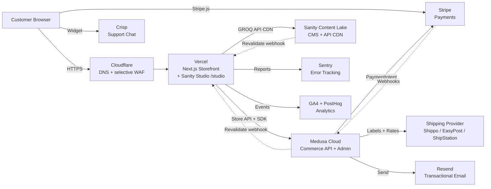
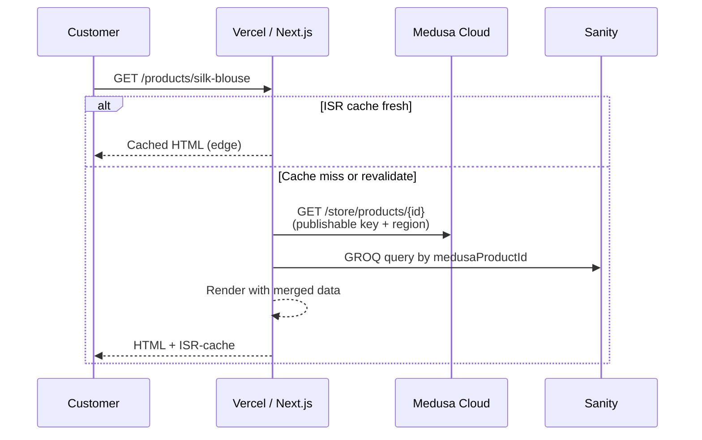
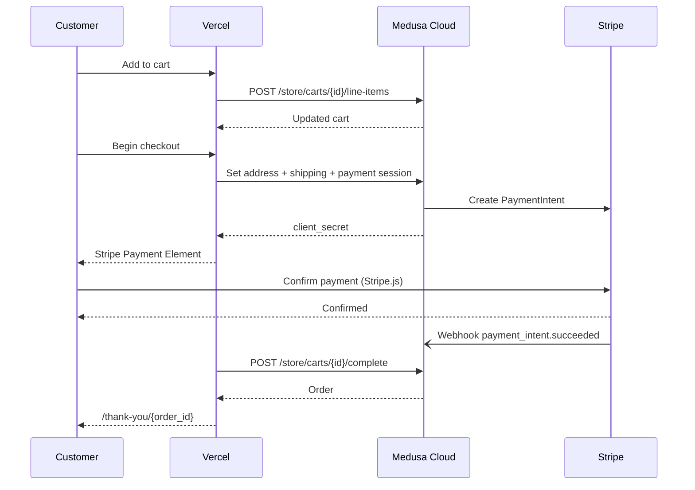
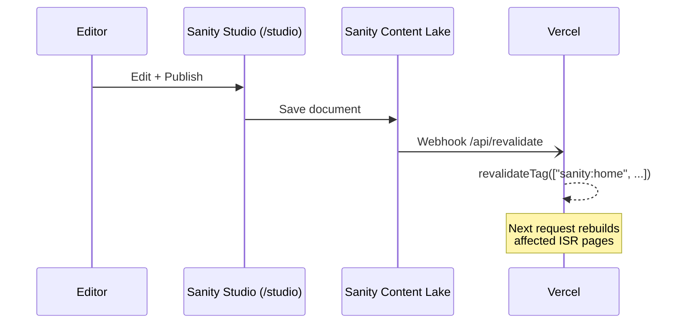
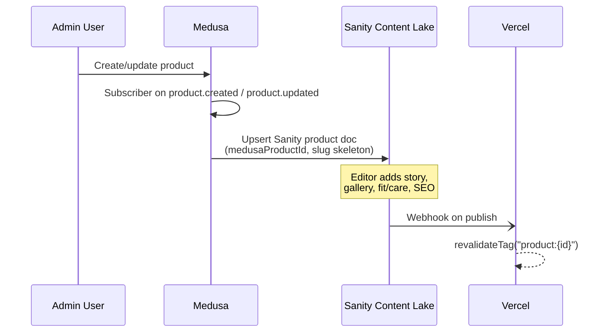
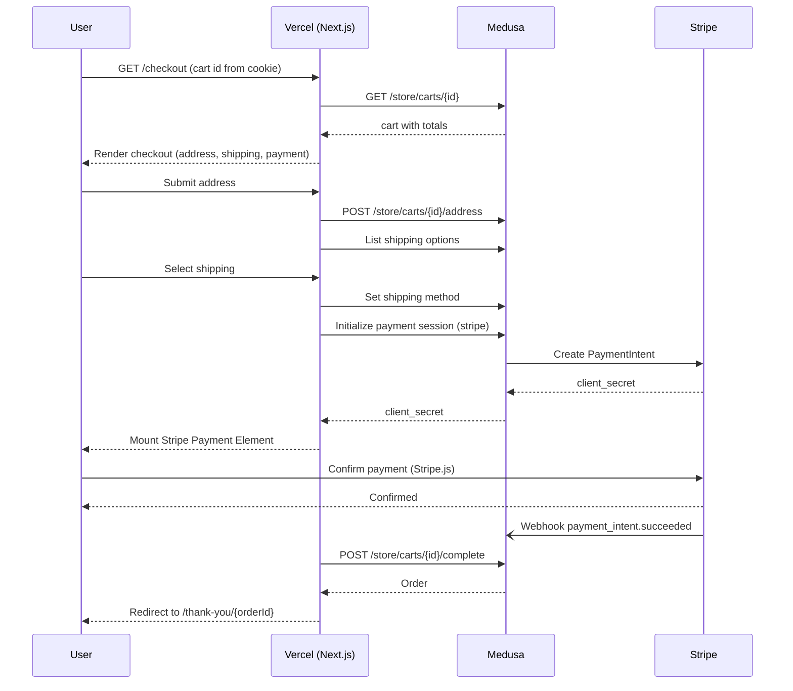
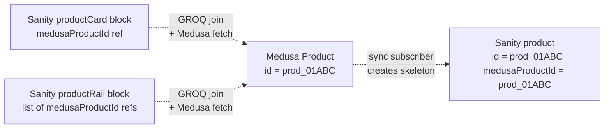

# vaïvae — Architecture Document

> Status: **Draft — sections 1-22 populated; pinned dependency manifest in §3.5; awaiting launch-blocker decisions in §19**
> Owner: Engineering
> Last updated: 2026-05-10

This document is the single source of truth for the technical architecture of vaïvae.com. It captures decisions, rationale, and concrete patterns that any contributor — human or AI agent — should follow when building, extending, or operating the platform.

It is a living document. Every significant architectural change is reflected here and recorded in the [Decision Log (ADRs)](#20-decision-log-adrs).

---

## Table of Contents

**Part I: Context**

1. [Introduction](#1-introduction)
2. [Goals, Requirements & Principles](#2-goals-requirements--principles)

**Part II: Architecture** 3. [High-Level Architecture](#3-high-level-architecture) 4. [Domain Model & Data Ownership](#4-domain-model--data-ownership) 5. [Frontend Architecture](#5-frontend-architecture) 6. [Commerce Backend (Medusa)](#6-commerce-backend-medusa) 7. [Content Architecture (Sanity)](#7-content-architecture-sanity) 8. [Integration Architecture](#8-integration-architecture)

**Part III: Quality Attributes** 9. [Authentication & Authorization](#9-authentication--authorization) 10. [Security & Compliance](#10-security--compliance) 11. [Performance, SEO & Accessibility](#11-performance-seo--accessibility) 12. [Internationalization & Multi-Market](#12-internationalization--multi-market) 13. [Observability & Monitoring](#13-observability--monitoring)

**Part IV: Operations** 14. [Environments, DevOps & Infrastructure](#14-environments-devops--infrastructure) 15. [Testing Strategy](#15-testing-strategy) 16. [Operational Runbooks](#16-operational-runbooks)

**Part V: Planning** 17. [Cost Model](#17-cost-model) 18. [Roadmap & Phasing](#18-roadmap--phasing) 19. [Risks & Mitigations](#19-risks--mitigations) 20. [Decision Log (ADRs)](#20-decision-log-adrs) 21. [Glossary](#21-glossary) 22. [Launch](#22-launch)

---

## 1. Introduction

### 1.1 Purpose

This document captures the agreed technical architecture of vaïvae.com. It exists to:

- Be the single, canonical source of truth for engineering, contractors, agencies, and AI development agents.
- Make decisions and tradeoffs explicit, so future contributors don't re-litigate settled choices.
- Define the system clearly enough that any competent developer (or AI agent) can implement against it without guessing.
- Make non-functional concerns — security, performance, accessibility, cost, operability — first-class, not afterthoughts.

It is a **living document**. Every significant change is reflected here and recorded in [Section 20: Decision Log (ADRs)](#20-decision-log-adrs).

### 1.2 Executive Summary

vaïvae is a luxury editorial fashion house building a direct-to-consumer storefront and brand magazine. The site must communicate refined, quiet authority while functioning as a high-conversion ecommerce platform. The visual and UX inspiration is `situationist.online`: immersive editorial storytelling, minimalist layout, cinematic imagery, strong typography, and focused product discovery.

The platform is built on a **headless, composable stack** that prioritizes:

- **Custom storefront experience** — built fully in code so it can be designed and iterated on without theme constraints.
- **Managed commerce primitives** — cart, checkout, orders, inventory, payments handled by a proven engine, not custom-built.
- **Editorial content as a first-class citizen** — lookbooks, campaigns, and brand essays managed in a real CMS, not stuffed into product descriptions.
- **Cost-managed and dev-heavy** — favor open-source-with-managed-hosting over expensive enterprise SaaS.

The agreed core stack:

| Layer      | Choice                                                                                      |
| ---------- | ------------------------------------------------------------------------------------------- |
| Storefront | `Next.js` (App Router, TypeScript) on `Vercel`                                              |
| Commerce   | `Medusa v2` on `Medusa Cloud`                                                               |
| CMS        | `Sanity`                                                                                    |
| Payments   | `Stripe` (Payment Element + Apple Pay / Google Pay / Stripe Link)                           |
| Email      | `Medusa Cloud Emails` (transactional, included in plan); `Klaviyo` (marketing, from launch) |
| Search     | Native first; `Meilisearch` or `Typesense` in Phase 2                                       |
| Shipping   | `Shippo` / `EasyPost` / `ShipStation` (chosen in [Section 8.4](#84-medusa--shipping))       |
| Support    | `Crisp` (basic chat)                                                                        |
| Analytics  | `GA4` + `PostHog` + `Sentry`                                                                |
| Media      | `Sanity Image CDN` for editorial; `Mux` if/when premium video is required                   |
| DNS / WAF  | `Cloudflare`                                                                                |

Full rationale and alternatives are captured in [Section 3.2: Tech Stack Summary](#32-tech-stack-summary).

### 1.3 Audience

| Audience                      | Why They Read This                                                |
| ----------------------------- | ----------------------------------------------------------------- |
| Engineering team              | Implementation reference and decision history                     |
| AI development agents         | Authoritative context for code generation, refactors, and reviews |
| Design / brand stakeholders   | Understand technical constraints that shape UX decisions          |
| Future agencies / contractors | Onboarding without rediscovering settled decisions                |
| Founders / leadership         | Visibility into architecture, cost, and risk                      |

### 1.4 Document Conventions

- **Format:** Single Markdown file at `docs/architecture.md`. Versioned in git alongside the codebase.
- **ADRs:** Significant decisions recorded in [Section 20](#20-decision-log-adrs) with one of four statuses: `Proposed`, `Accepted`, `Superseded`, `Rejected`. ADRs are append-only — superseded entries remain for history.
- **Section status:** Each section is implicitly `Draft` until reviewed and locked. The document banner reflects overall status.
- **Code identifiers:** The brand name is `vaïvae` in prose and `vaivae` in code, paths, and identifiers.
- **Tables over nested bullets:** Architectural decisions and comparisons are captured in tables for scannability.
- **Updates:** Any merged PR that changes architecture must update this document and add or update the relevant ADR. The doc and the code are reviewed together.
- **Glossary:** Terms are introduced in context and consolidated in [Section 21: Glossary](#21-glossary).

---

## 2. Goals, Requirements & Principles

### 2.1 Functional Requirements

The following capabilities must be supported at launch (Phase 1). Detailed implementation patterns are deferred to the relevant sections (e.g. Frontend in [Section 5](#5-frontend-architecture), Commerce in [Section 6](#6-commerce-backend-medusa)).

| Area                             | Requirement                                                                                                                                                                                                         |
| -------------------------------- | ------------------------------------------------------------------------------------------------------------------------------------------------------------------------------------------------------------------- |
| **Storefront browse**            | Full-bleed editorial homepage with cinematic hero; collection pages (Ready-to-Wear, Editorial/Capsule); product detail page with story-led content, gallery, fit/care info, model specs; lookbook and journal pages |
| **Product catalog**              | Variants by size and color; multiple media per product; story-driven copy alongside specs; stock-level visibility; ability to flag preorder / limited-run items                                                     |
| **Cart**                         | Persistent mini-cart drawer; quick add from collection and PDP; full cart page; cart preserved across sessions                                                                                                      |
| **Checkout**                     | Stripe-powered checkout with card + Apple Pay + Google Pay + Stripe Link; guest checkout primary; address validation; order confirmation page; transactional email                                                  |
| **Customer accounts (optional)** | Sign-up / sign-in via email + password (and/or magic link); order history; saved addresses; wishlist; email preferences                                                                                             |
| **Editorial / Journal**          | Long-form essays, campaign lookbooks, founder notes, behind-the-scenes; sortable by capsule, season, tag                                                                                                            |
| **Search & discovery**           | Keyword search across products and editorial; filters by capsule, fabric, silhouette, color, size, limited-edition flag                                                                                             |
| **Newsletter & email**           | Footer + inline signup forms; transactional email (order confirm, ship, refund); marketing email deferred to Phase 2                                                                                                |
| **Wholesale & press**            | Inquiry pages with forms; downloadable line sheet / press kit; manual follow-up via email — no buyer portal at launch                                                                                               |
| **Customer service**             | Shipping info, returns policy, sizing guide, FAQs, contact form, basic chat (Crisp)                                                                                                                                 |
| **Order tracking**               | Order status visible from confirmation email and (if account holder) account page; carrier tracking link surfaced                                                                                                   |
| **Returns**                      | Customer-initiated returns via form / email at launch; self-service returns portal deferred to Phase 2                                                                                                              |
| **Analytics & marketing tags**   | GA4 enhanced ecommerce, PostHog product analytics, Sentry error tracking, consent-gated tag firing                                                                                                                  |

### 2.2 Non-Functional Requirements

| Category                          | Target                                                                                                                                       | Notes                                                                                          |
| --------------------------------- | -------------------------------------------------------------------------------------------------------------------------------------------- | ---------------------------------------------------------------------------------------------- |
| **Availability**                  | 99.9% commerce backend; 99.99% storefront                                                                                                    | Inherited from `Medusa Cloud` and `Vercel` SLAs                                                |
| **Performance — Core Web Vitals** | LCP < 2.5s; INP < 200ms; CLS < 0.1                                                                                                           | At p75 across mobile and desktop                                                               |
| **Performance — Lighthouse**      | 90+ desktop; 80+ mobile                                                                                                                      | Stricter mobile target than the brief; appropriate for luxury                                  |
| **Accessibility**                 | WCAG 2.1 AA                                                                                                                                  | Keyboard navigation, alt text, color contrast ≥ 4.5:1, focus states, aria roles where required |
| **Security**                      | PCI DSS compliance via Stripe (no card data stored or transited); GDPR + CCPA; TLS 1.2+; secrets in managed vaults; least-privilege access   | See [Section 10: Security & Compliance](#10-security--compliance)                              |
| **Privacy & consent**             | Cookie banner with consent management; opt-in marketing email; right-to-be-forgotten honored via Medusa customer deletion + Sanity scrubbing |                                                                                                |
| **Scalability**                   | Handle 10x baseline traffic during capsule launches; checkout never degrades during drops                                                    | Vercel autoscales storefront; Medusa Cloud autoscales backend                                  |
| **Time-to-publish**               | Editor publish to live ≤ 60 seconds                                                                                                          | Sanity Live API + ISR / on-demand revalidation                                                 |
| **SEO**                           | Structured data (`Product`, `Article`, `BreadcrumbList`); sitemap; canonical URLs; mobile-first indexing                                     | See [Section 11.4: SEO](#114-seo)                                                              |
| **Recoverability**                | RPO ≤ 24h; RTO ≤ 4h                                                                                                                          | See [Section 10.5: Backups & Disaster Recovery](#105-backups--disaster-recovery)               |
| **Cost discipline**               | Dev-phase fixed cost < $50/month; post-launch baseline (excluding payment processing & ad spend) < $500/month                                | See [Section 17: Cost Model](#17-cost-model)                                                   |
| **Data residency**                | None at launch (US-hosted is acceptable); reassessed if EU/GCC market launches                                                               |                                                                                                |

### 2.3 In Scope / Out of Scope

#### Phase 1 — In Scope

- DTC ecommerce in **USD**, **English-only**
- Editorial / journal / lookbook content
- Guest checkout primary, optional customer accounts
- Anonymous + account-bound wishlist
- Newsletter signup (CRM integration deferred)
- Wholesale & press **inquiry forms** (no buyer portal)
- Order tracking via email + account page
- Customer-initiated returns via form
- Stripe payments + Apple Pay + Google Pay + Stripe Link
- WCAG 2.1 AA storefront
- Analytics + error monitoring + consent-gated tags

#### Phase 1 — Out of Scope (Deferred)

| Capability                                                    | Earliest Phase                                     |
| ------------------------------------------------------------- | -------------------------------------------------- |
| Multi-currency / multi-language                               | Phase 2+ if validated by demand                    |
| VIP / members-only gated drops                                | Phase 2                                            |
| Wholesale / B2B buyer portal                                  | Phase 2 or 3, possibly via Centra if scale demands |
| Subscriptions                                                 | Not planned                                        |
| Loyalty / rewards                                             | Phase 3                                            |
| POS / in-person retail                                        | Not planned                                        |
| Native mobile app                                             | Not planned                                        |
| AR / 3D / virtual try-on                                      | Not planned                                        |
| Voice / conversational commerce                               | Not planned                                        |
| Personalized homepage                                         | Phase 3                                            |
| Complex preorders with deposits                               | Phase 3                                            |
| Advanced search merchandising (Algolia / Klevu / Constructor) | Phase 2 if data justifies                          |
| Marketing automation (Klaviyo flows beyond signup)            | Phase 2                                            |
| Self-service returns portal (Loop / ReturnGO)                 | Phase 2                                            |
| Live concierge agent                                          | Phase 3                                            |

### 2.4 Architectural Principles

These are the rules every design decision is checked against. If a future change violates a principle, an ADR must justify the exception.

|   # | Principle                                      | What It Means                                                                                                                                  |
| --: | ---------------------------------------------- | ---------------------------------------------------------------------------------------------------------------------------------------------- |
|   1 | **Buy commerce, build brand**                  | Adopt managed primitives for cart, checkout, orders, payments, inventory. Invest custom effort in storefront experience and editorial content. |
|   2 | **Code is the source of truth**                | Schemas, types, content models, infrastructure config — all versioned in git. No "production-only" config drift.                               |
|   3 | **Prefer managed services**                    | Self-hosting is a last resort. Engineering hours are more expensive than well-priced SaaS.                                                     |
|   4 | **Don't duplicate commerce data**              | Sanity references Medusa products by ID. Never copy prices, inventory, or order data into the CMS.                                             |
|   5 | **AI-agent-friendly by default**               | Strong TypeScript types, typed schemas (Sanity, Zod), predictable file structure, ADRs explaining intent.                                      |
|   6 | **Defer complexity**                           | Add capability when proven by data, not anticipated by intuition. Premature optimization and premature abstraction are equally costly.         |
|   7 | **Significant decisions are ADRs**             | Anything that affects more than one section of this document gets an ADR.                                                                      |
|   8 | **Cost-conscious**                             | Pay-as-you-go before fixed enterprise tiers. Avoid SaaS with GMV-based fees unless the value clearly justifies them.                           |
|   9 | **Avoid lock-in we can't migrate from**        | Own product, order, and customer data in our own database. Avoid tools where exporting data is hostile or expensive.                           |
|  10 | **Performance and accessibility are features** | Treated as first-class requirements with budgets and targets, not late-stage QA.                                                               |
|  11 | **Boring beats clever**                        | Use established, well-supported tools. Avoid frameworks or services with thin community footprint or uncertain longevity.                      |
|  12 | **Observability from day one**                 | Errors, performance, and business events are observable in production from launch. No "we'll add monitoring later."                            |

---

## 3. High-Level Architecture

vaïvae is a **headless, composable** ecommerce platform. The customer-facing storefront is a custom Next.js app on Vercel; commerce primitives are owned by Medusa on Medusa Cloud; editorial content lives in Sanity; payments run through Stripe. All systems integrate via APIs and webhooks. No system is the source of truth for data it does not own.

### 3.1 System Context

The diagram below shows all runtime components, their hosting, and the primary call directions.



**Key boundaries:**

- **Customer browser** talks to the storefront for everything except direct Stripe.js card tokenization and the Crisp chat widget.
- **Storefront** never holds long-lived secrets; it only uses Medusa's publishable API key and Sanity's public read token in the browser. All sensitive operations are server-side route handlers.
- **Stripe webhooks** go to Medusa, never to the storefront. Medusa is the authority on order/payment state.
- **Sanity and Medusa** push revalidation webhooks to Vercel to keep ISR-cached pages fresh.

### 3.2 Tech Stack Summary

> Exact versions, peer dependencies, and excluded packages are in [§3.5 Pinned Dependency Manifest](#35-pinned-dependency-manifest). The table below is the high-level overview.

| Category                   | Choice                                                       | Plan / Version                                                  | Rationale                                                                                                                   | ADR                                                                          | Rejected Alternatives                                                                                                                |
| -------------------------- | ------------------------------------------------------------ | --------------------------------------------------------------- | --------------------------------------------------------------------------------------------------------------------------- | ---------------------------------------------------------------------------- | ------------------------------------------------------------------------------------------------------------------------------------ |
| **Storefront framework**   | `Next.js` (App Router, RSC, TypeScript)                      | `16.2.6`                                                        | Best ecosystem fit for Medusa + Sanity, strong SEO, AI-agent familiarity, ISR + on-demand revalidation                      | [ADR-002](#adr-002-storefront-framework--nextjs-on-vercel)                   | Hydrogen (Shopify lock-in), Astro (weaker dynamic story), SvelteKit (smaller ecosystem)                                              |
| **Storefront hosting**     | `Vercel`                                                     | Pro (per usage); Hobby for early dev                            | Best Next.js DX, preview deploys per PR, ISR, edge network, image optimization                                              | [ADR-002](#adr-002-storefront-framework--nextjs-on-vercel)                   | Netlify, Cloudflare Pages                                                                                                            |
| **Commerce backend**       | `Medusa v2`                                                  | `2.14.2`                                                        | Open-source TypeScript commerce engine; full ownership of product/order/customer data; no GMV fees                          | [ADR-001](#adr-001-commerce-backend--medusa-cloud)                           | Shopify Plus (cost), Saleor (Python stack), Vendure (cloud immature), Centra (enterprise pricing), self-built (violates principle 1) |
| **Commerce hosting**       | `Medusa Cloud`                                               | Develop ($29/mo) → Launch ($99/mo) → Scale ($299/mo) as needed  | Managed Postgres, Redis, S3, autoscaling, GitHub deploys, preview envs; eliminates DevOps for commerce backend              | [ADR-001](#adr-001-commerce-backend--medusa-cloud)                           | Self-hosted on Render / Fly / Railway (more ops), AWS (heavy)                                                                        |
| **CMS**                    | `Sanity Studio v5` (`sanity@5.24.0`, `next-sanity@12.4.5`)   | Free during dev; Growth ($15/seat) when private datasets needed | Schema-as-code, real-time editing, visual previews, Live Content API, Portable Text, AI-agent-friendly                      | [ADR-003](#adr-003-cms--sanity)                                              | Storyblok, Payload, Contentful, Strapi                                                                                               |
| **Sanity Studio location** | Embedded in storefront at `/studio`                          | next-sanity                                                     | One deployment, one domain, simplest auth                                                                                   | New ADR: see [ADR-005](#adr-005-monorepo-domains-and-studio-placement)       | Sanity-hosted, separate subdomain                                                                                                    |
| **Payments**               | `Stripe`                                                     | Pay-as-you-go                                                   | Best Medusa integration, no platform fee, wallets included, well-supported globally                                         | [ADR-004](#adr-004-payments--stripe)                                         | Adyen (enterprise), PayPal (add as secondary later)                                                                                  |
| **Transactional email**    | `Medusa Cloud Emails`                                        | Included in Medusa Cloud plan                                   | No custom provider build; verified sender domain; built-in delivery monitoring                                              | [ADR-012](#adr-012-email-strategy--medusa-cloud-emails--klaviyo-from-launch) | Custom Resend provider (deferred to fallback only), Postmark, SendGrid, AWS SES                                                      |
| **Marketing email / CRM**  | `Klaviyo`                                                    | Free up to 250 profiles                                         | Foundation flows from launch (welcome, abandoned cart, post-purchase); ecommerce-native; clean consent capture from day one | [ADR-012](#adr-012-email-strategy--medusa-cloud-emails--klaviyo-from-launch) | Loops, Customer.io, Brevo                                                                                                            |
| **Search**                 | Native first; `Meilisearch Cloud` or `Typesense` Phase 2     | Native = $0; Meilisearch from ~$30/mo                           | Defer paid search until catalog or traffic justifies it                                                                     | New ADR pending                                                              | Algolia (cost), Klevu (overkill at launch)                                                                                           |
| **Shipping**               | `Shippo` or `EasyPost` (TBD in [§8.4](#84-medusa--shipping)) | Pay-as-you-go                                                   | Label generation + multi-carrier rates via API; cheap at low volume                                                         | New ADR pending                                                              | ShipStation (good ops UI but pricier)                                                                                                |
| **Tax**                    | `Stripe Tax` (US) at launch                                  | Usage-based                                                     | Simplest given Stripe is already in stack; reassess if international tax becomes complex                                    | New ADR pending                                                              | TaxJar, Avalara                                                                                                                      |
| **Support / chat**         | `Crisp`                                                      | Free → ~$45/mo                                                  | Lean, brand-friendly chat for concierge feel; no commitment                                                                 | New ADR pending                                                              | Gorgias (overkill non-Shopify), Zendesk                                                                                              |
| **Analytics**              | `GA4` + `PostHog`                                            | Free tiers                                                      | GA4 for ads/attribution, PostHog for product analytics + funnels + replays                                                  | New ADR pending                                                              | Plausible (no ecommerce attribution), Mixpanel                                                                                       |
| **Error tracking**         | `Sentry`                                                     | Free → Team $26/mo                                              | Storefront + backend coverage from day one                                                                                  | New ADR pending                                                              | LogRocket, Datadog (cost)                                                                                                            |
| **Media — images**         | `Sanity Image CDN`                                           | Included                                                        | Editorial imagery managed in CMS; built-in transforms and CDN                                                               | —                                                                            | Cloudinary (deferred unless DAM workflows demanded)                                                                                  |
| **Media — video**          | `Mux` if/when needed                                         | Pay-as-you-go                                                   | Premium adaptive streaming; only added if cinematic video is core to launch                                                 | New ADR pending                                                              | Vimeo, self-hosted MP4                                                                                                               |
| **DNS + WAF**              | `Cloudflare`                                                 | Free                                                            | DNS, basic WAF for `api.vaivae.com`; not used as a proxy in front of Vercel                                                 | New ADR pending                                                              | Route53, Vercel-managed DNS                                                                                                          |
| **Repo + monorepo**        | `pnpm` workspaces + `Turborepo`                              | OSS                                                             | Best AI-agent fit (single search context), atomic PRs across stack, Medusa Cloud + Vercel both support                      | [ADR-005](#adr-005-monorepo-domains-and-studio-placement)                    | Nx (heavier), separate repos                                                                                                         |

> Plans and dollar figures are reference points as of the document's last update. The [Cost Model](#17-cost-model) is the authoritative source for current spend.

### 3.3 Data Flow

The four flows below cover the majority of system behavior. Detailed implementation patterns are in the relevant sections of the document.

#### 3.3.1 Product Browse (PDP)



Rules:

- Medusa supplies price, variants, inventory, availability. **Always** include region/sales-channel context in calls so calculated prices and inventory are correct.
- Sanity supplies story copy, gallery, fit/care content, SEO meta, and editorial modules.
- The two are joined at render time by `medusaProductId`. Sanity never duplicates price or stock.

#### 3.3.2 Cart & Checkout



Rules:

- The browser calls Stripe directly for tokenization. The storefront never sees raw card data.
- **Stripe webhooks go to Medusa**, never to Vercel. Medusa is the source of truth for payment and order state.
- The order completion call to Medusa is idempotent — it's safe to retry.
- Cart endpoints, checkout pages, and account pages are **never** cached at the CDN.

#### 3.3.3 Editorial Publish



Rules:

- Sanity Live API drives draft preview inside the Studio.
- Tag-based revalidation handles production cache busting.
- The revalidation endpoint validates a shared secret + Sanity webhook signature; unsigned calls are rejected.

#### 3.3.4 Product Sync (Medusa → Sanity)



Rules:

- Medusa creates a **skeleton** Sanity document on product create. Editors enrich it.
- Sync **never** overwrites editor-owned fields. Only `medusaProductId`, structural references, and seed metadata are managed by Medusa.
- Editors **cannot** create canonical products in Sanity. Product creation is always in Medusa.

### 3.4 Deployment Topology

#### 3.4.1 Repository Layout

A single GitHub monorepo, managed with `pnpm` workspaces and `Turborepo`:

```
vaivae/                              github.com/vaivae/vaivae
├── apps/
│   ├── storefront/                  Next.js storefront + embedded Sanity Studio at /studio
│   │   ├── app/
│   │   ├── sanity/                  Studio config, schemas, structure
│   │   └── ...
│   └── medusa/                      Medusa v2 backend + admin
│       ├── src/
│       │   ├── api/
│       │   ├── modules/
│       │   ├── subscribers/
│       │   └── workflows/
│       └── medusa-config.ts
├── packages/
│   ├── ui/                          Shared design-system primitives (optional)
│   ├── config/                      Shared tsconfig, eslint, prettier
│   └── types/                       Shared types (e.g. generated Sanity types)
├── docs/
│   └── architecture.md              ← this document
├── .github/workflows/               CI
├── pnpm-workspace.yaml
├── turbo.json
└── package.json
```

Notes:

- `apps/medusa` is what Medusa Cloud deploys (configured root path).
- `apps/storefront` is what Vercel deploys (configured root path).
- Sanity Studio lives **inside** `apps/storefront` so it shares config, deploys, and auth. There is no `apps/studio`.
- AI agents work from a single repo context, which materially improves cross-stack changes.

#### 3.4.2 Domain Layout

| Domain              | Service                                              | Notes                                                                                                   |
| ------------------- | ---------------------------------------------------- | ------------------------------------------------------------------------------------------------------- |
| `vaivae.com`        | Vercel storefront                                    | Apex → Vercel; `www.vaivae.com` 301 → apex (or vice versa, decided in [Section 14.6](#146-domain--dns)) |
| `vaivae.com/studio` | Sanity Studio (embedded in Next.js)                  | Auth via Sanity; protected route in Next.js                                                             |
| `api.vaivae.com`    | Medusa Cloud (backend + admin)                       | CNAME to Medusa Cloud; admin at `api.vaivae.com/app`                                                    |
| `admin.vaivae.com`  | Optional convenience redirect → `api.vaivae.com/app` | Defer at launch; add later if useful                                                                    |

Cloudflare manages DNS only. **Cloudflare proxy (orange cloud) is not used in front of Vercel** to avoid double-CDN issues, cache conflicts, and reduced visibility into Vercel firewall logs. Cloudflare proxy + WAF can be enabled selectively for `api.vaivae.com` if needed; webhook and admin paths must bypass cache.

#### 3.4.3 Environments

Three logical environments:

| Environment    | Storefront                      | Medusa                                   | Sanity Dataset | Stripe    | Domain           |
| -------------- | ------------------------------- | ---------------------------------------- | -------------- | --------- | ---------------- |
| **Local dev**  | `pnpm dev` on developer machine | Local Docker or Medusa Cloud Develop env | `development`  | Test mode | `localhost:3000` |
| **Preview**    | Vercel preview deploy per PR    | Medusa Cloud preview env per PR          | `development`  | Test mode | `*.vercel.app`   |
| **Production** | Vercel production               | Medusa Cloud production                  | `production`   | Live mode | `vaivae.com`     |

A separate **staging** environment is deferred until business operations require one (e.g. testing migrations against production-like data). For now, Vercel preview + Medusa preview environments serve that role.

#### 3.4.4 What Runs Where

| Component                      | Runs On                                    | Notes                                               |
| ------------------------------ | ------------------------------------------ | --------------------------------------------------- |
| Next.js storefront             | Vercel (Node + edge)                       | ISR + RSC + on-demand revalidation                  |
| Sanity Studio                  | Vercel (same Next.js app, `/studio` route) | Static + client-side authenticated SPA              |
| Medusa API                     | Medusa Cloud (autoscaled containers)       | Postgres + Redis + S3 included in plan              |
| Medusa Admin                   | Medusa Cloud (`/app` of backend)           | Same deploy as API                                  |
| Sanity Content Lake            | Sanity-hosted                              | Region: closest to majority of editors (default US) |
| Stripe                         | Stripe-hosted                              | Webhooks → Medusa                                   |
| Resend                         | Resend-hosted                              | Outbound only                                       |
| Shipping provider              | Provider-hosted                            | Webhooks → Medusa                                   |
| Sentry / PostHog / GA4 / Crisp | SaaS-hosted                                | Outbound from storefront                            |

### 3.5 Pinned Dependency Manifest

> **Authoritative source of truth for every package version in vaïvae.** AI agents must use these exact versions. Upgrades require an ADR ([§20](#20-decision-log-adrs)) and an updated entry in this section. Versions are accurate as of `2026-05-09`.

#### 3.5.1 Versioning Policy

- **Exact pins** in `package.json` (no `^` or `~` for production deps).
- **Lockfile committed** (`pnpm-lock.yaml`).
- **Renovate or Dependabot** opens reviewable upgrade PRs; humans approve.
- **Major version bumps** (e.g. Next 16 → 17) require a new ADR and explicit team approval.
- **Patch and minor bumps** are routine; CI must remain green.
- **Versions are aligned across the monorepo** where shared (e.g. `react` and `react-dom`, all `@medusajs/*` packages).

#### 3.5.2 Runtime Baseline

| Component      | Version       | Notes                                                                                             |
| -------------- | ------------- | ------------------------------------------------------------------------------------------------- |
| **Node.js**    | `24.15.0` LTS | Set in `.node-version`, `.nvmrc`, and `package.json` `engines`. Required for pnpm 11 + Sanity v5. |
| **pnpm**       | `11.0.9`      | Pinned via `packageManager` field. Requires Node `>=22.13`.                                       |
| **TypeScript** | `6.0.3`       | `strict: true` plus stricter flags ([§3.5.6](#356-typescript-strictness)).                        |
| **PostgreSQL** | `16.x`        | Medusa Cloud-managed; self-host should match.                                                     |
| **Redis**      | `7.x`         | Medusa Cloud-managed (Launch+); not included on Develop.                                          |

#### 3.5.3 Storefront — `apps/storefront`

##### Framework Core

| Package                       | Version   | Type | Notes                                                                                                                                                                                       |
| ----------------------------- | --------- | ---- | ------------------------------------------------------------------------------------------------------------------------------------------------------------------------------------------- |
| `next`                        | `16.2.6`  | dep  | Turbopack stable + default; sync request APIs gone (`cookies()`/`headers()`/`params`/`searchParams` are async); `middleware.ts` → `proxy.ts`; `revalidateTag()` requires cache profile arg. |
| `react`                       | `19.2.6`  | dep  | Keep aligned with `react-dom`.                                                                                                                                                              |
| `react-dom`                   | `19.2.6`  | dep  | Same as `react`.                                                                                                                                                                            |
| `babel-plugin-react-compiler` | `1.0.0`   | dev  | React Compiler 1.0 is GA. Use **annotation mode** (`compilationMode: "annotation"`) for the storefront because of the embedded Sanity Studio.                                               |
| `@types/node`                 | `24.12.3` | dev  |                                                                                                                                                                                             |
| `@types/react`                | `19.2.14` | dev  |                                                                                                                                                                                             |
| `@types/react-dom`            | `19.2.3`  | dev  |                                                                                                                                                                                             |

##### Sanity Stack

| Package                  | Version      | Type     | Notes                                                                                    |
| ------------------------ | ------------ | -------- | ---------------------------------------------------------------------------------------- |
| `sanity`                 | `5.24.0`     | dep      | Studio v5 GA. Requires React `^19.2.2`.                                                  |
| `next-sanity`            | `12.4.5`     | dep      | **Required for Next 16.** v11 must not be used with Next 16 (request/ISR amplification). |
| `@sanity/client`         | `7.22.0`     | dep      |                                                                                          |
| `@sanity/image-url`      | `2.1.1`      | dep      |                                                                                          |
| `@sanity/visual-editing` | `5.3.4`      | dep      | Usually transitively managed by `next-sanity`; pin only if directly imported.            |
| `@sanity/icons`          | `3.7.4`      | dep      |                                                                                          |
| `@sanity/vision`         | `5.24.0`     | dep      | Match `sanity` major.minor.                                                              |
| `@sanity/code-input`     | `7.1.0`      | dep      |                                                                                          |
| `@portabletext/react`    | `6.2.0`      | dep      |                                                                                          |
| `@portabletext/types`    | `4.0.2`      | dep      |                                                                                          |
| `styled-components`      | `6.4.1`      | dep      | Required peer for `@sanity/ui` and `@sanity/vision`.                                     |
| **Sanity API version**   | `2026-03-01` | constant | Pinned in code; **never** computed dynamically.                                          |

##### Styling

| Package                       | Version  | Type | Notes                                                      |
| ----------------------------- | -------- | ---- | ---------------------------------------------------------- |
| `tailwindcss`                 | `4.3.0`  | dev  | v4 with `@theme` directive for tokens.                     |
| `@tailwindcss/postcss`        | `4.3.0`  | dev  | Replaces old `tailwindcss` PostCSS plugin entry.           |
| `postcss`                     | `8.5.14` | dev  |                                                            |
| `@tailwindcss/forms`          | `0.5.11` | dev  | Loaded via `@plugin` in CSS.                               |
| `@tailwindcss/typography`     | `0.5.19` | dev  | For journal / Portable Text prose.                         |
| `prettier-plugin-tailwindcss` | `0.8.0`  | dev  | Tailwind v4 compatible.                                    |
| **`autoprefixer`**            | —        | —    | **Not used.** Tailwind v4 handles prefixing automatically. |

##### UI Primitives & Interaction

| Package                           | Version   | Type | Notes                                                                                                                                                           |
| --------------------------------- | --------- | ---- | --------------------------------------------------------------------------------------------------------------------------------------------------------------- |
| `@radix-ui/react-dialog`          | `1.1.15`  | dep  |                                                                                                                                                                 |
| `@radix-ui/react-popover`         | `1.1.15`  | dep  |                                                                                                                                                                 |
| `@radix-ui/react-dropdown-menu`   | `2.1.16`  | dep  |                                                                                                                                                                 |
| `@radix-ui/react-tabs`            | `1.1.13`  | dep  |                                                                                                                                                                 |
| `@radix-ui/react-tooltip`         | `1.2.8`   | dep  |                                                                                                                                                                 |
| `@radix-ui/react-accordion`       | `1.2.12`  | dep  |                                                                                                                                                                 |
| `@radix-ui/react-checkbox`        | `1.3.3`   | dep  |                                                                                                                                                                 |
| `@radix-ui/react-label`           | `2.1.8`   | dep  |                                                                                                                                                                 |
| `@radix-ui/react-separator`       | `1.1.8`   | dep  |                                                                                                                                                                 |
| `@radix-ui/react-slot`            | `1.2.4`   | dep  |                                                                                                                                                                 |
| `@radix-ui/react-visually-hidden` | `1.2.4`   | dep  |                                                                                                                                                                 |
| `react-aria-components`           | `1.17.0`  | dep  | Add only when Radix is insufficient (complex combobox, datepicker). Use **subpath imports** (e.g. `react-aria-components/Select`) — full entry is ~247 KB gzip. |
| `motion`                          | `12.38.0` | dep  | New package name; import from `motion/react`. **Replaces `framer-motion`.**                                                                                     |
| `gsap`                            | `3.15.0`  | dep  | ScrollTrigger orchestration for route-level cinematic scrollytelling. GSAP Standard “No Charge” license; route-level code-split only.                           |
| `@gsap/react`                     | `2.1.2`   | dep  | React hook wrapper for GSAP contexts and cleanup.                                                                                                               |
| `lenis`                           | `1.3.23`  | dep  | Smooth-scroll layer for the home cinematic sequence; disabled for reduced motion.                                                                               |
| `lucide-react`                    | `1.14.0`  | dep  | Tree-shakable; never use dynamic / all-icon imports.                                                                                                            |
| `cmdk`                            | `1.1.1`   | dep  | Optional, for command palette / search overlay.                                                                                                                 |
| `sonner`                          | `2.0.7`   | dep  | App-level toasts; preferred over `@radix-ui/react-toast`.                                                                                                       |
| `embla-carousel-react`            | `8.6.0`   | dep  | For product / lookbook carousels.                                                                                                                               |
| `react-intersection-observer`     | `10.0.3`  | dep  | Scroll-triggered effects.                                                                                                                                       |
| **`framer-motion`**               | —         | —    | **Not used.** Migrated to `motion`.                                                                                                                             |
| **`@radix-ui/react-toast`**       | —         | —    | **Not used.** Replaced by `sonner`.                                                                                                                             |
| **`radix-ui` umbrella**           | —         | —    | **Not used.** Pulls 55 deps and lags individual primitive patches.                                                                                              |

##### Forms, State, Validation

| Package               | Version  | Type | Notes                                                                                                                   |
| --------------------- | -------- | ---- | ----------------------------------------------------------------------------------------------------------------------- |
| `react-hook-form`     | `7.75.0` | dep  | Client Components only.                                                                                                 |
| `@hookform/resolvers` | `5.2.2`  | dep  | Use `@hookform/resolvers/zod`.                                                                                          |
| `zod`                 | `4.4.3`  | dep  | Storefront uses Zod v4. **Note: Medusa internally pins `zod@4.2.0`** — backend code must use `@medusajs/framework/zod`. |
| `zustand`             | `5.0.13` | dep  | Per-request stores via provider; never read/write from RSCs.                                                            |
| `nuqs`                | `2.8.9`  | dep  | URL state for filters/sort. Use `NuqsAdapter` from `nuqs/adapters/next/app`.                                            |

##### Utilities

| Package          | Version | Type |
| ---------------- | ------- | ---- |
| `clsx`           | `2.1.1` | dep  |
| `tailwind-merge` | `3.5.0` | dep  |

##### Commerce / Payments / Media

| Package                   | Version  | Type | Notes                                                                                            |
| ------------------------- | -------- | ---- | ------------------------------------------------------------------------------------------------ |
| `@medusajs/js-sdk`        | `2.14.2` | dep  | Pin to backend version.                                                                          |
| `@medusajs/types`         | `2.14.2` | dep  | Type-only storefront import surface for Store API response types; keep lockstep with Medusa.     |
| `@stripe/stripe-js`       | `9.4.0`  | dep  | Browser-side Stripe.js loader; npm `latest` tag as of 2026-05-09.                                |
| `@stripe/react-stripe-js` | `6.3.0`  | dep  | React bindings for Payment Element; peers require `@stripe/stripe-js >=9.3.1 <10.0.0`, React 19. |
| `@mux/mux-player-react`   | `3.13.0` | dep  | Editorial video player; peers include React 19.                                                  |

##### Observability & Analytics

| Package                  | Version    | Type | Notes                                                                                                       |
| ------------------------ | ---------- | ---- | ----------------------------------------------------------------------------------------------------------- |
| `@sentry/nextjs`         | `10.52.0`  | dep  | Source-map upload — beware Turbo cache hits skipping the upload step ([§14.3.4](#1434-migration-handling)). |
| `posthog-js`             | `1.372.10` | dep  | Consent-gated.                                                                                              |
| `@vercel/analytics`      | `2.0.1`    | dep  | Anonymous; not consent-gated.                                                                               |
| `@vercel/speed-insights` | `2.0.0`    | dep  | RUM Web Vitals.                                                                                             |

#### 3.5.4 Commerce Backend — `apps/medusa`

##### Medusa Core

> **Pin every `@medusajs/*` package to `2.14.2`** in lockstep. Mismatched versions produce silent runtime errors.

| Package                       | Version  | Type | Notes                                                                                                                                                                                           |
| ----------------------------- | -------- | ---- | ----------------------------------------------------------------------------------------------------------------------------------------------------------------------------------------------- |
| `@medusajs/medusa`            | `2.14.2` | dep  |                                                                                                                                                                                                 |
| `@medusajs/framework`         | `2.14.2` | dep  |                                                                                                                                                                                                 |
| `@medusajs/types`             | `2.14.2` | dep  |                                                                                                                                                                                                 |
| `@medusajs/utils`             | `2.14.2` | dep  |                                                                                                                                                                                                 |
| `@medusajs/cli`               | `2.14.2` | dev  |                                                                                                                                                                                                 |
| `@medusajs/admin-vite-plugin` | `2.14.2` | dev  |                                                                                                                                                                                                 |
| `@medusajs/admin-shared`      | `2.14.2` | dev  | For custom admin extensions.                                                                                                                                                                    |
| `@medusajs/admin-sdk`         | `2.14.2` | dev  |                                                                                                                                                                                                 |
| `@medusajs/dashboard`         | `2.14.2` | dev  | Direct pin required by the Admin Vite bundle under pnpm's strict module resolution.                                                                                                             |
| `@medusajs/draft-order`       | `2.14.2` | dev  | Default Admin plugin import; direct pin required by the Admin Vite bundle under pnpm's strict module resolution.                                                                                |
| `@medusajs/payment-stripe`    | `2.14.2` | dep  | Bundled in `@medusajs/medusa`; pinning explicitly is a safety net.                                                                                                                              |
| `@medusajs/analytics-posthog` | `2.14.2` | dep  | Server-side PostHog event capture (per [ADR-014](#adr-014-adopt-official-medusa-plugins--analytics-loyalty)).                                                                                   |
| `@medusajs/loyalty-plugin`    | `2.14.2` | dep  | **Deferred.** Published at this version; available for adoption when gift cards / store credit / loyalty are needed (per [ADR-014](#adr-014-adopt-official-medusa-plugins--analytics-loyalty)). |
| **`@medusajs/medusa-cli`**    | —        | —    | **Not used.** Legacy v1 CLI.                                                                                                                                                                    |
| **`@medusajs/cache-redis`**   | —        | —    | **Not used.** Replaced by `@medusajs/caching` + `@medusajs/caching-redis` (Cloud auto-configures these).                                                                                        |

##### Community Plugins

| Package                             | Version | Type         | Notes                                                                                                                                                                       |
| ----------------------------------- | ------- | ------------ | --------------------------------------------------------------------------------------------------------------------------------------------------------------------------- |
| `@alphabite/medusa-wishlist`        | `0.5.9` | dep          | Wishlist module (per [ADR-013](#adr-013-adopt-community-wishlist-plugin)). Published; peer deps pin Medusa `2.13.6`, so keep fallback / fork path if 2.14.2 issues surface. |
| `@stackd-solutions/medusa-wishlist` | `0.1.6` | — (fallback) | Documented fallback if `@alphabite/medusa-wishlist` v2.14 compatibility issues arise; peers allow Medusa `^2.13.5`.                                                         |

##### Custom Module Dependencies

| Package               | Version  | Type | Notes                                                                                                                                                                       |
| --------------------- | -------- | ---- | --------------------------------------------------------------------------------------------------------------------------------------------------------------------------- |
| `klaviyo-api`         | `22.0.1` | dep  | Node SDK for Klaviyo (per [ADR-012](#adr-012-email-strategy--medusa-cloud-emails--klaviyo-from-launch)). npm `latest` tag as of 2026-05-09; SDK revision `2026-04-15`.      |
| `posthog-node`        | `5.33.4` | dep  | Used by `@medusajs/analytics-posthog`; explicit pin satisfies the provider's `posthog-node@^5.11.0` dependency.                                                             |
| `shippo`              | `2.18.0` | dep  | For custom shipping label module. npm `latest` tag as of 2026-05-09; no Medusa peer dependency.                                                                             |
| `@mux/mux-node`       | `14.0.1` | dep  | Server-side Mux ops only if needed; npm `latest` tag as of 2026-05-09.                                                                                                      |
| `jose`                | `6.2.3`  | dep  | JWT verification (use over `jsonwebtoken`).                                                                                                                                 |
| `pino`                | `10.3.1` | dep  | Server logger.                                                                                                                                                              |
| `pino-pretty`         | `13.1.3` | dev  | Dev only.                                                                                                                                                                   |
| `ts-node`             | `10.9.2` | dev  | Medusa CLI registers this to load `medusa-config.ts` and `medusa exec` scripts in local dev/build commands.                                                                 |
| `tsconfig-paths`      | `4.2.0`  | dev  | Medusa CLI registers this alongside `ts-node` so TypeScript path aliases resolve during CLI execution.                                                                      |
| `awilix`              | `8.0.1`  | dep  | Direct pin matching `@medusajs/deps@2.14.2` (`awilix@^8.0.1`) and wishlist peer deps; do not upgrade to latest `13.x` without Medusa validation.                            |
| **`stripe`** (direct) | `22.1.1` | —    | **Do not pin directly in Medusa app.** `@medusajs/payment-stripe` brings its own Stripe SDK (`stripe@^15.5.0`, API version `2024-04-10`). Override only with strong reason. |

##### Email Fallback Dependencies (Conditional)

> Per [ADR-012](#adr-012-email-strategy--medusa-cloud-emails--klaviyo-from-launch), Medusa Cloud Emails is the primary transactional provider. The packages below are added **only** if a custom Resend provider is needed for a specific template that Cloud Emails cannot handle. Adoption requires a new ADR.

| Package                   | Version (if adopted) | Type |
| ------------------------- | -------------------- | ---- |
| `resend`                  | `6.12.3`             | dep  |
| `react-email`             | `6.1.1`              | dev  |
| `@react-email/components` | `1.0.12`             | dep  |
| `@react-email/render`     | `2.0.8`              | dep  |

#### 3.5.5 Monorepo Tooling — Root

| Package                            | Version  | Type   | Notes                                                                                                               |
| ---------------------------------- | -------- | ------ | ------------------------------------------------------------------------------------------------------------------- |
| `turbo`                            | `2.9.12` | dev    | Use `tasks` (not legacy `pipeline`).                                                                                |
| `eslint`                           | `9.39.4` | dev    | Flat config. **ESLint 10.3.0 exists but several plugins still pin to 9.** Stay on 9 until plugin matrix catches up. |
| `eslint-config-next`               | `16.2.6` | dev    | Match Next version.                                                                                                 |
| `eslint-config-prettier`           | `10.1.8` | dev    |                                                                                                                     |
| `@typescript-eslint/parser`        | `8.59.2` | dev    |                                                                                                                     |
| `@typescript-eslint/eslint-plugin` | `8.59.2` | dev    |                                                                                                                     |
| `prettier`                         | `3.8.3`  | dev    |                                                                                                                     |
| `husky`                            | `9.1.7`  | dev    |                                                                                                                     |
| `lint-staged`                      | `17.0.3` | dev    | Requires Node `>=22.22.1`.                                                                                          |
| `gitleaks`                         | `8.30.1` | binary | Pre-commit secret scanning; not an npm package. Also run in CI.                                                     |
| `@commitlint/cli`                  | `21.0.0` | dev    |                                                                                                                     |
| `@commitlint/config-conventional`  | `21.0.0` | dev    |                                                                                                                     |
| `tsx`                              | `4.21.0` | dev    | TS scripts and seeds.                                                                                               |

#### 3.5.6 TypeScript Strictness

`tsconfig.base.json` (extended by every workspace package):

| Flag                                 | Value        |
| ------------------------------------ | ------------ |
| `strict`                             | `true`       |
| `noUncheckedIndexedAccess`           | `true`       |
| `exactOptionalPropertyTypes`         | `true`       |
| `noImplicitReturns`                  | `true`       |
| `noFallthroughCasesInSwitch`         | `true`       |
| `noPropertyAccessFromIndexSignature` | `true`       |
| `noUncheckedSideEffectImports`       | `true`       |
| `verbatimModuleSyntax`               | `true`       |
| `isolatedModules`                    | `true`       |
| `moduleResolution`                   | `"Bundler"`  |
| `jsx`                                | `"preserve"` |
| `noEmit`                             | `true`       |

#### 3.5.7 Testing & Quality

| Package                       | Version  | Type | Notes                                                                                          |
| ----------------------------- | -------- | ---- | ---------------------------------------------------------------------------------------------- |
| `vitest`                      | `4.1.5`  | dev  |                                                                                                |
| `@vitest/coverage-v8`         | `4.1.5`  | dev  |                                                                                                |
| `@vitest/ui`                  | `4.1.5`  | dev  | Optional.                                                                                      |
| `vite`                        | `7.3.3`  | dev  | Direct root peer for the Vitest 4 runner; Medusa Admin still resolves its own Vite 5 peer.     |
| `@testing-library/react`      | `16.3.2` | dev  |                                                                                                |
| `@testing-library/jest-dom`   | `6.9.1`  | dev  | Use `@testing-library/jest-dom/vitest`.                                                        |
| `@testing-library/user-event` | `14.6.1` | dev  |                                                                                                |
| `jsdom`                       | `29.1.1` | dev  | Default DOM env for Vitest.                                                                    |
| `@playwright/test`            | `1.59.1` | dev  |                                                                                                |
| `@axe-core/playwright`        | `4.11.3` | dev  | A11y in E2E.                                                                                   |
| `@lhci/cli`                   | `0.15.1` | dev  | Lighthouse CI.                                                                                 |
| `@next/bundle-analyzer`       | `16.2.6` | dev  | **Requires `next build --webpack`** — Turbopack analyzer support not yet stable.               |
| **`pa11y-ci`**                | —        | —    | **Not used.** Pulls Puppeteer; duplicates Playwright. `@axe-core/playwright` covers our needs. |
| **`happy-dom`**               | —        | —    | **Not used.** `jsdom` is the default.                                                          |

#### 3.5.8 GitHub Actions

| Action               | Version                               |
| -------------------- | ------------------------------------- |
| `actions/checkout`   | `v6` (`6.0.2`)                        |
| `actions/setup-node` | `v6` (`6.4.0`)                        |
| `pnpm/action-setup`  | `v6` (`6.0.6`) — pin pnpm to `11.0.9` |

For high-security workflows (release, deploy), pin actions to commit SHAs rather than `v6`.

#### 3.5.9 CLIs & Devcontainer

| Tool       | Version                    | Purpose                                                      |
| ---------- | -------------------------- | ------------------------------------------------------------ |
| Sanity CLI | bundled in `sanity@5.24.0` | TypeGen, schema extract, deploy.                             |
| Medusa CLI | `@medusajs/cli@2.14.2`     | Migrations, scripts.                                         |
| Stripe CLI | `1.40.9`                   | Local webhook forwarding.                                    |
| Wrangler   | `4.90.0`                   | Cloudflare option only ([§19 Risk R11](#191-risk-register)). |

#### 3.5.10 Excluded / Avoided Packages

These are explicitly **not** in the stack. Listed here so AI agents do not add them by reflex.

| Package                           | Why Excluded                                                  | Use Instead                                                 |
| --------------------------------- | ------------------------------------------------------------- | ----------------------------------------------------------- |
| `framer-motion`                   | Replaced by `motion/react`                                    | `motion@12.38.0`                                            |
| `@radix-ui/react-toast`           | App-level toast UX                                            | `sonner@2.0.7`                                              |
| `radix-ui` (umbrella)             | 55 deps, lags individual patches, large bundle                | Individual `@radix-ui/react-*` primitives                   |
| `autoprefixer`                    | Tailwind v4 handles prefixing                                 | —                                                           |
| `postcss-import`                  | Tailwind v4 handles `@import`                                 | —                                                           |
| `pa11y-ci`                        | Duplicates Playwright/Puppeteer browser stack                 | `@axe-core/playwright`                                      |
| `happy-dom`                       | Spec gaps for our React tests                                 | `jsdom`                                                     |
| `@cloudflare/next-on-pages`       | Deprecated                                                    | `@opennextjs/cloudflare` (only if Cloudflare path is taken) |
| `@medusajs/medusa-cli`            | Legacy v1 CLI                                                 | `@medusajs/cli@2.14.2`                                      |
| `@medusajs/cache-redis`           | Deprecated old Cache Module                                   | Caching is auto-configured by Medusa Cloud                  |
| `next/font` as a separate package | Built into Next.js                                            | Import `next/font/local` directly                           |
| `dotenv`                          | Next.js + Medusa load envs natively; Node 24 has `--env-file` | Use built-ins                                               |
| `concurrently`                    | Turbo handles task graph                                      | Turbo `dev` task                                            |
| `cross-env`                       | Not needed on macOS/Linux dev + Linux CI                      | Use plain env syntax                                        |
| `@cloudflare/next-on-pages`       | Deprecated                                                    | `@opennextjs/cloudflare`                                    |
| `jsonwebtoken`                    | Older API, no async-friendly verify                           | `jose@6.2.3`                                                |

#### 3.5.11 Critical Compatibility Notes

These are the **specific gotchas** AI agents must know about, written explicitly because they violate "obvious" assumptions:

1. **`next-sanity` v11 is incompatible with Next 16** — they cause request and ISR-write amplification. Use `next-sanity@12.4.5` with `next@16.2.6`. Sanity has a public advisory on this.
2. **Sanity API version is pinned to `2026-03-01`** — never use `new Date()` to compute it. Bumping requires testing.
3. **React Compiler is in annotation mode** for the storefront — the Sanity Studio is sensitive to over-aggressive memoization.
4. **Stripe API version inside Medusa** is `2024-04-10` (set by `@medusajs/payment-stripe`'s bundled `stripe@^15.5.0`). Custom Stripe code outside the provider may use `2026-04-22.dahlia`, but **never** override the provider's bundled SDK.
5. **Medusa internally uses `zod@4.2.0`** via `@medusajs/deps`. Backend customizations must `import { z } from "@medusajs/framework/zod"` to avoid version conflicts. The storefront uses `zod@4.4.3` directly — that's fine because the two systems don't share a runtime.
6. **`zod` v4 has breaking changes from v3** affecting common patterns: `.errors` → `.issues`, `errorMap`/`invalid_type_error`/`required_error` unified into `error`, `.default()` short-circuits on `undefined` (use `.prefault()` for v3 behavior), `z.string().email()` deprecated (use `z.email()`).
7. **Turbopack is default in Next 16** — `@next/bundle-analyzer` requires `next build --webpack` to function until Turbopack analyzer support stabilizes.
8. **Custom webpack config breaks `next build`** under Turbopack. Use `--webpack` flag if needed; we don't add custom webpack config.
9. **`middleware.ts` is renamed to `proxy.ts`** in Next 16. Medusa Cloud has not validated `proxy.ts` for storefronts — if proxy is required, deploy storefront on Vercel.
10. **`next lint` is removed** in Next 16. Use `eslint .` directly.
11. **`cookies()`, `headers()`, `params`, `searchParams` are async** in Next 16. AI agents producing synchronous calls is an instant red flag.
12. **`revalidateTag()` requires a cache profile argument** in Next 16. Old `revalidateTag(tag)` signature is not valid.
13. **pnpm 11 requires Node `>=22.13`** — Node 20 is no longer compatible.
14. **Medusa Cloud storefront builds use Node 24.x** (cannot be overridden).
15. **Medusa Cloud auto-configures Redis** for Caching, Event Bus, Workflow Engine, and Locking on Launch+ plans. Do **not** add explicit module config in `medusa-config.ts` for these on Cloud.
16. **Sentry source-map upload + Turbo cache** can produce a cache hit that skips upload. Either disable cache for release builds or run source-map upload as a separate uncached step ([§14.3.4](#1434-migration-handling)).
17. **The Sanity Studio bundle** is large — keep `SanityLive` and Visual Editing components **out of** the `/studio` layout. Sanity's docs warn that mixing them causes unexpected reloads.

#### 3.5.12 Upgrade Cadence

| Type                | Cadence                          | Process                                               |
| ------------------- | -------------------------------- | ----------------------------------------------------- |
| Patch (`X.Y.Z+1`)   | Continuous via Renovate          | CI passes → merge                                     |
| Minor (`X.Y+1.0`)   | Weekly batches                   | CI passes → merge; release notes scanned              |
| Major (`X+1.0.0`)   | Per package, evaluated per major | New ADR; manual upgrade window; full E2E + smoke pass |
| Security advisories | Within 48h                       | Hotfix release if production-impacting                |

A single pinned snapshot of dependencies — including their resolved transitive deps — is the only thing that ships to production. The committed `pnpm-lock.yaml` is the contract.

---

## 4. Domain Model & Data Ownership

The platform operates on a strict principle: **every piece of data has exactly one source of truth.** Other systems may cache, mirror, or render it, but they may not edit it. This section defines who owns what and how data moves between systems.

### 4.1 Source-of-Truth Map

| Data                                                     | Source of Truth                                                 | Mirrored Where                                 | Notes                                                              |
| -------------------------------------------------------- | --------------------------------------------------------------- | ---------------------------------------------- | ------------------------------------------------------------------ |
| Product ID, variant ID, SKU                              | **Medusa**                                                      | Sanity (`medusaProductId` reference only)      | Immutable identifiers                                              |
| Product handle (URL slug)                                | **Medusa**                                                      | —                                              | Storefront routes use Medusa's `handle`                            |
| Short factual description                                | **Medusa**                                                      | —                                              | Used by Admin search, exports, Google Merchant feed                |
| Long story-led copy & gallery                            | **Sanity**                                                      | —                                              | Editorial content, Portable Text, custom modules                   |
| Material composition                                     | **Medusa** for filterable values; **Sanity** for narrative copy | —                                              | Filters and compliance rely on Medusa                              |
| Fit & care                                               | **Sanity**                                                      | —                                              | Reusable references via `sizeGuide` document                       |
| Model specs (height, wearing size)                       | **Sanity**                                                      | —                                              | PDP-only editorial detail                                          |
| Packshot / variant images                                | **Medusa**                                                      | —                                              | Used by cart, admin, exports                                       |
| Lifestyle / lookbook imagery                             | **Sanity**                                                      | —                                              | CMS-managed assets                                                 |
| Variant labels (e.g. `Charcoal`)                         | **Medusa** (`ProductOptionValue`)                               | Sanity (optional swatch metadata by reference) | Medusa is source for filterable values                             |
| Price, sale price, price rules                           | **Medusa** (Pricing module)                                     | —                                              | **Never** copy to Sanity                                           |
| Inventory, availability, backorder                       | **Medusa** (Inventory module)                                   | —                                              | Resolved per `SalesChannel` / `StockLocation`                      |
| Promotions, gift cards, tax, shipping                    | **Medusa**                                                      | —                                              | Operational commerce                                               |
| Customer (email, addresses)                              | **Medusa**                                                      | —                                              |                                                                    |
| Customer wishlist                                        | **Medusa** (custom module)                                      | localStorage for guests, merged on login       | See [§4.2.3](#423-customer-side-data)                              |
| Marketing opt-in & consent                               | **Medusa** (custom module on customer)                          | Klaviyo when added (one-way push from Medusa)  | Medusa is durable record of consent                                |
| GDPR consent log                                         | **Medusa** (custom module)                                      | —                                              | Versioned consent records with timestamp + source                  |
| Cart, order, line items, returns, refunds                | **Medusa**                                                      | —                                              |                                                                    |
| Editorial pages (lookbook, journal, capsule, home, etc.) | **Sanity**                                                      | —                                              | Defined in [§4.2.2](#422-content-entities-sanity)                  |
| Legal & policy pages                                     | **Sanity**                                                      | —                                              | Operational logic (e.g. return eligibility window) lives in Medusa |
| Navigation, footer, brand settings                       | **Sanity** (singleton)                                          | —                                              |                                                                    |
| SEO metadata per page                                    | **Sanity** (with Medusa fallback for product data)              | —                                              |                                                                    |

**Hard rules:**

1. **Sanity never writes back to Medusa.** No reverse sync, ever.
2. **Medusa never reads from Sanity to make commerce decisions.** Pricing, inventory, eligibility, fulfillment are computed entirely in Medusa.
3. **Mirrored fields in Sanity are read-only.** Editor UI hides or disables them.
4. **No commerce data is duplicated for "performance".** If a price needs to be displayed, it is fetched from Medusa per request (with caching at the storefront layer, not the data layer).

### 4.2 Core Entities

#### 4.2.1 Commerce Entities (Medusa v2)

vaïvae uses Medusa v2's standard modules. We do not fork core entities; extensions go through the patterns described in [§6.1](#61-modules-used) and [§6.2](#62-customizations--plugins).

| Entity                                                               | Purpose                                  | Key Fields                                                                                                        | Notes for vaïvae                                                              |
| -------------------------------------------------------------------- | ---------------------------------------- | ----------------------------------------------------------------------------------------------------------------- | ----------------------------------------------------------------------------- |
| `Product`                                                            | Master product record                    | `id`, `handle`, `title`, `subtitle`, `description`, `status`, `material`, `origin_country`, `hs_code`, `metadata` | `handle` drives PDP route. `description` = short factual summary.             |
| `ProductVariant`                                                     | One purchasable SKU (size + color combo) | `id`, `sku`, `title`, `manage_inventory`, `allow_backorder`, dimensions, `metadata`                               | One variant per size×color. Inventory always managed.                         |
| `ProductOption` / `ProductOptionValue`                               | Defines variant axes (Size, Color)       | `value`, `metadata`                                                                                               | We use exactly two options at launch: Size, Color.                            |
| `ProductCategory`                                                    | Hierarchical category tree               | `name`, `handle`, `mpath`                                                                                         | Used for filtering and sales-channel scoping.                                 |
| `ProductCollection`                                                  | Commerce grouping                        | `title`, `handle`                                                                                                 | Distinct from Sanity `capsulePage`. Use sparingly to avoid confusion.         |
| `Customer`                                                           | Shopper account                          | `email`, `has_account`, addresses, `metadata`                                                                     | Guest checkouts create customers with `has_account = false`.                  |
| `Cart`                                                               | In-progress order                        | `currency_code`, `region_id`, `sales_channel_id`, line items                                                      | Always carries region + sales channel context.                                |
| `Order`                                                              | Completed cart                           | `display_id`, `status`, transactions, line items, returns                                                         | Source of truth for order state.                                              |
| `Region`                                                             | Market / currency / tax context          | `currency_code`, `automatic_taxes`, countries                                                                     | At launch: one region (`USD`, US).                                            |
| `SalesChannel`                                                       | Availability + inventory scoping         | `name`, linked stock locations                                                                                    | At launch: one storefront sales channel.                                      |
| `StockLocation`                                                      | Physical inventory location              | address, linked sales channels                                                                                    | At launch: one location (3PL or HQ).                                          |
| `Inventory` (`InventoryItem` + `InventoryLevel` + `ReservationItem`) | Stock per variant per location           | `stocked_quantity`, `reserved_quantity`, `available_quantity`                                                     | Reservations protect cart inventory.                                          |
| `ShippingProfile` / `ShippingOption`                                 | Shipping rules and rates                 | service zone, provider, rules                                                                                     | See [§8.4](#84-medusa--shipping).                                             |
| `Promotion`                                                          | Discount codes & automatic promotions    | `code`, `type`, rules, application method                                                                         | Used for capsule launches, friends-and-family, post-purchase incentives.      |
| `Return` / `Refund`                                                  | Reverse logistics                        | reason, items, status, amount                                                                                     | Customer-initiated returns flow described in [§16](#16-operational-runbooks). |

#### 4.2.2 Content Entities (Sanity)

Document types planned for Phase 1. Each schema is fully defined in code in `apps/storefront/sanity/schemas/`.

| Schema                | Type      | Purpose                                                                                                                                                                                                                                            |
| --------------------- | --------- | -------------------------------------------------------------------------------------------------------------------------------------------------------------------------------------------------------------------------------------------------- |
| `product`             | document  | Editorial enrichment of one Medusa product. Sanity `_id === medusaProductId`; mirror fields (`medusaProductId`, `title`, `handle`, `mirrorMaterials`) are read-only, while gallery, story copy, fit & care, model specs, and SEO are Sanity-owned. |
| `homePage`            | singleton | Composable homepage with modular sections (hero, capsule rail, editorial excerpt, brand promise, CTA).                                                                                                                                             |
| `capsulePage`         | document  | Seasonal capsule / collection landing page with hero, story, product rail.                                                                                                                                                                         |
| `lookbook`            | document  | Visual-first editorial story with galleries, hotspots, product references, season metadata.                                                                                                                                                        |
| `journalArticle`      | document  | Long-form essays / brand notes / behind-the-scenes; Portable Text body, author, publish date, tags, product embeds.                                                                                                                                |
| `landingPage`         | document  | Flexible campaign / SEO landing page with modular blocks.                                                                                                                                                                                          |
| `campaignLandingPage` | document  | Standalone paid-traffic campaign pages with conversion-optimized layout.                                                                                                                                                                           |
| `aboutPage`           | singleton | Brand story, founder note, craft & production.                                                                                                                                                                                                     |
| `pressPage`           | singleton | Press kit, mentions, downloadable assets.                                                                                                                                                                                                          |
| `wholesalePage`       | singleton | Inquiry CTA + line-sheet download link.                                                                                                                                                                                                            |
| `legalPage`           | document  | Privacy, terms, returns policy, shipping policy, FAQ — managed in CMS, not hardcoded.                                                                                                                                                              |
| `sizeGuide`           | document  | Reusable size charts referenced by `product`.                                                                                                                                                                                                      |
| `globalSettings`      | singleton | Navigation, footer, social links, announcement bar, default SEO, brand contacts.                                                                                                                                                                   |

**Reusable objects (not standalone documents):**

| Object                                                                             | Purpose                                                                         |
| ---------------------------------------------------------------------------------- | ------------------------------------------------------------------------------- |
| `seo`                                                                              | meta title, description, canonical, OG image, noindex/nofollow                  |
| `productCard`                                                                      | Curated product reference with optional badge, CTA copy, and image override     |
| `productRail`                                                                      | Carousel/grid of product references with title, layout option, and product list |
| `imagePair`, `editorialSpread`, `videoChapter`, `quote`, `heroFilm`, `journalBody` | Editorial layout primitives for Portable Text and module composition            |

#### 4.2.3 Customer-Side Data

| Data                           | Storage                                                                                                                          | Why                                                                                                                                                 |
| ------------------------------ | -------------------------------------------------------------------------------------------------------------------------------- | --------------------------------------------------------------------------------------------------------------------------------------------------- |
| Wishlist (logged-in)           | `@alphabite/medusa-wishlist` plugin (per [ADR-013](#adr-013-adopt-community-wishlist-plugin))                                    | Persists across devices; needs auth and variant validation                                                                                          |
| Wishlist (guest)               | `localStorage`                                                                                                                   | No friction at launch                                                                                                                               |
| Wishlist (transition on login) | Storefront persists guest wishlist id, then transfers with `POST /store/wishlists/:id/transfer` after login (provided by plugin) | Best-of-both-worlds hybrid                                                                                                                          |
| Recently viewed                | `localStorage` (with TTL)                                                                                                        | Personalization data; high-write, low-durability needs                                                                                              |
| Marketing opt-in & consent     | Medusa custom `marketing-consent` module on `Customer`                                                                           | Durable append-only consent log; **synced to Klaviyo from launch** per [ADR-012](#adr-012-email-strategy--medusa-cloud-emails--klaviyo-from-launch) |
| GDPR consent log               | Medusa custom module (`marketing-consent.ConsentRecord`)                                                                         | Versioned with timestamp, source, IP/UA where required                                                                                              |
| Auth session                   | Medusa-issued JWT in HttpOnly cookie                                                                                             | See [§9](#9-authentication--authorization)                                                                                                          |

Implementation note: `marketing-consent` stores `ConsentRecord` rows as an append-only forensic log. Current state is derived from the latest `consented_at` row for a customer, unsubscribe rows set `expires_at` for the 30-day suppression-retention window, and `POST /store/customers/me/marketing-consent` plus `POST /store/newsletter` emit `marketing-consent.updated` for Klaviyo sync subscribers. The Medusa service token is `marketing_consent` because Medusa v2 module names must be alphanumeric/underscore; the folder, Store API path, and event name retain `marketing-consent`.

### 4.3 Sync Strategy

#### 4.3.1 Direction & Triggers

| Event                     | Direction                             | Trigger                            | Action                                                                                                                                     |
| ------------------------- | ------------------------------------- | ---------------------------------- | ------------------------------------------------------------------------------------------------------------------------------------------ |
| Product created in Medusa | Medusa → Sanity                       | `product.created` subscriber       | Create Sanity `product` stub with deterministic `_id`, `medusaProductId`, `title`, `handle`, and `mirrorMaterials`                         |
| Product updated in Medusa | Medusa → Sanity                       | `product.updated` subscriber       | Patch only Medusa-owned mirror fields; never touch editor-owned fields                                                                     |
| Product deleted in Medusa | Medusa → Sanity                       | `product.deleted` subscriber       | Delete the Sanity `product` document keyed by the Medusa product ID                                                                        |
| Sanity content published  | Sanity → Vercel                       | Sanity webhook → `/api/revalidate` | `revalidateTag("product:{id}")` or relevant content tag                                                                                    |
| Medusa product changed    | Medusa → Vercel                       | Subscriber → revalidate webhook    | `revalidateTag("product:{id}")` so storefront refreshes                                                                                    |
| Stripe payment events     | Stripe → Medusa                       | Stripe webhook → Medusa            | Reconciles payment state on `Order`                                                                                                        |
| Order events              | Medusa → Resend (transactional email) | Subscriber                         | Sends order confirmation, ship, refund emails                                                                                              |
| Marketing consent change  | Medusa → Klaviyo                      | Subscriber                         | One-way push from launch (per [ADR-012](#adr-012-email-strategy--medusa-cloud-emails--klaviyo-from-launch)); updates profile + suppression |
| Customer create/update    | Medusa → Klaviyo                      | Subscriber                         | Profile upsert with consent state                                                                                                          |
| Order events              | Medusa → Klaviyo                      | Subscriber                         | `Placed Order`, `Order Shipped`, `Cancelled Order` events                                                                                  |
| Cart updated (with email) | Medusa → Klaviyo                      | Subscriber                         | `Started Checkout` event triggers abandoned-cart flow                                                                                      |
| Klaviyo suppression       | Klaviyo → Medusa                      | `POST /store/hooks/klaviyo`        | Appends unsubscribed `ConsentRecord` rows for unsubscribes, bounces, spam complaints, and manual suppressions                              |

#### 4.3.2 ID Conventions

| Concern                                                      | Convention                                                                              |
| ------------------------------------------------------------ | --------------------------------------------------------------------------------------- |
| Medusa IDs (`prod_*`, `variant_*`, `cus_*`, `order_*`, etc.) | Immutable system identifiers — stored verbatim                                          |
| Sanity `product._id`                                         | Exactly `medusaProductId` (deterministic, prevents duplicates)                          |
| Sanity `medusaProductId` field                               | Always present and indexed, even when encoded into `_id` (eases queries and migrations) |
| URL slugs                                                    | Medusa `handle` for PDPs; Sanity slugs for editorial content                            |
| Drafts                                                       | Sanity drafts are editor-owned overlays; Medusa sync never reads draft data back        |

#### 4.3.3 Idempotency & Reliability

- All sync subscribers are **idempotent**. They re-fetch authoritative state from Medusa inside the handler rather than trusting event payloads.
- Sanity product sync is idempotent through deterministic `_id`, `createIfNotExists`, and `patch().set()` of mirror fields only.
- Failed transient sync jobs are retried by Medusa Cloud's event infrastructure with backoff; permanent data errors are logged and skipped.
- A future **manual resync job** (admin-only Medusa workflow) can repair drift in bulk.

#### 4.3.4 Agent 21 `sanity-sync` Module

- Medusa module token: `sanity_sync`; module path: `apps/medusa/src/modules/sanity-sync/`.
- Subscribers listen to `product.created`, `product.updated`, and `product.deleted` in `apps/medusa/src/subscribers/`.
- Direction is Medusa → Sanity only. Sanity `_id === medusaProductId` for `product` documents.
- Mirror fields written by Medusa: `medusaProductId`, `title`, `handle`, and `mirrorMaterials`.
- Editorial fields such as `editorialReady`, `heroImage`, `narrative`, `pdpStorytelling`, `materials`, `careNotes`, and `seo` are preserved. `editorialReady` is seeded only when the document is first created.
- Sanity API version is pinned to `2026-03-01` in Medusa code. It is not read from env and must never use `new Date()`.
- There is no reverse sync. Sanity webhooks only call storefront cache revalidation; they never mutate Medusa.

#### 4.3.5 Pitfalls Explicitly Avoided

| Pitfall                                                         | Mitigation                                                               |
| --------------------------------------------------------------- | ------------------------------------------------------------------------ |
| Editing commerce fields in Sanity                               | Mirrored fields are read-only in the Studio UI                           |
| Using Sanity for price/inventory                                | Always fetched from Medusa at render or checkout                         |
| Treating Medusa `ProductCollection` as editorial campaign pages | Keep commerce collections and Sanity capsule pages separate              |
| Wishlist in customer `metadata`                                 | Use a dedicated module (lists are not metadata)                          |
| Sync race conditions                                            | Deterministic IDs + idempotent patches + re-fetch on event               |
| Reverse-sync loops                                              | Sanity webhooks revalidate storefront caches only; Medusa is not mutated |
| Variant label drift                                             | Option values stay in Medusa; Sanity enriches by reference only          |
| Forgetting region / sales-channel context                       | All product/cart fetches in storefront include region + sales channel    |

---

## 5. Frontend Architecture

The storefront is a `Next.js 15+` App Router app built with `TypeScript`, deployed to Vercel. Server Components are the default; client interactivity is opt-in. Editorial pages are static or ISR; commerce-personalized data (cart, account, checkout) is rendered dynamically. Every architectural choice is in service of the brief's two priorities: **cinematic editorial UX** and **frictionless conversion**.

### 5.1 Rendering & Routing

#### 5.1.1 Route Structure

Routes are organized by **concern**, not by URL, using route groups. URL structure stays brand-clean.

```
app/
├── (site)/                          public marketing & editorial
│   ├── layout.tsx                   global header/footer/cart drawer
│   ├── page.tsx                     /                 home
│   ├── shop/
│   │   ├── page.tsx                 /shop             all products
│   │   └── [collection]/page.tsx    /shop/[slug]      collection
│   ├── products/
│   │   └── [handle]/page.tsx        /products/[handle] PDP
│   ├── journal/
│   │   ├── page.tsx                 /journal          editorial index
│   │   └── [slug]/page.tsx          /journal/[slug]   article
│   ├── lookbook/
│   │   ├── page.tsx                 /lookbook
│   │   └── [slug]/page.tsx          /lookbook/[slug]
│   ├── capsules/
│   │   ├── page.tsx                 /capsules
│   │   └── [slug]/page.tsx          /capsules/[slug]
│   ├── about/page.tsx               /about
│   ├── press/page.tsx               /press
│   ├── wholesale/page.tsx           /wholesale
│   ├── search/page.tsx              /search
│   ├── account/                     authenticated customer area
│   │   ├── layout.tsx               account chrome + server-side auth guard
│   │   ├── page.tsx                 /account
│   │   ├── orders/page.tsx          /account/orders
│   │   ├── orders/[orderId]/page.tsx
│   │   ├── addresses/page.tsx
│   │   ├── profile/page.tsx
│   │   ├── wishlist/page.tsx
│   │   └── marketing-preferences/page.tsx
│   └── (legal)/
│       ├── privacy/page.tsx
│       ├── terms/page.tsx
│       ├── returns/page.tsx
│       ├── shipping/page.tsx
│       └── faq/page.tsx
├── (checkout)/                      isolated checkout funnel
│   ├── layout.tsx                   minimal chrome, no marketing scripts
│   ├── checkout/page.tsx            /checkout
│   └── thank-you/[orderId]/page.tsx /thank-you/[orderId]
├── studio/                          embedded Sanity Studio
│   └── [[...tool]]/page.tsx         /studio
├── api/
│   ├── revalidate/route.ts          Sanity + Medusa webhooks
│   └── checkout/                    Server Action handlers (where required)
├── not-found.tsx                    global 404
├── global-error.tsx                 global 500
└── layout.tsx                       root layout
```

Notes:

- `/products/[handle]` uses Medusa's product `handle` (per [§4.3.2](#432-id-conventions)).
- Capsules and collections are intentionally separate: `capsules/[slug]` is **Sanity-driven** editorial; `shop/[collection]` is **Medusa-driven** commerce.
- Checkout has its own layout group with no marketing scripts, no third-party widgets, and no animations that hurt INP.
- The Sanity Studio mounts at `/studio` via `next-sanity` and is excluded from i18n/middleware paths.
- Implementation note: the embedded Studio uses `app/(studio)/studio/[[...tool]]/page.tsx` with a separate `(studio)` layout. Public storefront live/visual plumbing, toasts, analytics, and brand chrome live in the `(site)` layout so `/studio` never inherits `<SanityLive />` or Visual Editing components.

#### 5.1.2 Parallel & Intercepting Routes

| Pattern                                | Use                                                                                                                                |
| -------------------------------------- | ---------------------------------------------------------------------------------------------------------------------------------- |
| Cart drawer                            | Persistent client-state drawer in root layout (per ADR-006). The full `/cart` page exists for direct URL access and accessibility. |
| Quick view (PDP modal from collection) | Intercepting route `(.)products/[handle]` over collection page; full `/products/[handle]` renders on direct refresh                |
| Search overlay                         | Optional parallel slot `@search` if a global search overlay is needed; otherwise a simple drawer pattern                           |

The cart is **not** an intercepting route by default — keeping it as a client-state drawer simplifies optimistic UI and avoids making more of the app dynamic.

#### 5.1.3 Rendering Strategy Per Page

| Page                                    | Source                                 | Strategy                                    | Cache Tag                                   |
| --------------------------------------- | -------------------------------------- | ------------------------------------------- | ------------------------------------------- |
| `/` (home)                              | Sanity + featured Medusa products      | `force-cache` + tag revalidation            | `sanity:home`, `product:*` (where featured) |
| `/shop`                                 | Medusa collections + products          | ISR, tag revalidation                       | `collection:*`, `product:*`                 |
| `/shop/[collection]`                    | Medusa                                 | ISR per collection                          | `collection:[slug]`                         |
| `/products/[handle]`                    | Medusa (price, stock) + Sanity (story) | Static shell + dynamic price/stock segment  | `product:[handle]`, `sanity:product:[id]`   |
| `/journal`, `/journal/[slug]`           | Sanity                                 | ISR                                         | `sanity:journal:*`                          |
| `/lookbook`, `/lookbook/[slug]`         | Sanity + Mux                           | ISR                                         | `sanity:lookbook:*`                         |
| `/capsules`, `/capsules/[slug]`         | Sanity (+ Medusa product refs)         | ISR                                         | `sanity:capsule:*`                          |
| `/about`, `/press`, `/wholesale`, legal | Sanity                                 | Static / ISR                                | `sanity:page:[slug]`                        |
| `/search`                               | Search service / Medusa                | Dynamic                                     | —                                           |
| `/cart`                                 | Medusa cart                            | `no-store`, dynamic                         | —                                           |
| `/checkout`                             | Medusa + Stripe                        | `no-store`, dynamic, isolated layout        | —                                           |
| `/account/*`                            | Medusa customer                        | `no-store`, dynamic, server-side auth check | —                                           |
| `/account/wishlist`                     | Medusa wishlist (auth)                 | `no-store`, dynamic, server-side auth check | —                                           |
| `/thank-you/[orderId]`                  | Medusa order                           | Dynamic, server-validated by token          | —                                           |
| `/studio`                               | Sanity Studio (client)                 | Static shell, client-rendered               | —                                           |

Rules:

- `force-cache`, `no-store`, `revalidate`, and tags are **always explicit**. We never rely on Next.js defaults for cache behavior.
- Cart, account, and checkout routes never touch the global static cache.
- `/account/layout.tsx` is the authoritative account guard. It awaits the Medusa customer session server-side and redirects unauthenticated users to `/login?next=/account`; all `/account/*` sub-routes inherit that guard.
- The LCP element is **always in the static shell**. We do not stream the hero image or the H1.
- `generateStaticParams` is used for top products, collections, capsules, and journal articles. The long tail is rendered on demand.

#### 5.1.4 Server vs Client Components

Server Components (default) for: pages, layouts, product grids, PDP shells, Sanity blocks, metadata, structured data, image-heavy editorial layouts, server-side auth checks.

Client Components (`"use client"`) only for:

- Variant selectors, add-to-cart buttons
- Cart drawer, mini-cart counter
- Filters, sort controls
- Carousels, gallery zoom, lightbox
- Animation orchestration (Framer Motion variants)
- Checkout forms (RHF), Stripe Payment Element host
- Account forms
- Video players (Mux Player)
- Third-party widgets (Crisp, analytics consent)

#### 5.1.5 Runtime

| Use Case                                                                          | Runtime                    |
| --------------------------------------------------------------------------------- | -------------------------- |
| Pages, layouts, Medusa SDK, Stripe, Sanity (server), webhooks, image placeholders | **Node** runtime (default) |
| Lightweight middleware (redirects, geo bucketing if introduced)                   | **Edge** runtime           |

Checkout, payment, and Medusa SDK calls run on **Node**, not Edge.

### 5.2 Design System

#### 5.2.1 Styling

- **Tailwind CSS v4** for utilities, with the `@theme` directive backing tokens by CSS custom properties.
- **CSS Modules** allowed for highly art-directed editorial sections where Tailwind utilities feel mechanical.
- **No runtime CSS-in-JS** (no styled-components, Emotion). RSC-friendly + small bundle.
- Class composition via `clsx` + `tailwind-merge` (typically through `cn()` helper).

#### 5.2.2 Design Tokens

Tokens live as CSS custom properties in a single `tokens.css`, exposed to Tailwind via `@theme`. Semantic naming, not literal:

```
--color-bg, --color-fg, --color-muted, --color-accent, --color-border, --color-error
--font-serif, --font-sans
--text-display, --text-h1, --text-h2, --text-body, --text-caption
--space-section, --space-block, --space-inline
--radius-sm, --radius-md, --radius-lg
--ease-editorial, --duration-fast, --duration-slow
--shadow-soft
```

If/when Figma tokens are formalized, export via Tokens Studio → Style Dictionary → CSS variables. Tokens are the **only** source of design values; no hardcoded hex codes or px sizes in components.

#### 5.2.3 Typography

- **Variable WOFF2 fonts** loaded with `next/font/local`. Brand serif for display/editorial, brand sans for nav/UI/checkout. Final font selection is a design decision, not architecture.
- Subsetting + display: `font-display: swap` only on non-LCP fonts.
- Maximum two font families on critical paths.
- A reserved font budget of ~120 KB total across both families (post-subset).

#### 5.2.4 Component Primitives

| Layer                                            | Choice                                                                               |
| ------------------------------------------------ | ------------------------------------------------------------------------------------ |
| Accessible primitives                            | **Radix UI** (Dialog, Popover, Dropdown, Tabs, Tooltip, Accordion, etc.)             |
| Composition pattern                              | shadcn/ui-style — components live in `apps/storefront/components/ui/`, owned in repo |
| Complex inputs (combobox, listbox, date pickers) | **React Aria Components** when Radix is insufficient                                 |
| Forms                                            | **React Hook Form** + **Zod** resolvers                                              |
| Headless logic                                   | Custom hooks colocated with components                                               |
| Icons                                            | **Lucide** (default) or custom SVG sprite for branded glyphs                         |

We **do not** build dialogs, drawers, focus traps, or comboboxes from scratch.

#### 5.2.5 Motion

| Use                                                                                | Tool                                                                                                  |
| ---------------------------------------------------------------------------------- | ----------------------------------------------------------------------------------------------------- |
| Component transitions, hover reveals, layout animations, gesture, page transitions | **Framer Motion / `motion/react`**                                                                    |
| Pure decorative micro-interactions                                                 | CSS transitions / animations (no JS cost)                                                             |
| High-end cinematic scrollytelling on lookbook/campaign                             | **GSAP + ScrollTrigger** (deferred — only when a lookbook genuinely needs it; route-level code-split) |
| Reduced motion                                                                     | Honor `prefers-reduced-motion: reduce` everywhere; provide static fallbacks for hero animations       |

#### 5.2.6 Images

- `next/image` for all images; `loader` configured to call `Sanity Image CDN` for Sanity-managed assets.
- Sanity handles crop, hotspot, format negotiation; Next handles `sizes`, responsive srcset, priority, and layout stability.
- LCP image always has `priority`. Every `Image` has `width` + `height` (or `fill` with reserved aspect ratio).

#### 5.2.7 Video

- **Mux Player React** for editorial video with adaptive streaming, captions, posters, accessible controls.
- Background-video usage only for muted decorative loops, capped resolution, with poster fallback and reduced-motion respect.
- Hero video is **not** the LCP element — a poster image is.

### 5.3 State Management

vaïvae has **no global Redux store**. State is colocated with the system that owns it.

| State                                       | Where It Lives                                                                          | Pattern                                                                |
| ------------------------------------------- | --------------------------------------------------------------------------------------- | ---------------------------------------------------------------------- |
| **Cart**                                    | Medusa (cart object)                                                                    | Server-driven; cart ID in HttpOnly cookie; optimistic UI on mutations  |
| **Auth session**                            | HttpOnly cookie (Medusa-issued JWT)                                                     | Server-side auth check in `(account)` and `(checkout)` layouts         |
| **Wishlist (auth)**                         | Medusa custom module on `Customer`                                                      | Server Component fetch; SWR for client interactivity                   |
| **Wishlist (guest)**                        | `localStorage`                                                                          | Merged into Medusa wishlist on login                                   |
| **Recently viewed**                         | `localStorage` with TTL                                                                 | Read on PDP / homepage rails                                           |
| **Form state**                              | Local — React Hook Form (`useForm`) + Zod resolver; `useActionState` for Server Actions |                                                                        |
| **UI state (drawers, modals, mobile nav)**  | **Zustand**                                                                             | Tiny, ergonomic, AI-agent-friendly. One store per concern.             |
| **URL state (filters, sort, search query)** | URL search params + `nuqs` (or native `useSearchParams`)                                | Shareable, SSR-friendly                                                |
| **Theme**                                   | CSS — no JS state                                                                       | Single brand theme; data-attribute swaps if introduced                 |
| **Server data (read)**                      | Server Components                                                                       | Default. SWR/TanStack Query only when client interactivity demands it. |
| **Server data (write)**                     | Server Actions                                                                          | Cart mutations, account updates, form submissions                      |

Tokens like Stripe/Sanity write tokens **never** appear in client code. The browser only ever sees the Medusa publishable key, the Sanity public read token (or no token, for public datasets), and the Stripe publishable key.

### 5.4 Cart & Checkout UX

#### 5.4.1 Cart Drawer

- Always mounted in the root layout, off-screen by default.
- Toggled by Zustand store `useCartUI`.
- Opens on add-to-cart, on cart icon click, and via shortcut where appropriate.
- Closes on outside click, Escape key, route change.
- Animated with Framer Motion; respects reduced motion.
- Renders cart line items, totals, promo code input, primary CTA `Checkout`, secondary CTA `View cart`.
- A11y: `Dialog` role, focus trap, return focus to trigger on close.

#### 5.4.2 Add-to-Cart Flow

1. Customer clicks **Add** on PDP (or Quick Add on collection if single variant).
2. Optimistic update: local cart count increments; drawer opens with placeholder line item if needed.
3. Server Action `addToCart(variantId, quantity)` calls Medusa `POST /store/carts/{id}/line-items`.
4. On success: line item replaces optimistic placeholder; live region announces "Added to cart".
5. On error: optimistic state rolls back; user-friendly error surfaces in drawer.

Quick Add only appears when a product has one variant (or only one in-stock variant). Otherwise, the user opens the PDP or quick-view modal.

#### 5.4.3 Checkout Flow



Rules:

- Payment session is **re-initialized** whenever cart totals, shipping method, region, or currency change.
- The `cart complete` call is **idempotent** — safe to retry on transient failures.
- Order confirmation page validates the `orderId` against the customer's session or a one-time signed token (so URLs aren't guessable).
- Checkout layout strips: top nav, footer (legal links only), marketing scripts, chat widget, third-party pixels (consent-gated).

#### 5.4.4 Address Validation

- Country-specific required fields enforced via Zod schemas.
- Optional: Google Places autocomplete behind a feature flag; defer to Phase 2 unless a high-value market demands it.
- Error messages live with the field, not at the top of the form, and are announced via `aria-live`.

### 5.5 Page Inventory

| Route                                                 | Source                                   | Rendering                          | Auth             | Notes                                           |
| ----------------------------------------------------- | ---------------------------------------- | ---------------------------------- | ---------------- | ----------------------------------------------- |
| `/`                                                   | Sanity (`homePage`) + Medusa (featured)  | ISR, tags                          | —                | Hero is LCP — static                            |
| `/shop`                                               | Medusa                                   | ISR                                | —                | Default sort + filters via URL                  |
| `/shop/[collection]`                                  | Medusa collection                        | ISR                                | —                | Filters by URL params                           |
| `/products/[handle]`                                  | Medusa + Sanity (`product`)              | Static shell + dynamic price/stock | —                | Quick view via intercepting route               |
| `/journal`                                            | Sanity (`journalArticle` list)           | ISR                                | —                | Pagination via URL                              |
| `/journal/[slug]`                                     | Sanity (`journalArticle`)                | ISR                                | —                | Long-form Portable Text                         |
| `/lookbook`                                           | Sanity (`lookbook` list)                 | ISR                                | —                | Visual-first                                    |
| `/lookbook/[slug]`                                    | Sanity + Mux                             | ISR                                | —                | Heavy media lazy below fold                     |
| `/capsules`                                           | Sanity (`capsulePage` list)              | ISR                                | —                |                                                 |
| `/capsules/[slug]`                                    | Sanity + Medusa product refs             | ISR                                | —                |                                                 |
| `/about`                                              | Sanity (`aboutPage`)                     | Static                             | —                |                                                 |
| `/press`                                              | Sanity (`pressPage`)                     | ISR                                | —                | Downloadable assets                             |
| `/wholesale`                                          | Sanity (`wholesalePage`) + form          | Static + Server Action             | —                | Inquiry form                                    |
| `/search`                                             | Search service / Medusa                  | Dynamic                            | —                | Phase 1: native; Phase 2: Meilisearch/Typesense |
| `/cart`                                               | Medusa cart                              | `no-store`                         | optional         | Cart ID via cookie                              |
| `/checkout`                                           | Medusa + Stripe                          | `no-store`                         | optional (guest) | Isolated layout                                 |
| `/thank-you/[orderId]`                                | Medusa order                             | `no-store`                         | session/token    | Token-gated                                     |
| `/account`                                            | Medusa customer                          | `no-store`                         | required         |                                                 |
| `/account/orders`                                     | Medusa                                   | `no-store`                         | required         |                                                 |
| `/account/orders/[orderId]`                           | Medusa                                   | `no-store`                         | required         |                                                 |
| `/account/addresses`                                  | Medusa                                   | `no-store`                         | required         |                                                 |
| `/account/profile`                                    | Medusa customer                          | `no-store`                         | required         | Email edit deferred until verification flow     |
| `/account/wishlist`                                   | `@alphabite/medusa-wishlist` plugin      | `no-store`                         | required         | PDP heart redirects guests to sign in           |
| `/account/marketing-preferences`                      | Medusa `marketing-consent` Server Action | `no-store`                         | required         | Persists durable consent via custom Store API   |
| `/privacy`, `/terms`, `/returns`, `/shipping`, `/faq` | Sanity (`legalPage`)                     | ISR                                | —                |                                                 |
| `/studio`                                             | Sanity Studio                            | Static + client                    | Sanity auth      | Embedded                                        |
| `404`, `500`                                          | —                                        | Static / static error shell        | —                | Branded                                         |

---

## 6. Commerce Backend (Medusa)

The commerce backend is **Medusa v2**, deployed on **Medusa Cloud**, sourced from `apps/medusa` in the monorepo. We use Medusa as-shipped wherever possible; customization is reserved for capabilities Medusa does not provide natively (wishlist, marketing consent, Sanity sync, Resend email, Shippo label generation).

### 6.1 Modules Used

Medusa v2 ships a Commerce Module suite. Our policy: **never disable core modules** — defer configuration instead. This keeps APIs and workflows operating as documented.

#### 6.1.1 Standard Modules — Configured at Launch

| Module           | Launch Configuration                                                                              |
| ---------------- | ------------------------------------------------------------------------------------------------- |
| `Product`        | One catalog, two product options (Size, Color); `manage_inventory: true` on all variants          |
| `Pricing`        | One price set per variant in USD                                                                  |
| `Inventory`      | One `InventoryItem` per variant; one `StockLocation`                                              |
| `Cart`           | Default; cart ID stored in HttpOnly cookie on storefront                                          |
| `Order`          | Default                                                                                           |
| `Customer`       | Email + password auth; addresses tied to customer                                                 |
| `Auth`           | Email/password provider; magic-link deferred                                                      |
| `Payment`        | Stripe provider only; provider id `pp_stripe_stripe` (see [§6.2.2](#622-stripe-payment-provider)) |
| `Fulfillment`    | Manual provider only at launch (see [§6.2.4](#624-shipping--fulfillment))                         |
| `Region`         | One region: USD, country `us`, automatic taxes via Stripe Tax                                     |
| `Currency`       | USD only                                                                                          |
| `Sales Channel`  | One channel: `Storefront`; one publishable API key bound to it                                    |
| `Stock Location` | One location; service zone `US Domestic`                                                          |
| `Store`          | Default singleton                                                                                 |
| `Tax`            | Stripe Tax provider (see [§6.2.5](#625-tax))                                                      |
| `API Key`        | One publishable key for storefront; admin keys for CI/scripts                                     |
| `Promotion`      | Configured but unused at launch; ready for capsule discount codes                                 |

#### 6.1.2 Standard Modules — Deferred

| Module         | Status   | Activation Trigger                               |
| -------------- | -------- | ------------------------------------------------ |
| `Loyalty`      | Deferred | Phase 3, only if loyalty programs are introduced |
| `Store Credit` | Deferred | When refunds-as-store-credit becomes desirable   |
| `Translation`  | Deferred | When second language is added (Phase 2+)         |
| `Multi-region` | Deferred | When entering EU / GCC markets                   |

#### 6.1.3 Custom Modules

We add **two** custom modules and adopt one community plugin. All live inline under `apps/medusa/src/modules/` (custom) or installed via npm (plugin).

| Module                                                  | Source                                                                                       | Purpose                                                                     | Models                                                       | Links                        |
| ------------------------------------------------------- | -------------------------------------------------------------------------------------------- | --------------------------------------------------------------------------- | ------------------------------------------------------------ | ---------------------------- |
| `marketing-consent` (service token `marketing_consent`) | Custom (this repo)                                                                           | Newsletter opt-in + GDPR consent log                                        | `ConsentRecord` append-only log; latest row is current state | `customer-marketing-consent` |
| `sanity-sync` (service token `sanity_sync`)             | Custom (this repo)                                                                           | One-way Medusa → Sanity product mirror                                      | None; idempotency uses deterministic Sanity `_id`            | None                         |
| Wishlist                                                | **`@alphabite/medusa-wishlist@0.5.9`** ([ADR-013](#adr-013-adopt-community-wishlist-plugin)) | Authenticated + guest wishlists, transfer-on-login, multiple wishlists, SDK | (provided by plugin)                                         | (provided by plugin)         |

Additional **official Medusa plugins** ([ADR-014](#adr-014-adopt-official-medusa-plugins--analytics-loyalty)):

| Plugin                               | Purpose                                                      | Status                                   |
| ------------------------------------ | ------------------------------------------------------------ | ---------------------------------------- |
| `@medusajs/analytics-posthog@2.14.2` | Server-side PostHog event capture (reliable purchase events) | Adopted at launch                        |
| `@medusajs/loyalty-plugin@2.14.2`    | Gift cards, store credit, loyalty                            | Available, deferred (enable when needed) |

Rules:

- Custom modules **never** modify core entities. They add their own tables and link to core models via Module Links.
- GDPR consent is append-only. Current consent state is queryable; full history is preserved for audits.
- Community plugins reviewed quarterly for maintenance signal (last commit, open issues, npm activity).

### 6.2 Customizations & Plugins

#### 6.2.1 Custom Module Patterns

```
apps/medusa/src/modules/
├── marketing-consent/
│   ├── models/consent-record.ts
│   ├── service.ts
│   ├── migrations/
│   └── index.ts
├── sanity-sync/
│   ├── models/sync-record.ts
│   ├── service.ts (sanity client + upsert helpers)
│   └── ...
└── shipping-shippo/
    ├── service.ts (Shippo SDK wrapper for label purchase)
    └── ...
```

Notes:

- The `wishlist/` module is **removed** from this list per [ADR-013](#adr-013-adopt-community-wishlist-plugin) — replaced by `@alphabite/medusa-wishlist`.
- The `resend-notification/` module is **removed** from this list per [ADR-012](#adr-012-email-strategy--medusa-cloud-emails--klaviyo-from-launch) — replaced by Medusa Cloud Emails. Build only as fallback if Cloud Emails proves insufficient for a specific template.

#### 6.2.2 Stripe Payment Provider

- Plugin: official `@medusajs/medusa/payment-stripe` (built into Medusa v2 core distribution).
- Configured per region (US/USD at launch).
- Stripe webhook endpoint: `https://api.vaivae.com/hooks/payment/stripe_stripe`.
- Stripe Connect / multi-account scenarios deferred.
- Wallets (Apple Pay / Google Pay / Stripe Link) enabled via Payment Element configuration on the storefront — no Medusa-side change required.

#### 6.2.3 Email Strategy

Per [ADR-012](#adr-012-email-strategy--medusa-cloud-emails--klaviyo-from-launch), email is split into transactional (Cloud Emails) and marketing (Klaviyo).

##### Transactional — Medusa Cloud Emails

- **Primary provider**: Medusa Cloud's built-in email service, included in our plan.
- Verified sender domain configured: `vaïvae <hello@vaivae.com>`.
- Branded templates managed via Cloud Emails dashboard.
- Templates at launch: `order_placed`, `order_shipped`, `order_refunded`, `password_reset`, `welcome`.
- Idempotency: Medusa's notification log keys each send by `{order_id}-{template}`; replays do not duplicate.
- Triggers: subscribers (see [§6.3](#63-workflows--subscribers)) emit notifications through Medusa's notification module; Cloud Emails handles delivery.

##### Transactional Fallback — Custom Resend Provider

Build only if Cloud Emails proves insufficient for a specific template (e.g. needs deeply custom HTML/CSS or React Email composition that the Cloud Emails editor can't satisfy).

- Implementation pattern: follow Medusa's official Resend example (`medusajs/examples`) as code donor — do **not** build a module from scratch.
- Templates authored as **React Email** components.
- Coexists with Cloud Emails — register the Resend provider only for the templates that need it; Cloud Emails handles the rest.
- Adoption requires an ADR.

##### Marketing — Klaviyo

- **Primary provider**: Klaviyo from launch ([ADR-012](#adr-012-email-strategy--medusa-cloud-emails--klaviyo-from-launch)).
- Free tier (250 profiles / 500 sends) covers initial signups; upgrade when list grows.
- Triggers: Medusa subscribers push events to Klaviyo via `klaviyo-api` Node SDK:
  - `customer.created` / `customer.updated` → profile upsert
  - `marketing-consent.updated` → consent property + suppression state on profile
  - `cart.updated` (with email) → `Started Checkout` flow trigger
  - `order.placed` → `Placed Order` event with line items + revenue
  - `order.fulfillment_created` → `Order Shipped` event
  - `order.canceled` → `Cancelled Order` event
- Newsletter signup flow: storefront `subscribeNewsletterAction` → Medusa `POST /store/newsletter` → append `ConsentRecord` → Klaviyo profile upsert + newsletter-list subscription.
- Suppression sync: Klaviyo system webhook `POST /store/hooks/klaviyo` verifies `Klaviyo-Signature` with `KLAVIYO_WEBHOOK_SECRET` and appends unsubscribe/bounce/spam/manual suppression records back into `marketing-consent`.
- Product feed: synced from Medusa via Klaviyo's catalog import.
- Flows shipped at launch:
  - **Welcome series** (after newsletter signup with double opt-in)
  - **Abandoned checkout** (the highest-ROI flow in DTC ecommerce)
  - **Post-purchase thank-you** (24h after `Placed Order`)
- Other flows (browse abandonment, win-back, VIP, drop announcements) added in Phase 2.

##### Inquiry Emails (`wholesale_inquiry`, `press_inquiry`)

- Server Action on the storefront submits the form.
- Action sends ops notification through Medusa Cloud Emails to `wholesale@vaivae.com` / `press@vaivae.com`.
- Action also creates a Klaviyo profile with appropriate tags (`wholesale_inquiry`, `press_inquiry`).
- No customer-facing reply at submission time; sent asynchronously by the operator.

#### 6.2.4 Shipping & Fulfillment

Medusa v2 does not have an officially-maintained Shippo provider at the time of writing. We adopt a pragmatic split:

| Concern                     | Approach                                                                                                                                                                                     |
| --------------------------- | -------------------------------------------------------------------------------------------------------------------------------------------------------------------------------------------- |
| **Checkout shipping rates** | Manual fulfillment provider with **flat-rate** shipping options per service zone. No live Shippo rates at launch.                                                                            |
| **Label generation**        | Subscriber on `order.fulfillment_created` calls Shippo API via `apps/medusa/src/modules/shipping-shippo/` to purchase labels and store label/tracking metadata on the fulfillment.           |
| **Parcel / origin**         | Phase 1 uses one standard luxury garment parcel (`12x10x4 in`, `16 oz`) and a single brand origin address from `SHIPPO_FROM_*`, with code-owned fallback placeholders for local development. |
| **Tracking propagation**    | Tracking number stored on fulfillment metadata; included in `order_shipped` email; surfaced on `/account/orders/[id]`.                                                                       |
| **Future**                  | Build a proper v2 fulfillment provider for Shippo when live rates, multiple parcel sizes, product weight-driven package selection, or multi-carrier optimization become valuable (Phase 2+). |

Rationale: building a v2 fulfillment provider for live rates is significant work and not needed at launch. Flat-rate shipping plus subscriber-driven label generation is the lowest-cost reliable path.

#### 6.2.5 Tax

- **Stripe Tax** as the tax provider for the US region.
- Configured at the Region level (`automatic_taxes: true`, provider: `stripe`).
- Cost: ~0.5% per taxable transaction; no monthly fee.
- Reassessed if/when international markets are added — TaxJar or Avalara may be more cost-effective at scale.

#### 6.2.6 Search Provider

Deferred until catalog size or search UX requires it. When activated:

- First choice: `@rokmohar/medusa-plugin-meilisearch` (Meilisearch Cloud-hosted).
- Indexes: `products`, with the storefront querying via a thin search API that respects sales channel + region.
- Fallback to native DB search at launch.

### 6.3 Workflows & Subscribers

Medusa v2 distinguishes **subscribers** (asynchronous, at-least-once side effects) from **workflow hooks** (synchronous, in-flow logic). We follow this rule:

| Use Case                                                     | Mechanism                                       |
| ------------------------------------------------------------ | ----------------------------------------------- |
| Side effect that should not block commerce flow              | **Subscriber**                                  |
| Logic that must run inside a transaction or block completion | **Workflow hook**                               |
| Long-running batch                                           | **Workflow** triggered by admin API or schedule |

#### 6.3.1 Subscribers

Located at `apps/medusa/src/subscribers/`.

| Subscriber               | File                                        | Events                                                  | Action                                                                                                                                           |
| ------------------------ | ------------------------------------------- | ------------------------------------------------------- | ------------------------------------------------------------------------------------------------------------------------------------------------ |
| Sanity product sync      | `sanity-sync-product-*.ts`                  | `product.created`, `product.updated`, `product.deleted` | Create/patch/delete Sanity `product` docs; refetch product by id; idempotent via deterministic `_id === medusaProductId`                         |
| Order confirmation email | `order-placed-email.ts`                     | `order.placed`                                          | Trigger Cloud Emails `order_placed` template; log to notification log                                                                            |
| Shipment email           | `shipment-created-email.ts`                 | `shipment.created`                                      | Cloud Emails `order_shipped` with tracking                                                                                                       |
| Refund email             | `refund-issued-email.ts`                    | `payment.refunded`                                      | Cloud Emails `order_refunded`                                                                                                                    |
| Password reset           | `password-reset-email.ts`                   | `auth.password_reset`                                   | Cloud Emails `password_reset`                                                                                                                    |
| Welcome                  | `welcome-email.ts`                          | `customer.created`                                      | Cloud Emails `welcome`                                                                                                                           |
| Klaviyo profile sync     | `klaviyo-customer-upsert.ts`                | `customer.created`, `customer.updated`                  | Upsert Klaviyo profile with consent state                                                                                                        |
| Klaviyo placed order     | `klaviyo-order-placed.ts`                   | `order.placed`                                          | Push `Placed Order` event with line items, revenue, and stable `unique_id`                                                                       |
| Klaviyo shipped order    | `klaviyo-order-shipped.ts`                  | `order.fulfillment_created`                             | Push `Order Shipped` event with fulfillment/tracking metadata                                                                                    |
| Klaviyo cancelled order  | `klaviyo-order-cancelled.ts`                | `order.canceled`                                        | Push `Cancelled Order` event                                                                                                                     |
| Klaviyo cart sync        | `klaviyo-cart-started-checkout.ts`          | `cart.updated` (when email present)                     | Trigger Klaviyo `Started Checkout` flow, throttled by `cart.metadata.klaviyo_started_checkout_at`                                                |
| Klaviyo consent sync     | `klaviyo-consent-sync.ts`                   | `marketing-consent.updated`                             | Update Klaviyo profile consent + suppression                                                                                                     |
| PostHog purchase event   | _Provided by `@medusajs/analytics-posthog`_ | `order.placed`                                          | Server-side `purchase` event (resilient to ad-blockers)                                                                                          |
| Shippo label purchase    | `shippo-create-label.ts`                    | `order.fulfillment_created`                             | Calls Shippo via `shipping-shippo` service; stores label URL, tracking number, tracking URL, transaction ID, and rate ID on fulfillment metadata |

All subscribers are **idempotent**: they re-fetch authoritative state from Medusa, use upserts/notification-log keys, and tolerate replays.

#### 6.3.2 Workflows

Located at `apps/medusa/src/workflows/`.

| Workflow               | Purpose                                                | Trigger                                                                                             |
| ---------------------- | ------------------------------------------------------ | --------------------------------------------------------------------------------------------------- |
| `sanity-sync-products` | Bulk resync products to Sanity (recovery / migrations) | Admin route `POST /admin/sanity/resync` (single product) or `POST /admin/sanity/resync-all` (batch) |

> The `merge-wishlist` workflow is **not** custom-built — `@alphabite/medusa-wishlist` provides this functionality per [ADR-013](#adr-013-adopt-community-wishlist-plugin).

Standard workflows we use **as-shipped**:

- `completeCartWorkflow` — order placement; we attach side effects via subscribers, not hooks
- `completeOrderWorkflow` — admin order completion
- `createReturnWorkflow` — customer returns

#### 6.3.3 Custom API Routes

| Route                                        | File                                                    | Purpose                                                                            |
| -------------------------------------------- | ------------------------------------------------------- | ---------------------------------------------------------------------------------- |
| `GET /store/customers/me/marketing-consent`  | `src/api/store/customers/me/marketing-consent/route.ts` | Return latest authenticated customer consent state                                 |
| `POST /store/customers/me/marketing-consent` | `src/api/store/customers/me/marketing-consent/route.ts` | Append consent record; emit `marketing-consent.updated` for Klaviyo sync           |
| `POST /store/newsletter`                     | `src/api/store/newsletter/route.ts`                     | Public newsletter signup; records consent, emits sync event, subscribes in Klaviyo |
| `POST /store/hooks/klaviyo`                  | `src/api/store/hooks/klaviyo/route.ts`                  | Klaviyo suppression/unsubscribe webhook; HMAC verified with raw-body middleware    |
| `POST /admin/sanity/resync`                  | `src/api/admin/sanity/resync/route.ts`                  | Trigger single-product resync workflow                                             |
| `POST /admin/sanity/resync-all`              | `src/api/admin/sanity/resync-all/route.ts`              | Trigger batch resync workflow                                                      |

> Storefront note: `/account/marketing-preferences` calls the authenticated custom Store API route and must include the customer bearer token plus publishable API key. Durable consent is stored only in Medusa.

> Wishlist API routes are provided by `@alphabite/medusa-wishlist` per [ADR-013](#adr-013-adopt-community-wishlist-plugin) — no custom implementation needed. Published `0.5.9` routes are plural: `GET /store/wishlists`, `POST /store/wishlists`, `GET /store/wishlists/:id/items`, `POST /store/wishlists/:id/add-item`, `DELETE /store/wishlists/:id/items/:item_id`, and `POST /store/wishlists/:id/transfer`.

### 6.4 Admin Customization

We extend Medusa Admin minimally. The principle: **let Medusa Admin be Medusa Admin.** Editorial workflows happen in Sanity Studio.

| Extension                                   | Path                                                                                                                     | Purpose                                                                            |
| ------------------------------------------- | ------------------------------------------------------------------------------------------------------------------------ | ---------------------------------------------------------------------------------- |
| Sanity widget on Product detail             | `apps/medusa/src/admin/widgets/product-sanity.tsx`                                                                       | Shows sync status + last synced; "Open in Sanity Studio" link; "Resync now" action |
| Wishlist widget on Customer detail          | _Provided by `@alphabite/medusa-wishlist` if available_; otherwise `apps/medusa/src/admin/widgets/customer-wishlist.tsx` | Read-only list of wishlisted variants (for CS / concierge)                         |
| Marketing consent widget on Customer detail | `apps/medusa/src/admin/widgets/customer-consent.tsx`                                                                     | Read-only current consent state + last event; opt-out action                       |
| Sanity settings route                       | `apps/medusa/src/admin/routes/sanity/page.tsx`                                                                           | Trigger batch resync; show recent sync log                                         |

Explicitly **out of scope** at launch: custom dashboards, branding/theme changes, replacing core admin screens, custom order screens.

### 6.5 Configuration & Environment

#### 6.5.1 `medusa-config.ts` Shape

```
projectConfig:
  databaseUrl       (Cloud-managed)
  redisUrl          (Cloud-managed)
  http:
    storeCors       https://vaivae.com
    adminCors       https://api.vaivae.com
    authCors        https://vaivae.com
    jwtSecret       (Cloud secret)
    cookieSecret    (Cloud secret)
admin:
  backendUrl        https://api.vaivae.com
  path              /app
modules:
  - paymentModule with Stripe provider
  - fulfillmentModule with manual provider
  - taxModule with Stripe Tax provider
  - notificationModule (Cloud Emails managed by Medusa Cloud — no provider config needed)
  - marketing-consent (custom)
  - sanity-sync (custom)
  - shipping-shippo (custom)
plugins:
  - @alphabite/medusa-wishlist
  - @medusajs/analytics-posthog
featureFlags: []
```

#### 6.5.2 Environment Variables

| Category                   | Variables                                                                                           | Notes                                                                                                                                                    |
| -------------------------- | --------------------------------------------------------------------------------------------------- | -------------------------------------------------------------------------------------------------------------------------------------------------------- |
| **Cloud-managed**          | `DATABASE_URL`, `REDIS_URL`, `NODE_ENV`, `PORT`, `MEDUSA_WORKER_MODE`                               | Do not set manually on Medusa Cloud                                                                                                                      |
| **Auth**                   | `JWT_SECRET`, `COOKIE_SECRET`                                                                       | Strong random; rotate per environment                                                                                                                    |
| **CORS / URLs**            | `STORE_CORS`, `ADMIN_CORS`, `AUTH_CORS`, `MEDUSA_BACKEND_URL`, `MEDUSA_STOREFRONT_URL`              | Per environment                                                                                                                                          |
| **Stripe**                 | `STRIPE_API_KEY`, `STRIPE_WEBHOOK_SECRET`                                                           | Live in production, test in dev                                                                                                                          |
| **Sanity**                 | `SANITY_PROJECT_ID`, `SANITY_DATASET`, `SANITY_WRITE_TOKEN`, `SANITY_STUDIO_URL`                    | Write token kept server-side only; API version pinned in code to `2026-03-01`                                                                            |
| **Cloud Emails**           | _Auto-configured by Medusa Cloud_                                                                   | Verified sender domain set in Cloud dashboard                                                                                                            |
| **Klaviyo**                | `KLAVIYO_PRIVATE_KEY`, `KLAVIYO_NEWSLETTER_LIST_ID`, `KLAVIYO_WEBHOOK_SECRET`, `KLAVIYO_PUBLIC_KEY` | Private key server-only; newsletter list ID per environment; webhook secret verifies suppression callbacks; public key is for storefront onsite tracking |
| **PostHog (server)**       | `POSTHOG_API_KEY`, `POSTHOG_HOST`                                                                   | Used by `@medusajs/analytics-posthog`                                                                                                                    |
| **Shippo**                 | `SHIPPO_API_KEY`, `SHIPPO_FROM_*`                                                                   | Test token in dev; origin address can be overridden per environment                                                                                      |
| **Resend (fallback only)** | `RESEND_API_KEY`, `RESEND_FROM_EMAIL`, `RESEND_REPLY_TO`                                            | Set only if custom Resend provider is enabled per [ADR-012](#adr-012-email-strategy--medusa-cloud-emails--klaviyo-from-launch)                           |
| **Feature flags**          | `SHIPPING_LABEL_AUTOPURCHASE`                                                                       | Reserved for future order-placed label autopurchase; the fulfillment-created Shippo label subscriber is not gated                                        |

Secrets live in Medusa Cloud's environment manager (per environment) and are never committed. Local development uses `apps/medusa/.env.local`, which is `.gitignore`d.

#### 6.5.3 Local Development

- `pnpm --filter @vaivae/medusa dev` runs Medusa locally with Postgres + Redis via Docker Compose.
- Seed scripts (`pnpm --filter @vaivae/medusa seed`) provision: region, sales channel, stock location, sample products, admin user.
- Stripe webhooks forwarded with `stripe listen --forward-to localhost:9000/hooks/payment/stripe_stripe`.
- Sanity sync uses the `development` dataset.

---

## 7. Content Architecture (Sanity)

Sanity is the editorial source of truth (per [§4.1](#41-source-of-truth-map)). The Studio is embedded in the storefront at `/studio`. We use **Sanity Studio v5+** for TypeGen GA, Content Releases, and current Visual Editing.

### 7.1 Schemas

#### 7.1.1 Folder Structure

Schemas live inside `apps/storefront/sanity/`:

```
sanity/
├── env.ts                      project id, dataset, api version, tokens
├── lib/
│   ├── client.ts               sanity client config (read)
│   ├── live.ts                 defineLive for Live Content API
│   └── queries.ts              defineQuery exports for TypeGen
├── schemas/
│   ├── documents/              product, capsulePage, lookbook,
│   │                            journalArticle, landingPage,
│   │                            campaignLandingPage, legalPage,
│   │                            sizeGuide
│   ├── singletons/             homePage, aboutPage, pressPage,
│   │                            wholesalePage, globalSettings
│   ├── objects/
│   │   ├── shared/             seo, link, cta, mediaItem,
│   │   │                        imageWithHotspot, measurementTable,
│   │   │                        productReference (medusaProductId)
│   │   └── sections/           heroFilm, brandPromise, productRail,
│   │                            capsuleRail, editorialExcerpt,
│   │                            lookbookGrid, journalRail, imagePair,
│   │                            videoChapter, quote, cta-section
│   └── index.ts                exports all
├── structure/                  desk structure, singleton routes
├── presentation/               document locations + resolvers
└── plugins/                    custom plugins (if any)
```

#### 7.1.2 Conventions

- **Always** use `defineType`, `defineField`, `defineArrayMember`. Required for TypeGen quality and editor-tool affordances.
- Document/object names are **singular and semantic** (`product`, not `products` or `product_pages`).
- Every document and major object has `icon`, `preview`, and `groups` for editor UX.
- Reusable structures live as **named object types**, never anonymous inline objects.
- Field names are content-meaningful (`heroMedia`, not `image1`).
- Localization-ready naming: never `titleEn`; just `title`. We add locale wrappers later via `sanity-plugin-internationalized-array` if/when introduced.

#### 7.1.3 Document Types — Field Summary

| Type                                      | Key Fields                                                                                                                                                                                                                                                                                        |
| ----------------------------------------- | ------------------------------------------------------------------------------------------------------------------------------------------------------------------------------------------------------------------------------------------------------------------------------------------------- |
| `product`                                 | `medusaProductId` (immutable, required, unique), read-only mirror fields (`title`, `handle`, `mirrorMaterials`), `editorialReady`, `heroImage`, `gallery`, `narrative`, `pdpStorytelling`, `modelSpecs`, `materials`, `colorSwatches`, `sizeGuide`, `careNotes`, sustainability fields, and `seo` |
| `capsulePage`                             | `title`, `slug`, `season`, `launchDate`, `hero` (`heroFilm` or `imagePair`), `story` (Portable Text), `productRail`, optional `sections`, `seo`                                                                                                                                                   |
| `lookbook`                                | `title`, `slug`, `campaign`, `season`, `coverMedia`, `blocks` (visual blocks: `imagePair`, `videoChapter`, `editorialSpread`, `productHotspot`), `credits`, `seo`                                                                                                                                 |
| `journalArticle`                          | `title`, `slug`, `author`, `tags`, `publishedAt`, `heroMedia`, `body` (Portable Text with custom marks for product embeds), `relatedArticles`, `relatedProducts`, `seo`                                                                                                                           |
| `landingPage`                             | `title`, `slug`, `sections` (broad set), `seo`                                                                                                                                                                                                                                                    |
| `campaignLandingPage`                     | `campaignName`, `slug`, conversion-focused module set, UTM defaults, `seo`                                                                                                                                                                                                                        |
| `legalPage`                               | `policyType` (privacy/terms/returns/shipping/faq), `slug`, `currentVersion` (object: effectiveDate, body), `revisions` (array of past versions — never overwrite)                                                                                                                                 |
| `sizeGuide`                               | `category`, `gender`, `unit`, `tables` (array of `measurementTable` rows), `fitNotes`, `diagramImage`, `revisedAt`                                                                                                                                                                                |
| `homePage`                                | singleton; `sections` constrained to home-safe modules; required `seo`; max one hero                                                                                                                                                                                                              |
| `aboutPage`, `pressPage`, `wholesalePage` | singletons; `hero`, `body`, `sections` (curated), `assets` (for press downloads), `seo`                                                                                                                                                                                                           |
| `globalSettings`                          | singleton; `nav` (array of `link`), `footer` (columns, links, legal, social), `announcementBar`, `brand` (contact, social), default `seo`, default share image                                                                                                                                    |

#### 7.1.4 Reusable Objects

| Object             | Fields                                                                                                                                          |
| ------------------ | ----------------------------------------------------------------------------------------------------------------------------------------------- |
| `seo`              | `metaTitle`, `metaDescription`, `canonicalOverride`, `shareImage`, `noIndex`                                                                    |
| `link`             | discriminated: `internal` (reference to document), `external` (URL), `productByMedusaId`, `anchor` (in-page); optional `label`, `trackingLabel` |
| `cta`              | `label`, `link`, `style` (`primary`/`secondary`/`ghost`)                                                                                        |
| `mediaItem`        | `kind` (`image`/`video`), `image` (with hotspot/crop), `muxAsset` (ref), `posterImage`, `alt`, `caption`, `usageRights`                         |
| `imageWithHotspot` | `asset`, `hotspot`, `crop`, `alt` (required), `caption`                                                                                         |
| `productReference` | `medusaProductId` (required), optional editorial overrides (`displayTitleOverride`, `eyebrow`, `imageOverride`)                                 |
| `measurementTable` | `title`, `units`, `rows` (array of objects, since Sanity arrays cannot directly contain arrays)                                                 |

#### 7.1.5 Singletons

Three-layer enforcement, because Studio UI alone is not security:

1. **Deterministic `_id`** — `homePage` document has `_id = "homePage"`, etc.
2. **Structure tool** opens that ID directly; no list view that allows duplicates.
3. **Document actions filter** — disables `duplicate` and `delete` for singleton types.
4. CI check (later) verifies no duplicates exist via a maintenance script.

#### 7.1.6 Type Generation

- **Sanity TypeGen** (official) — not `sanity-codegen` (archived).
- Configured in `sanity.cli.ts`; `pnpm sanity typegen generate` runs locally and in CI.
- All GROQ queries declared with `defineQuery` from `next-sanity` and exported from `sanity/lib/queries.ts`.
- Generated `sanity.types.ts` is committed and consumed by the storefront via inferred return types.
- TypeGen runs in CI on every PR; mismatches between schema and queries fail the build.

### 7.2 Page Builder Modules

We ship a **constrained, brand-safe palette** of 10-12 modules. Editors compose pages from this set; freeform layout is intentionally not supported. Frontend code owns spacing, typography, and animation; Sanity exposes only semantic intent.

#### 7.2.1 Module Inventory

| Module             | Purpose                                                                    | Allowed In                            |
| ------------------ | -------------------------------------------------------------------------- | ------------------------------------- |
| `heroFilm`         | Full-bleed hero with image or Mux video, headline, subhead, CTA            | Home, capsule, landing, campaign      |
| `brandPromise`     | Editorial statement block — large type, optional subcopy                   | Home, about, capsule                  |
| `productRail`      | Curated product list (carousel or grid); references via `productReference` | Home, capsule, journal, landing       |
| `capsuleRail`      | Curated list of capsule pages                                              | Home, journal                         |
| `editorialExcerpt` | Pull-quote from a journal article + link                                   | Home, capsule                         |
| `lookbookGrid`     | Visual grid referencing a lookbook                                         | Home, capsule, lookbook               |
| `journalRail`      | Recent journal articles                                                    | Home, about                           |
| `imagePair`        | Two side-by-side editorial images with optional captions                   | Home, capsule, lookbook, journal, PDP |
| `videoChapter`     | Single Mux video chapter with optional caption + product hotspots          | Lookbook, journal, capsule            |
| `quote`            | Editorial pull quote, attribution                                          | Journal, about, capsule               |
| `cta-section`      | Standalone CTA band with link                                              | Home, landing, campaign, wholesale    |
| `pdpStorytelling`  | PDP-specific section subset (story, fit, materials)                        | `product` only                        |

#### 7.2.2 Per-Page Module Sets

Each document type allows **only** the modules listed above. We do **not** use a universal `pageBuilder` array.

| Page Type                            | Allowed Modules                                                                                                         |
| ------------------------------------ | ----------------------------------------------------------------------------------------------------------------------- |
| `homePage`                           | `heroFilm`, `capsuleRail`, `editorialExcerpt`, `brandPromise`, `productRail`, `journalRail`, `cta-section`, `imagePair` |
| `capsulePage`                        | `heroFilm`, `productRail`, `imagePair`, `lookbookGrid`, `quote`, `editorialExcerpt`, `cta-section`                      |
| `lookbook`                           | `videoChapter`, `imagePair`, `editorialSpread`, `productHotspot`                                                        |
| `journalArticle`                     | Portable Text body + minimal embed modules (no full page-builder freedom)                                               |
| `landingPage`, `campaignLandingPage` | Broader subset for marketing flexibility                                                                                |
| `product`                            | `pdpStorytelling`, `imagePair`, `quote`, `videoChapter`                                                                 |

#### 7.2.3 Module Naming & Validation

- Modules named by **editorial intent**, not CSS layout (`heroFilm`, not `twoColumnDark`).
- If a module needs more than two visual variants, split into separate modules.
- Validation rules enforced in schema:
  - Hero: max 1 per page
  - Product rail: 4-12 products
  - Required `alt` on every image
  - SEO `metaTitle` ≤ 60 chars; `metaDescription` ≤ 160 chars
  - Mutually-exclusive module combinations rejected (e.g. two heroes)

### 7.3 Editorial Workflow

#### 7.3.1 Draft → Publish

- Sanity's built-in draft/published model is the entire workflow at launch.
- **No custom workflow plugin.** No Kanban review states. The team is small; process overhead is not justified.
- **Comments and Tasks** (Growth plan) are used for collaboration on drafts.
- Editors with the `Editor` role can publish; admins always can.

#### 7.3.2 Scheduled Drops & Releases

- **Sanity Content Releases** (API v `2025-02-19`+) are used for capsule launches that touch multiple documents (capsule page, homepage hero, journal article, announcement bar) coordinated to the same instant.
- Schemas are designed with releases in mind — no hidden assumptions that there is exactly one published version of any given document.
- For single-document scheduling (e.g. one journal article going live at noon), **Scheduled Drafts** are used.
- Legacy "Scheduled Publishing" plugin is **not** used.

#### 7.3.3 Visual Editing

Configured via Sanity **Presentation Tool** + `next-sanity` `defineLive` + Draft Mode.

| Route                                                 | Visual Editing    |
| ----------------------------------------------------- | ----------------- |
| `/`                                                   | ✓                 |
| `/products/[handle]`                                  | ✓                 |
| `/capsules/[slug]`                                    | ✓                 |
| `/lookbook/[slug]`                                    | ✓                 |
| `/journal/[slug]`                                     | ✓                 |
| `/about`, `/press`, `/wholesale`                      | ✓                 |
| `/privacy`, `/terms`, `/returns`, `/shipping`, `/faq` | — (defer)         |
| `/cart`, `/checkout`, `/account/*`                    | — (not editorial) |

Stega encoding rules:

- **Always** clean stega from: `<title>`/meta tags, OpenGraph, JSON-LD, sitemap, canonical URLs, analytics payloads, A/B test keys, business-logic comparisons.
- Use `stegaClean()` from `@sanity/client/stega` or per-query `stega: false` for these contexts.

#### 7.3.4 Localization Plan

- **Phase 1: English-only.** No localization plugins installed. Schemas use neutral field names (`title`, never `titleEn`).
- **Future:** When a second language is introduced:
  - Document-level localization for `capsulePage`, `lookbook`, `journalArticle`, `legalPage`, `product` (where storytelling differs by market).
  - Field-level localization via `sanity-plugin-internationalized-array` for `globalSettings`, nav labels, announcement bar copy, and product microcopy.
  - Sanity's `@sanity/document-internationalization` for top-level locale fanout.
- Schema fields are **already namable for localization**; no rewrite required.

#### 7.3.5 Roles & Access

| Role            | Who                                                  | Permissions                                                     |
| --------------- | ---------------------------------------------------- | --------------------------------------------------------------- |
| `Administrator` | Founder/owner                                        | Full access including schema deploy, tokens, dataset management |
| `Editor`        | Brand/marketing team                                 | Create, edit, publish content                                   |
| `Viewer`        | Stakeholders (no charge on Free; included on Growth) | Read-only                                                       |

- **Plan:** Sanity Free during pre-launch dev. Upgrade to **Growth** (~$15/seat/month) **before** uploading any embargoed launch content. Free datasets are public; Growth supports private datasets.
- SSO via SAML is Enterprise-only and is not required at launch.
- API tokens are **never** exposed to the browser. Read tokens for draft mode are HttpOnly cookies; write tokens are server-only secrets in Medusa.

### 7.4 Sanity ↔ Medusa References

#### 7.4.1 Reference Pattern

The canonical link between Medusa products and Sanity content is `medusaProductId`. It is:

- **Immutable** — never edited after creation.
- **Required and unique** on `product`.
- **Validated** at schema level via custom validation rule (regex check `prod_*`).
- **Used as the deterministic Sanity `_id`** (e.g. `_id = prod_01ABC...`) to prevent duplicates.



#### 7.4.2 Mirror Fields

To keep the Studio editor experience usable, `product` carries a **read-only** mirror group containing Medusa-owned fields:

| Field             | Source                    | Purpose                                         |
| ----------------- | ------------------------- | ----------------------------------------------- |
| `medusaProductId` | Medusa `product.id`       | Deterministic identity and storefront join key  |
| `title`           | Medusa `product.title`    | Editor preview                                  |
| `handle`          | Medusa `product.handle`   | URL preview, deep link                          |
| `mirrorMaterials` | Medusa `product.metadata` | Filterable material labels for editor reference |

These fields are:

- Marked `readOnly: true` in schema so editors can't change them.
- Grouped under `Mirror` to keep the editing UI focused.
- **Never** rendered as live commerce data on the storefront — runtime always fetches from Medusa.

Medusa never writes editorial-owned fields such as `heroImage`, `narrative`, `pdpStorytelling`, `materials`, `careNotes`, or `seo`.

#### 7.4.3 Product References in Page-Builder Blocks

`productCard` and `productRail` modules reference Medusa products by `medusaProductId`, not by Sanity reference to `product`. Reasons:

- A product can be referenced in editorial content even before its `product` stub is fully enriched.
- Avoids hard coupling page-builder content to Sanity document lifecycle.
- Single hop at fetch time: GROQ returns the product IDs; storefront fetches the live Medusa data.

Optional editorial overrides per reference:

- `displayTitleOverride` (e.g. campaign name vs product title)
- `eyebrow` (e.g. "Drop 02")
- `imageOverride` (campaign image instead of packshot)

#### 7.4.4 Sync Mechanics Summary

(Detailed sync flow is in [§4.3](#43-sync-strategy). Recap:)

- **Direction:** Medusa → Sanity, one-way, only for mirror fields.
- **Trigger:** Medusa subscriber on `product.created`, `product.updated`, `product.deleted`.
- **Idempotency:** deterministic `_id === medusaProductId`, `createIfNotExists`, and `patch().set()` of mirror fields only.
- **Delete behavior:** Sanity `product` doc is deleted by deterministic `_id` when Medusa emits `product.deleted`.
- **Recovery:** a future admin-only resync workflow may replay Medusa products into Sanity if drift is detected.

#### 7.4.5 Pitfalls Explicitly Avoided

| Pitfall                                    | Mitigation                                                                                                  |
| ------------------------------------------ | ----------------------------------------------------------------------------------------------------------- |
| Editor edits Medusa mirror fields          | `readOnly: true` + grouped under `Mirror`                                                                   |
| Sanity used to render live price/inventory | Storefront always fetches Medusa at request time                                                            |
| Stale mirror fields mislead editor         | Product events re-patch deterministic Sanity docs; manual smoke/resync can repair drift                     |
| Broken product references in editorial     | `medusaProductId` is a string, not a Sanity ref; storefront degrades gracefully if product no longer exists |
| Sync loops                                 | Sanity webhooks revalidate Next.js caches only; they never mutate Medusa                                    |
| Stega leaking into SEO/JSON-LD             | `stegaClean()` applied to all metadata payloads                                                             |

#### 7.4.1 Reference Mechanics

| Concept             | Pattern                                                                                                                |
| ------------------- | ---------------------------------------------------------------------------------------------------------------------- |
| Identity            | `medusaProductId` (string, indexed, immutable). Stored on `product._id` deterministically: `_id === medusaProductId`   |
| Direction           | Medusa → Sanity only. Sanity never writes commerce fields back.                                                        |
| Mirror fields       | `product.medusaProductId`, `title`, `handle`, and `mirrorMaterials` are read-only in Studio. Editors cannot edit them. |
| `productCard` block | Stores `medusaProductId` + optional editorial overrides (`displayTitle`, `eyebrow`, `imageOverride`, `merchCopy`)      |
| `productRail` block | Stores ordered array of `medusaProductId` + display options (layout, max items)                                        |
| Live data           | Storefront fetches price, stock, availability, calculated price from Medusa **at request time** — never from Sanity    |
| Stale mirror repair | A future admin-only replay can call the same Sanity sync service for all Medusa products                               |

#### 7.4.2 Custom Inputs

- A custom **product picker** input is provided for `productCard` and `productRail` so editors can search Medusa products by title/handle without leaving Studio.
- Backed by a thin storefront API route (`/api/sanity/products/search`) that proxies Medusa Admin search with auth.

#### 7.4.3 Type Generation

- **Sanity TypeGen** is the chosen tool (`sanity-codegen` is archived/superseded).
- Studio v5+ used for TypeGen GA + automatic generation during `sanity dev`/`sanity build`.
- All GROQ queries authored with `defineQuery` and assigned to named exports in `apps/storefront/sanity/lib/queries.ts`.
- Generated `sanity.types.ts` checked in and referenced by `tsconfig.json`.
- Centralized projections for module shapes and Medusa mirror fields reduce drift.

#### 7.4.4 Webhooks & Revalidation

- Sanity webhook → Next.js `/api/revalidate` → tag-based revalidation (`sanity:product:{id}`, `sanity:home`, `sanity:journal:{slug}`, etc.).
- Webhook endpoint validates Sanity signature; secret stored as Vercel environment variable.
- Tags are scoped narrowly — never revalidate `sanity:*` for a single edit.

#### 7.4.5 Pitfalls Avoided

| Pitfall                                 | Mitigation                                                                                       |
| --------------------------------------- | ------------------------------------------------------------------------------------------------ |
| Sanity becomes commerce source of truth | Mirror fields are read-only; storefront always fetches commerce data from Medusa at request time |
| Stale mirror fields                     | Deterministic ids allow safe replay through the Medusa `sanity-sync` service                     |
| Page-builder bloat                      | Capped module palette, validation rules, deprecation policy                                      |
| Singleton duplicates                    | Deterministic ids + Structure Tool + action filtering + duplicate-audit script                   |
| Public dataset exposure                 | Embargoed content only on private `production` dataset                                           |
| Stega leaking into metadata             | `stega: false` per query; `stegaClean()` on derived strings                                      |
| Webhook spoofing                        | Signature validation + shared secret + raw body                                                  |
| TypeGen drift                           | TypeGen runs in CI; missing/changed types fail the build                                         |

#### 7.4.6 Agent 8 Schema Alignment

Agent 8 resolved the temporary forward references left by the initial page-builder pass: capsule rails now reference `capsule`, editorial excerpts and journal rails reference `journal`, and lookbook grids reference `lookbook`. The Sanity `product` document is created exclusively by the Medusa → Sanity sync subscriber (Agent 21) with deterministic product identity; Studio create/delete is disabled so editors only enrich existing product documents. Phase 1 text fields remain plain strings / Portable Text with localization-neutral names; if Phase 2 adds locales, refactor these fields to `sanity-plugin-internationalized-array` or document-level localization with a content migration.

---

## 8. Integration Architecture

This section captures the concrete contracts between systems: clients, endpoints, secrets, webhooks, and error-handling. It is the working spec for any developer or AI agent implementing or debugging cross-system flows.

### 8.1 Storefront ↔ Medusa

#### 8.1.1 Clients

| Context                                                    | Client                                      | Auth                                                                     |
| ---------------------------------------------------------- | ------------------------------------------- | ------------------------------------------------------------------------ |
| Server (Server Components, Server Actions, route handlers) | `@medusajs/js-sdk`                          | Publishable API key + region context; admin key never used in storefront |
| Browser                                                    | Same SDK or `fetch` for cart mutations only | Publishable API key (public)                                             |

Typed wrappers under `apps/storefront/src/lib/medusa/` expose the server-only SDK singleton, region helpers, cart cookie helpers, and Server Actions. Secrets are read through the storefront env schema server-side only. Direct browser SDK usage is deferred until a non-sensitive client-only use case exists; cart mutations prefer Server Actions.

#### 8.1.2 Cart Identification

- Cart ID issued by Medusa stored in HttpOnly cookie `_vaivae_cart_id` (Secure in production, SameSite=Lax, path `/`, 30-day expiry). The leading underscore namespaces the cookie to vaïvae storefront plumbing.
- Cookie set by Server Action when first line item is added.
- On checkout, the same cookie is read to fetch and complete the cart.
- Cart cookie cleared on order completion.

#### 8.1.3 Region & Sales-Channel Context

Every product/cart fetch carries:

- `region_id` (resolved server-side from the cached US/USD Medusa region at launch; future: from `[countryCode]` segment).
- Sales-channel scope is implicit in the publishable key.

This is enforced by the Medusa helpers — calls without region context fail loudly. Phase 1 resolves the default US/USD region from Medusa and caches the region list with tag `regions` and a 1-hour revalidate window. Current implementation uses `unstable_cache` because `next-sanity` `defineLive` does not yet support `cacheComponents: true`; migrate this helper to `"use cache"`, `cacheTag("regions")`, and `cacheLife({ stale: 300, revalidate: 3600, expire: 86400 })` when that compatibility lands. Cart truth lives in Medusa; Zustand holds UI ephemera only. Cart fetches use React `cache()` for per-request memoization and are not cross-request cached. Medusa-driven storefront revalidation is received at `https://vaivae.com/api/revalidate/medusa`.

#### 8.1.4 Error Handling & Retries

- Medusa errors mapped to user-friendly storefront errors via a `MedusaError → UserMessage` table.
- Retries: idempotent reads (GET) up to 2 retries with exponential backoff. Mutations are **not** retried automatically; failures surface to UI.
- Rate-limit responses (HTTP 429) trigger graceful degradation in product list pages (cached fallback rendered).
- All Medusa errors logged to Sentry with `medusa.endpoint`, `medusa.statusCode`, and `cart_id`/`customer_id` tags.

#### 8.1.5 Endpoint Map

| Storefront Action          | Medusa Endpoint                                  | Method        |
| -------------------------- | ------------------------------------------------ | ------------- |
| List products              | `GET /store/products`                            | server        |
| Get product by handle      | `GET /store/products?handle={h}`                 | server        |
| Get collections            | `GET /store/collections`                         | server        |
| Create cart                | `POST /store/carts`                              | Server Action |
| Add line item              | `POST /store/carts/{id}/line-items`              | Server Action |
| Update line item           | `PATCH /store/carts/{id}/line-items/{lid}`       | Server Action |
| Remove line item           | `DELETE /store/carts/{id}/line-items/{lid}`      | Server Action |
| Set address                | `POST /store/carts/{id}`                         | Server Action |
| List shipping options      | `GET /store/shipping-options`                    | server        |
| Set shipping method        | `POST /store/carts/{id}/shipping-methods`        | Server Action |
| Init payment session       | `POST /store/payment-collections`                | server        |
| Complete cart              | `POST /store/carts/{id}/complete`                | Server Action |
| Customer login             | `POST /auth/customer/emailpass`                  | Server Action |
| Customer register          | `POST /auth/customer/emailpass/register`         | Server Action |
| Customer profile           | `GET /store/customers/me`                        | server        |
| Wishlist (custom)          | `GET/POST /store/wishlist`                       | mixed         |
| Wishlist merge (custom)    | `POST /store/wishlist/merge`                     | Server Action |
| Marketing consent (custom) | `GET/POST /store/customers/me/marketing-consent` | Server Action |

### 8.2 Storefront ↔ Sanity

#### 8.2.1 Clients

| Context                      | Client                                                  | Notes                                                                                                   |
| ---------------------------- | ------------------------------------------------------- | ------------------------------------------------------------------------------------------------------- |
| Server (RSC, Server Actions) | `next-sanity` `createClient` + `defineLive`             | useCdn=true for public GET; useCdn=false for build-time `generateStaticParams` and webhook revalidation |
| Browser                      | `next-sanity` `client` (read-only public token or none) | Used for live preview only                                                                              |

`apps/storefront/sanity/lib/client.ts` exports a single configured client; per-call `client.withConfig({...})` overrides cache mode.

#### 8.2.2 Query Strategy

- All GROQ queries are declared with `defineQuery` from `next-sanity` and exported from `sanity/lib/queries.ts`.
- Queries are co-located with their consumer when possible.
- Common projection fragments (e.g. `seoFragment`, `productCardFragment`, `imageWithHotspotFragment`) are defined once and composed.
- Page-builder rendering uses a single `<Sections>` component dispatching on `_type` discriminator.

#### 8.2.3 Live Content & Draft Mode

- `defineLive` configured with both `serverToken` and `browserToken` (Viewer permissions).
- Draft mode toggled only via Sanity Presentation Tool or Vercel Toolbar; no user-facing draft toggle.
- Draft cookies are HttpOnly + Secure + SameSite=Lax.
- Stega encoding **on** for editorial content; **stripped** before metadata, JSON-LD, sitemap, analytics.

#### 8.2.4 Revalidation Webhook

- Endpoint: `POST /api/revalidate` in storefront.
- Validates Sanity webhook signature (shared secret, signature header).
- Body indicates document type + ID; route maps to revalidation tags:
  - `product` → `revalidateTag("product:{medusaProductId}")`
  - `homePage` → `revalidateTag("sanity:home")`
  - `capsulePage` → `revalidateTag("sanity:capsule:{slug}")`
  - `journalArticle` → `revalidateTag("sanity:journal:{slug}")`
  - etc.
- Returns 200 quickly; revalidation runs asynchronously.

### 8.3 Medusa ↔ Stripe

#### 8.3.1 Provider

- `@medusajs/medusa/payment-stripe` registered in `medusa-config.ts` under `paymentModule`.
- Provider id: `pp_stripe_stripe`.
- Enabled per region (US/USD at launch).

#### 8.3.2 Webhook Endpoint

| Concern        | Value                                                                   |
| -------------- | ----------------------------------------------------------------------- |
| Production URL | `https://api.vaivae.com/hooks/payment/stripe_stripe`                    |
| Local dev      | `stripe listen --forward-to localhost:9000/hooks/payment/stripe_stripe` |
| Signature      | Stripe `whsec_*` validated by Medusa provider                           |

#### 8.3.3 Subscribed Events

Medusa's Stripe provider handles the standard set:

- `payment_intent.succeeded`
- `payment_intent.payment_failed`
- `payment_intent.canceled`
- `payment_intent.amount_capturable_updated`
- `charge.refunded`
- `charge.refund.updated`
- `payment_intent.requires_action` (for SCA / 3DS)

We do **not** subscribe to additional Stripe events at launch. Custom flows (e.g. dispute handling) added when operationally needed.

#### 8.3.4 Idempotency

- Stripe deduplicates webhooks by `event.id`; Medusa stores processed event ids and skips replays.
- Cart completion `POST /store/carts/{id}/complete` is idempotent: completing an already-completed cart returns the existing order.

#### 8.3.5 Test Mode vs Live

- Local dev + Vercel preview deploys use Stripe **test mode** (`sk_test_*`, `pk_test_*`).
- Production uses Stripe live keys, set in Medusa Cloud and Vercel production env.
- Per-environment webhook endpoints prevent cross-mode contamination.

### 8.4 Medusa ↔ Shipping

#### 8.4.1 Checkout Rates

- Medusa's manual fulfillment provider exposes shipping options registered per service zone.
- At launch: `Standard` (flat $X), `Express` (flat $Y), `Free over $Z`. Final pricing decided in operations setup.
- Rates surfaced to storefront via `GET /store/shipping-options`.

#### 8.4.2 Label Purchase (Shippo)

- Subscriber `shippo-create-label.ts` listens to `order.fulfillment_created`, which Medusa v2.14 emits when an Admin-created order fulfillment is created.
- The subscriber calls Shippo via the custom `shipping-shippo` module:
  1. Creates a Shippo shipment with origin from `SHIPPO_FROM_*`, destination from the order shipping address, and the Phase 1 parcel default (`12x10x4 in`, `16 oz`).
  2. Selects the cheapest returned rate and creates a Shippo transaction / label (`PDF_4x6`).
  3. Stores `shippo_label_url`, `shippo_tracking_number`, `shippo_tracking_url`, `shippo_transaction_id`, `shippo_rate_id`, and `shippo_status` on fulfillment metadata.
- The subscriber is idempotent: it skips purchase if `fulfillment.metadata.shippo_label_url` already exists.
- If Shippo fails, the subscriber writes `shippo_error` and `shippo_failed_at` to fulfillment metadata, then re-throws so the event bus can retry according to environment retry settings.
- Phase 2 moves package selection from the hardcoded parcel to Medusa-owned product/variant weights and multiple parcel sizes; live rates at checkout still require a proper Shippo fulfillment provider.

#### 8.4.3 Tracking Propagation

- Tracking number stored on `Fulfillment` metadata.
- `order_shipped` email includes tracking link.
- Customer account `/account/orders/[id]` surfaces tracking link.

#### 8.4.4 Carrier Strategy

- Phase 1: USPS + UPS via Shippo, single origin (US-based 3PL or HQ).
- Phase 2: Add international carriers + DHL/FedEx as international expansion happens.
- Carrier accounts owned by vaïvae (not white-labeled through Shippo).

### 8.5 Medusa ↔ Email

Per [ADR-012](#adr-012-email-strategy--medusa-cloud-emails--klaviyo-from-launch), email is split into transactional (Medusa Cloud Emails) and marketing (Klaviyo). Inquiries go through Cloud Emails to operator inboxes.

#### 8.5.1 Transactional — Medusa Cloud Emails

Built into Medusa Cloud. No custom provider configuration in `medusa-config.ts` — Cloud manages it.

| Template            | Triggered By                        | Channel                    |
| ------------------- | ----------------------------------- | -------------------------- |
| `order_placed`      | Subscriber on `order.placed`        | Cloud Emails               |
| `order_shipped`     | Subscriber on `shipment.created`    | Cloud Emails               |
| `order_refunded`    | Subscriber on `payment.refunded`    | Cloud Emails               |
| `password_reset`    | Subscriber on `auth.password_reset` | Cloud Emails               |
| `welcome`           | Subscriber on `customer.created`    | Cloud Emails               |
| `wholesale_inquiry` | Server Action on form submit        | Cloud Emails (to operator) |
| `press_inquiry`     | Server Action on form submit        | Cloud Emails (to operator) |

Sender identity (configured in Medusa Cloud dashboard):

- From: `vaïvae <hello@vaivae.com>`
- Reply-To: `support@vaivae.com`
- DKIM, SPF, DMARC configured at DNS by Medusa Cloud's domain verification flow.

Idempotency: each send keyed by `{order_id}-{template}`; Medusa Cloud's notification log prevents duplicates on subscriber replay.

#### 8.5.2 Transactional Fallback — Custom Resend Provider

Adopted **only** if Cloud Emails proves insufficient for a specific template. Implementation pattern: follow `medusajs/examples` Resend module as code donor. Coexists with Cloud Emails (registered for specific templates). Adoption requires a new ADR.

#### 8.5.3 Marketing — Klaviyo

Sent from Klaviyo's infrastructure. Triggered by Klaviyo flows that listen to events pushed from Medusa subscribers.

| Klaviyo Event      | Source                             | Flow Triggered                  |
| ------------------ | ---------------------------------- | ------------------------------- |
| `Started Checkout` | Medusa `cart.updated` (with email) | Abandoned checkout              |
| `Placed Order`     | Medusa `order.placed`              | Post-purchase thank-you         |
| `Order Shipped`    | Medusa `order.fulfillment_created` | (Reference event for marketing) |
| `Cancelled Order`  | Medusa `order.canceled`            | Win-back                        |

Sender identity:

- From: `vaïvae <hello@vaivae.com>` (verified separately in Klaviyo)
- Reply-To: `hello@vaivae.com`
- Marketing-specific subdomain considered (`mail.vaivae.com`) to isolate marketing reputation from transactional.

Implementation:

- Medusa module token: `klaviyo`; files live in `apps/medusa/src/modules/klaviyo/`.
- Storefront newsletter forms call `POST /store/newsletter`; the endpoint creates/fetches a Medusa customer, records consent in `marketing-consent`, emits `marketing-consent.updated`, and synchronously upserts/subscribes the profile in Klaviyo.
- Klaviyo ecommerce subscribers send deterministic `unique_id` values for retry-safe events.

#### 8.5.4 Bounce & Complaint Handling

| Source       | Channel                                       | Action                                                                                                                                                                        |
| ------------ | --------------------------------------------- | ----------------------------------------------------------------------------------------------------------------------------------------------------------------------------- |
| Cloud Emails | Medusa Cloud dashboard alerts on hard bounces | Mark customer `email_invalid` in Medusa metadata; future sends skip                                                                                                           |
| Klaviyo      | Built-in suppression list                     | Klaviyo handles automatically; `POST /store/hooks/klaviyo` appends unsubscribed `ConsentRecord` rows for unsubscribes, hard bounces, spam complaints, and manual suppressions |

### 8.6 Webhooks & Events

#### 8.6.1 Webhook Inventory

| Source                               | Destination | Path                                                             | Auth                                                    |
| ------------------------------------ | ----------- | ---------------------------------------------------------------- | ------------------------------------------------------- |
| Stripe                               | Medusa      | `https://api.vaivae.com/hooks/payment/stripe_stripe`             | Stripe signature (`Stripe-Signature`)                   |
| Klaviyo (suppression / unsubscribes) | Medusa      | `https://api.vaivae.com/store/hooks/klaviyo` (custom)            | HMAC-SHA256 (`Klaviyo-Signature` + `Klaviyo-Timestamp`) |
| Shippo (tracking updates)            | Medusa      | `https://api.vaivae.com/hooks/shipping/shippo` (custom, Phase 2) | Shippo signature                                        |
| Sanity                               | Vercel      | `https://vaivae.com/api/revalidate`                              | Sanity webhook signature + shared secret                |
| Medusa product events                | Vercel      | `https://vaivae.com/api/revalidate/medusa`                       | Shared secret in header                                 |

> Bounce/complaint handling for transactional email is managed by Medusa Cloud's email dashboard — no custom webhook needed for Cloud Emails.

#### 8.6.2 Signature Validation

- Every webhook handler **must** validate signature **before** parsing body or invoking side effects.
- Shared secrets stored in environment variables (per environment).
- Unsigned or invalid-signature requests return `401` and are logged to Sentry as security events.

#### 8.6.3 Retry & Replay

- All webhook handlers are **idempotent**.
- Stripe and Resend retry failed webhooks per their own policies; we ignore the implementation detail by being idempotent.
- Manual replay is supported via:
  - Stripe Dashboard (resend event)
  - Resend Dashboard (resend event)
  - Sanity Manage UI (resend webhook)
  - Medusa Admin "Resync to Sanity" workflow

#### 8.6.4 Webhook Body Handling

- **Raw body** preserved for signature validation; not parsed before validation.
- Bodies parsed and processed only after signature passes.
- Handlers return `200` quickly (within 2s); long work happens in workflows or queued jobs.

### 8.7 Third-Party Integrations

#### 8.7.1 Sentry

- Two projects: `vaivae-storefront` (Next.js) and `vaivae-medusa` (Node).
- Sample rates: traces 0.1, replay 0.0 at launch (replay is privacy-sensitive; revisit in Phase 2).
- PII scrubbing: emails, addresses, payment data redacted before send.
- Source maps uploaded in CI for storefront releases.
- Storefront and Medusa both set `sendDefaultPii: false` and use `beforeSend` + `beforeBreadcrumb` scrubbing for email, phone, address, name, token, payment, card-shaped strings, and URL query strings.
- Medusa initializes `@sentry/node` from `apps/medusa/instrumentation.ts` before app modules run; `SENTRY_DSN` is optional locally and required in managed environments by deployment policy.

#### 8.7.2 GA4

- Loaded via Google Tag Manager.
- **Consent-gated** by Termly — fires only after the user accepts analytics cookies.
- Enhanced Ecommerce events: `view_item`, `add_to_cart`, `begin_checkout`, `purchase`.
- Server-side events for `purchase` come from `@medusajs/analytics-posthog` and Medusa subscribers via Measurement Protocol (resilient to ad-blockers).

#### 8.7.2a Klaviyo (Onsite)

- Klaviyo onsite tracking script loaded on the storefront (`https://static.klaviyo.com/onsite/js/klaviyo.js`).
- **Consent-gated** by Termly.
- Identifies known customers (post-login or after newsletter signup) for cross-device profile resolution.
- Client-side `klaviyo.identify()` only after explicit consent + identification event.
- Server-side events (the canonical source) come from Medusa subscribers — onsite is supplementary.

#### 8.7.3 PostHog

- Loaded via storefront SDK; consent-gated.
- Session replay: **off at launch** (privacy + perf). Re-evaluated when funnels need it.
- Funnels: `view_item → add_to_cart → begin_checkout → purchase`.
- PII (emails, addresses) never sent; only product IDs, variant IDs, order IDs, region.

#### 8.7.4 Crisp Chat

- Single-script load on storefront, deferred until idle.
- Excluded from `/checkout/*` routes (do not interfere with conversion).
- Operator inbox is `support@vaivae.com`; routing via Crisp's segments.
- Pre-chat survey captures email + order number for context.

#### 8.7.5 Consent & Tag Loading Strategy

- **Termly Pro+** is the consent management platform per [ADR-015](#adr-015-compliance-foundation--termly-pro-global-gdpr-posture-off-provider-backups).
- Termly gates all non-essential tags (GA4, GTM, PostHog, Klaviyo onsite, Crisp).
- Essential cookies (cart, session) explicitly excluded from consent gating.
- Tag firing strategy: **opt-in globally** (GDPR-equivalent posture) per [ADR-015](#adr-015-compliance-foundation--termly-pro-global-gdpr-posture-off-provider-backups).
- Google Consent Mode v2 enabled — tags load in "denied" state and only switch to "granted" after consent.
- Runtime flow: Termly CMP → `useConsent()` → `AnalyticsProvider` → consent-gated PostHog, GTM/GA4, and Klaviyo onsite scripts.
- PostHog initializes only after `analytics` consent with `autocapture` and automatic pageviews disabled; route changes emit explicit pageviews.
- GTM loads only after `advertising` consent. Google Consent Mode v2 defaults are denied before GTM loads, then updated from `useConsent()`.
- Klaviyo onsite loads only after `analytics` consent. `klaviyo.identify()` is allowed only after consent plus a real identification event; email is never sent by generic page tracking.

#### 8.7.6 Loading Discipline

- Third-party scripts loaded with `next/script` strategies:
  - `lazyOnload` for Crisp, GTM after consent
  - `afterInteractive` for Sentry (must capture client errors)
- **Zero** third-party scripts on `/checkout/*` and `/account/*` routes (consent banner aside).
- Client ecommerce events on checkout/confirmation use the typed `track()` helper and only dispatch if consent and an already-initialized analytics client are present; these routes do not load analytics tag scripts directly.

---

## 9. Authentication & Authorization

Auth surfaces are minimized. We use each system's native auth where possible (Medusa for customers and admins, Sanity for editors) and avoid introducing a separate identity provider. WorkOS, Clerk, and similar IdPs are explicitly **not** used at launch (per [ADR-001](#adr-001-commerce-backend--medusa-cloud) and the cost-discipline principle).

### 9.1 Customer Authentication

#### 9.1.1 Method

- **Email + password** as primary authentication, via Medusa's `emailpass` provider on the `Auth` module.
- **Magic link** used only for password reset and verify-email flows — not as a primary login method.
- Social login (Google, Apple) and passkeys: **deferred** to later phases.
- Customer auth endpoints (per [§8.1.5](#815-endpoint-map)) handled by Server Actions, never by client-side fetches.

#### 9.1.2 Password Policy

- **Minimum 12 characters** with minimal launch complexity: at least one uppercase letter, one lowercase letter, and one digit.
- **Breach check** on signup and password change via HaveIBeenPwned `range` API (`k`-anonymity, no plaintext password leaves the browser).
- **No forced rotation.** Users prompted to change only if a breach match is detected.
- Passwords hashed by Medusa with argon2 (default).

#### 9.1.3 Session Management

- Medusa issues a JWT on successful auth.
- Stored in **HttpOnly + Secure-in-production + SameSite=Lax cookie** `_vaivae_auth`.
- **30-day sliding expiry** — refreshed by authenticated Server Actions where response cookies can be mutated.
- Re-authentication required for sensitive actions:
  - Password change
  - Email change
  - Address book updates above a threshold (later)
- Logout clears the cookie; Medusa logout/revocation is called when supported by the SDK flow.

#### 9.1.7 Storefront Implementation Notes

- Auth Server Actions live in `apps/storefront/src/lib/medusa/auth-actions.ts`.
- Storefront customer lookup lives in `apps/storefront/src/lib/medusa/customer.ts` and treats the Medusa token as opaque.
- The browser-facing auth cookie is `_vaivae_auth` with `httpOnly`, `sameSite=lax`, `secure` in production, `path=/`, and a 30-day `maxAge`.
- HaveIBeenPwned checks are client-side via the Web Crypto API and the Pwned Passwords k-anonymity range endpoint.
- CSP `connect-src` must include `https://api.pwnedpasswords.com` for signup and password-reset forms.

#### 9.1.4 Email Verification

- Verification email sent on signup, but **not required** to checkout.
- Welcome email contains a "Verify your email" CTA.
- Verified status stored on `Customer.metadata.email_verified_at`.
- For **marketing email subscription**, double opt-in is required (CAN-SPAM / GDPR-aligned). Implementation in [§8.7](#87-third-party-integrations) and Phase 2 marketing automation.

#### 9.1.5 Rate Limiting & Abuse Protection

- **No account-based lockout** (creates an account-takeover DoS vector).
- IP-level rate limiting at Cloudflare WAF on `api.vaivae.com/auth/*`:
  - 10 failed attempts per IP per 5 minutes → throttle
  - 50 failed attempts per IP per 15 minutes → require CAPTCHA challenge
- Failed login attempts logged to Sentry as `auth.login_failed` with hashed IP.
- Suspicious patterns (geo-distributed credential stuffing) trigger Cloudflare's bot-management rules.

#### 9.1.6 Two-Factor Authentication

Deferred. Re-evaluated in Phase 2 or 3 if:

- Account-takeover incidents occur, or
- VIP gated drops require stronger account assurance, or
- Wholesale buyer portal launches (B2B accounts justify 2FA).

### 9.2 Admin Authentication (Medusa)

#### 9.2.1 Provider

- Medusa Admin's built-in email + password auth.
- Admin accounts created via CLI or by an existing Admin user.
- Strict membership: founder, lead developer, and a maximum of 1-2 other operations users at launch.

#### 9.2.2 Password Policy

- Same 12-char minimum + breach-check policy as customers.
- Admin password rotation: voluntary, not forced. Rotation enforced **only** on suspected compromise.

#### 9.2.3 2FA / SSO

- Medusa v2 does not ship 2FA for Admin at launch.
- Compensating controls:
  - Strong unique passwords (encouraged via team password manager).
  - Admin access only over TLS (mandatory).
  - All admin actions logged in Medusa's audit trail.
  - Cloudflare access policies on `api.vaivae.com/app` (optional Phase 2: IP allow-list or device certificate).
- 2FA / SSO for Medusa Admin re-evaluated when Medusa adds it natively or when team grows.

#### 9.2.4 Admin Roles

Medusa v2 has a single Admin role at launch (no granular RBAC out of the box). Future custom roles built via custom modules if operations grow.

### 9.3 CMS Authentication (Sanity)

#### 9.3.1 Identity

- Sanity-managed identity. Editors log in via Google OAuth (default) at `vaivae.com/studio`.
- Optional GitHub login for developers.
- SAML SSO is Enterprise-only and is **not** required at launch.

#### 9.3.2 Roles

| Role               | Granted To              | Permissions                                |
| ------------------ | ----------------------- | ------------------------------------------ |
| `Administrator`    | Founder, lead developer | Full Studio + Manage UI + token management |
| `Editor` (Growth+) | Brand/marketing team    | Create, edit, publish content              |
| `Viewer` (free)    | Stakeholders            | Read-only                                  |

- Maximum 5-7 seats at launch.
- Role assignment audited monthly.

#### 9.3.3 Studio Access

- Embedded Studio at `vaivae.com/studio` is accessible publicly (the Studio itself is just a static SPA).
- Authenticated state and content are gated by Sanity tokens, not by Next.js route protection.
- A Next.js middleware redirects unauthenticated `/studio` traffic only if explicitly desired (deferred — Sanity's own auth is sufficient).

### 9.4 API Authentication

| Surface                                     | Token                                                           | Scope                     | Where Stored                                          |
| ------------------------------------------- | --------------------------------------------------------------- | ------------------------- | ----------------------------------------------------- |
| **Storefront → Medusa Store API (browser)** | Publishable API Key (`pk_*`)                                    | Sales channel: storefront | Public env var (`NEXT_PUBLIC_MEDUSA_PUBLISHABLE_KEY`) |
| **Storefront → Medusa Store API (server)**  | Same publishable key + customer JWT (when authenticated)        | Sales channel + customer  | Server-side env + cookie                              |
| **Customer authenticated API calls**        | Medusa JWT in HttpOnly cookie `vaivae_session`                  | Per-customer              | Cookie                                                |
| **Storefront → Sanity (server, read)**      | Sanity read token (Viewer perms)                                | Project + dataset         | Server-side env (`SANITY_API_READ_TOKEN`)             |
| **Storefront → Sanity (browser, public)**   | None (or public token)                                          | Project + public dataset  | None for free; pub token for Growth                   |
| **Medusa subscribers → Sanity (write)**     | Sanity write token (Editor perms)                               | Project + dataset         | Medusa Cloud env (`SANITY_WRITE_TOKEN`)               |
| **Storefront → Stripe (browser)**           | Stripe publishable key                                          | Account                   | Public env                                            |
| **Medusa → Stripe (server)**                | Stripe secret key                                               | Account                   | Medusa Cloud env (`STRIPE_API_KEY`)                   |
| **Stripe → Medusa webhooks**                | Stripe signature (`Stripe-Signature` header + `whsec_*` secret) | Webhook endpoint          | Medusa Cloud env (`STRIPE_WEBHOOK_SECRET`)            |
| **Medusa → Resend**                         | Resend API key                                                  | Account                   | Medusa Cloud env (`RESEND_API_KEY`)                   |
| **Medusa → Shippo**                         | Shippo API token                                                | Account                   | Medusa Cloud env (`SHIPPO_API_KEY`)                   |
| **Sanity → Vercel webhook**                 | Sanity webhook signature + shared secret header                 | Per webhook               | Vercel env (`SANITY_REVALIDATE_SECRET`)               |
| **Medusa → Vercel webhook**                 | Shared secret header                                            | Per webhook               | Both envs (`MEDUSA_REVALIDATE_SECRET`)                |
| **Admin scripts → Medusa Admin API**        | Admin API token                                                 | Per-token                 | Local dev `.env`, never committed                     |

#### 9.4.1 Token Lifecycle

- All secrets rotated on a schedule:
  - Annually as a baseline.
  - Immediately on suspected compromise.
  - On staff offboarding (any role with token access).
- Rotation procedure documented in [§16.4](#164-backups--restore).
- Tokens are never logged. Sentry has scrubbing rules for typical token shapes.

#### 9.4.2 Browser Exposure Rules

- **Only** these tokens may appear in the browser bundle:
  - Medusa publishable key
  - Stripe publishable key
  - Sanity public read token (if dataset is private + browser needs reads)
- Anything else in client code is a security defect; CI ESLint rule + secret-scanning prevent it.

#### 9.4.3 CORS

- Medusa `STORE_CORS = https://vaivae.com` (and preview origins in non-production).
- Medusa `ADMIN_CORS = https://api.vaivae.com`.
- Medusa `AUTH_CORS = https://vaivae.com`.
- Strict — no wildcards in production.

### 9.5 VIP / Gated Access

VIP gated drops are **deferred to Phase 2**. We design now so the future implementation is incremental, not a rewrite.

#### 9.5.1 Design (Phase 2 Soft Gating)

| Element                | Approach                                                                                                                       |
| ---------------------- | ------------------------------------------------------------------------------------------------------------------------------ |
| Eligibility marker     | `Customer.metadata.tier = "vip"` (or Medusa Customer Group `vip`)                                                              |
| Product/page gating    | Future Sanity `product.access = "vip"` flag; storefront middleware checks customer tier on PDP / capsule routes                |
| Storefront enforcement | Server Component checks tier; non-VIP gets a "Members only" gate page with newsletter signup                                   |
| Cart-level enforcement | **Not** enforced at launch of Phase 2. A determined attacker could add a VIP variant via API. Acceptable risk for soft gating. |

#### 9.5.2 Design (Phase 3 Hard Gating — Future)

When demand justifies it:

- Medusa **Sales Channel** per customer tier (`storefront-public` + `storefront-vip`) — VIP products only available in the VIP channel.
- VIP customers' carts/orders use the VIP sales channel.
- Sales-channel enforcement happens at Medusa Cart creation; non-VIP customers can never create a cart that includes VIP-only inventory.
- Adds operational complexity (separate channel inventory + product publishing); justifies the work only when revenue impact is proven.

#### 9.5.3 Wholesale & Press Inquiries

Per ADR (Phase 1 scope):

- Public forms at `/wholesale` and `/press`.
- Rate limited at Cloudflare (5 submissions per IP per minute).
- CAPTCHA challenge (Cloudflare Turnstile) on submit.
- Submissions go to Medusa as a custom event → Resend email to ops + persistent record in Medusa.
- No buyer portal, no auth, no SSO at this stage.

---

## 10. Security & Compliance

vaïvae's threat surface is intentionally minimized: payments are delegated to Stripe, identity is owned by the platforms we use, and we hold the smallest amount of customer data necessary. The decisions below capture our launch posture and clearly mark items that **must** be locked in before going live.

### 10.1 PCI / Payments

#### 10.1.1 PCI Scope

- **Card data never touches our infrastructure.** All card capture happens via Stripe Payment Element (browser-side tokenization).
- Medusa receives only Stripe `PaymentIntent` IDs and confirmation status — no PAN, no CVV, no PCI-scoped data.
- Storefront and Medusa qualify for **PCI DSS SAQ A** (the simplest compliance track for merchants who outsource card handling entirely).
- Stripe is PCI DSS Level 1 certified and provides the underlying compliance.

#### 10.1.2 SAQ A Controls We Maintain

| Control                                               | How                                                                                      |
| ----------------------------------------------------- | ---------------------------------------------------------------------------------------- |
| TLS 1.2+ on all customer-facing endpoints             | Vercel + Cloudflare default                                                              |
| Strong password policy on staff accounts              | Per [§9.2](#92-admin-authentication-medusa) and [§9.3](#93-cms-authentication-sanity)    |
| Patching / vendor updates                             | Medusa Cloud + Vercel + Sanity manage their own infra; we keep Medusa version current    |
| Vulnerability monitoring                              | Sentry + GitHub Dependabot + secret scanning                                             |
| Annual SAQ A self-assessment                          | Founder/lead developer attests annually; documented in `docs/compliance/saq-a-{year}.md` |
| Restricted access to systems handling cardholder data | None of our systems handle CHD; Stripe alone does                                        |

#### 10.1.3 Out of Scope

- We do not store, transmit, or process card data, expiry, or CVV.
- No phone / mail order / paper card capture is supported.
- Saved payment methods (Stripe Link, Apple Pay) are stored by Stripe under their compliance, not ours.

### 10.2 GDPR, CCPA & Cookies

> Per [ADR-015](#adr-015-compliance-foundation--termly-pro-global-gdpr-posture-off-provider-backups), all decisions in this section are **finalized**. Launch blockers R1-R3 are closed.

#### 10.2.1 Geographic Posture

We apply a **GDPR-equivalent privacy standard globally**:

- Single privacy policy.
- Marketing email is **opt-in worldwide**.
- No geo-detection of consent posture.
- Data subject rights (access, rectify, port, delete) are honored for all customers regardless of jurisdiction.
- Cookie consent banner is the same in every region.

This avoids dual-standard logic, simplifies operations, and is the cleanest brand story. Minor conversion impact accepted in exchange for legal simplicity and EU readiness from day one.

#### 10.2.2 Cookie Consent / CMP + Legal Documents

**Vendor: Termly Pro+** (~$15/mo annual).

Termly Pro+ provides:

| Capability                            | Provided by Termly                  |
| ------------------------------------- | ----------------------------------- |
| Region-aware cookie banner            | Yes                                 |
| Auto cookie scanning (weekly)         | Yes                                 |
| Google Consent Mode v2 integration    | Yes                                 |
| Global Privacy Control (GPC) signal   | Yes                                 |
| IAB TCF 2.3 support                   | Yes                                 |
| Generated privacy policy              | Yes                                 |
| Generated terms of service            | Yes                                 |
| Generated returns / shipping policies | Yes                                 |
| Cookie policy                         | Yes (auto from scan)                |
| Custom banner styling                 | Yes — required for luxury brand fit |
| Multi-language ready                  | Yes (Phase 2+)                      |

**One-time lawyer review** (~$1.5-5k) of all Termly-generated documents before public launch. The generator gives the structure; the lawyer ensures luxury-brand-specific accuracy (return windows, warranty language, shipping promises, arbitration clauses).

**Banner styling**: Termly's default banner is functional but visually generic. We override styles to match brand tokens (typography, spacing, color, no aggressive accept-all CTAs). Banner UX reviewed in design review like any other UI surface.

**Tag firing rules**:

- All non-essential third-party scripts (GA4, GTM, PostHog, Microsoft Clarity, Crisp, Klaviyo onsite tracking) gated by Termly consent state.
- Essential cookies (cart ID, session) excluded from consent gating.
- CI test verifies no analytics SDK initializes before consent on any route.

**Storefront implementation**:

- Public root slugs are resolved by `apps/storefront/src/app/(site)/[slug]/page.tsx` in this order: `legal` document → generic `page` document → 404.
- Sanity `page` and `legal` schemas guard top-level app routes and legal policy slugs. `legal` documents may use their own canonical kind slug (for example `kind: privacy` with slug `privacy`); generic `page` documents may not claim legal slugs.
- Cross-document-type slug uniqueness is still an editor trust contract because Sanity does not enforce it by default. TODO: add a custom cross-type `isUnique` hardener if editors start managing many root-level pages.
- Termly CMP is wired in the public storefront layout with `NEXT_PUBLIC_TERMLY_WEBSITE_UUID` using `https://app.termly.io/embed.min.js?autoBlock=on&websiteUUID=...`; local development skips the script when the UUID is unset and logs a development-only warning.
- `/cookies` embeds Termly's live cookie inventory widget. Termly remains the source of truth for cookie inventory; cookie records are not mirrored into Sanity.
- `apps/storefront/src/lib/consent/use-consent.ts` exposes `useConsent()` returning `{ analytics, advertising, ready }`. Agent 24 owns analytics initialization and must use this hook or an equivalent Termly/GTM consent state before loading non-essential tags.
- Termly dashboard setup: configure a custom bottom banner, apply vaïvae brand colors, keep `Accept all`, `Reject non-essential`, and `Manage choices` available, enable Google Consent Mode v2, route privacy/SAR notifications to `privacy@vaivae.com`, and complete lawyer review before launch.

#### 10.2.3 Data Subject Rights

Process for handling DSRs (right to access, rectify, delete, port):

- Inbound channel: `privacy@vaivae.com` and a `/contact?subject=privacy` form. Termly's automated SAR/DSAR form is deferred for Phase 1; when enabled, it must notify the monitored `privacy@vaivae.com` alias.
- SLA: respond within **30 days** (GDPR baseline; CCPA allows 45 days).
- Customer deletion implemented via Medusa Admin action that:
  - Anonymizes the `Customer` record (clears email, name, phone, addresses).
  - Removes the customer's wishlist (custom module).
  - Marks marketing-consent record as `deleted`.
  - Preserves `Order` history with the customer pseudonymized (orders kept for tax compliance).
  - Sanitizes Sanity Comments / Tasks authored by the customer (manual until volume justifies tooling).
- Data export delivered as a JSON file (orders, profile, addresses, wishlist) generated on demand from Medusa.
- DSR log stored in Medusa as `dsr_request` records (custom module if frequency justifies; `metadata` initially).

#### 10.2.4 Marketing Consent

- Double opt-in for newsletter signup.
- Unsubscribe link in every marketing email; unsubscribes propagate to the `marketing-consent` module immediately.
- Medusa remains the durable consent source for first-party signup and account settings; Klaviyo suppression webhooks append opt-out records back to Medusa for unsubscribes, hard bounces, spam complaints, and manual suppressions.
- Transactional emails (order confirm, ship, refund) are **not** subject to marketing consent — they are operational.

#### 10.2.5 Data Retention

Per [ADR-015](#adr-015-compliance-foundation--termly-pro-global-gdpr-posture-off-provider-backups), retention policy is **finalized**:

| Data                                    | Retention                                                                                         |
| --------------------------------------- | ------------------------------------------------------------------------------------------------- |
| Customer profiles                       | Until deletion request; anonymized after 3 years of inactivity                                    |
| Orders                                  | **7 years** (US tax compliance); pseudonymized when customer is deleted but order record retained |
| Marketing list (Klaviyo)                | Deleted on unsubscribe + 30 days                                                                  |
| Webhook delivery logs                   | 30 days                                                                                           |
| Sentry event logs                       | 90 days (Team plan default)                                                                       |
| PostHog event data                      | 1 year (default; revisited if storage costs grow)                                                 |
| GA4 event data                          | 14 months (default)                                                                               |
| Application logs (Vercel, Medusa Cloud) | Vendor defaults (~7-30 days)                                                                      |
| Backup files (off-provider)             | 7 daily / 4 weekly / 3 monthly                                                                    |

This policy is reflected in the Termly-generated privacy policy and reviewed by the lawyer.

#### 10.2.6 Data Processing Agreements

- Stripe DPA: accepted on Stripe account setup.
- Vercel DPA: accepted on plan signup.
- Medusa Cloud DPA: accepted on signup.
- Sanity DPA: available on Growth+; sign before going to production.
- Resend DPA: accepted on plan signup.
- Termly DPA: accepted before enabling CMP, policy hosting, or DSAR intake in production.
- Cloudflare DPA: built into ToS.
- Maintain a **DPA registry** in `docs/compliance/dpas.md` listing each processor + DPA URL + accepted date.

### 10.3 Secrets Management

#### 10.3.1 Storage

| Environment                                           | Storage                                                                 |
| ----------------------------------------------------- | ----------------------------------------------------------------------- |
| Local dev                                             | `.env.local` files (gitignored); per-developer secrets                  |
| Vercel preview / production                           | Vercel Environment Variables (per environment, encrypted at rest)       |
| Medusa Cloud preview / production                     | Medusa Cloud Environment Variables (per environment, encrypted at rest) |
| Team-shared secrets (Stripe, Resend dashboards, etc.) | 1Password (or equivalent) shared vault for the engineering team         |

**Hard rules:**

- No secrets in git, ever. Pre-commit secret-scanning enforced via `gitleaks` in a Husky pre-commit hook + GitHub secret scanning.
- No secrets in browser bundles except those explicitly listed in [§9.4.2](#942-browser-exposure-rules).
- No secrets pasted into Slack, email, tickets, or AI agent contexts.

#### 10.3.2 Rotation

- Annual rotation as baseline for all production secrets.
- Immediate rotation on:
  - Suspected compromise
  - Staff offboarding (any role with secret access)
  - Vendor breach disclosure
- Rotation procedure documented in [§16.4](#164-backups--restore).

#### 10.3.3 Audit

- Quarterly secret audit: list of all production secrets vs list of staff with access; revoke unused tokens.
- Vendor admin user lists reviewed quarterly.

### 10.4 Threat Model

Lightweight STRIDE-style enumeration of the most likely threats and mitigations. Updated as the architecture evolves.

| Threat                  | Vector                                   | Mitigation                                                                                                                         |
| ----------------------- | ---------------------------------------- | ---------------------------------------------------------------------------------------------------------------------------------- |
| Card-data theft         | XSS, malicious script                    | Stripe Payment Element runs in iframe; CSP restricts scripts; checkout strips third-party scripts; Sentry alerts on console errors |
| Account takeover        | Credential stuffing                      | IP rate-limiting (Cloudflare), HaveIBeenPwned breach check, no account-based lockout, monitoring of `auth.login_failed`            |
| Cart hijacking          | Session token theft                      | HttpOnly + Secure + SameSite=Lax cookies; short-lived auth tokens; re-auth for sensitive ops                                       |
| Webhook spoofing        | Forged webhooks                          | Signature validation on all webhooks; shared secret per integration                                                                |
| Inventory drainage      | Bot-driven add-to-cart at drops          | Cloudflare Bot Fight Mode + Turnstile on /shop and PDP add-to-cart at drops; Medusa cart reservations                              |
| Data exfiltration       | Compromised admin token                  | Tokens scoped per surface; rotation policy; audit log; least privilege                                                             |
| DoS                     | Volumetric or app-layer                  | Cloudflare DDoS (free tier covers basics); Vercel scales; Medusa Cloud autoscales; rate limits on auth/checkout                    |
| Vendor breach           | Stripe / Sanity / Medusa / Vercel breach | Limit data shared with each vendor; DPAs in place; monitor breach notifications; rotate secrets immediately on disclosure          |
| Insider misuse          | Editor publishing harmful content        | Sanity Comments/Tasks workflow + 4-eyes review for high-impact pages (homepage, legal); audit log                                  |
| Legal / consent failure | Tags fire pre-consent                    | Server-rendered consent gate; CI check that no analytics SDKs initialize in non-consent paths                                      |

#### 10.4.1 Edge Security Posture

- **Cloudflare Free** tier on `vaivae.com` (DNS-only) and `api.vaivae.com` (DNS + WAF where appropriate).
- Cloudflare proxy **not** placed in front of Vercel for the storefront (avoids double-CDN issues per [§3.4.2](#342-domain-layout)).
- Cloudflare proxy **enabled** on `api.vaivae.com` with:
  - Bot Fight Mode on
  - WAF managed rules (free tier) on
  - Custom rate-limit rules on `/auth/*` ([§9.1.5](#915-rate-limiting--abuse-protection))
  - **Bypass cache** for all `/store/*`, `/admin/*`, `/app/*`, `/hooks/*` paths
- Cloudflare Turnstile on:
  - Auth (login, register, password reset)
  - Wholesale and press inquiry forms
  - Newsletter signup (after Phase 2 marketing automation)

#### 10.4.2 Content Security Policy

- Strict CSP enforced on storefront:
  - `script-src` restricted to self with per-request nonces plus consent-gated vendors: Stripe, Termly, GTM/GA, PostHog, Klaviyo.
  - `style-src` restricted to self, Google Fonts, Termly, and temporary `'unsafe-inline'` for third-party widgets.
  - `frame-src` restricted to self, Stripe, Termly, Mux player, and GTM preview/debug frames.
  - `connect-src` restricted to self, Medusa, Sanity, Stripe, HIBP, Termly, Mux/Litix, GTM/GA, PostHog, Klaviyo, Vercel Insights, and Sentry ingest.
  - `img-src` permits self, data/blob, Sanity CDN, Mux/Litix, Stripe beacons, GTM/GA beacons, PostHog, Klaviyo, Termly, and Vercel preview hosts.
  - `font-src` permits self, Google Fonts, and data URIs.
  - `frame-ancestors 'self'`, `object-src 'none'`, `script-src-attr 'none'`, `base-uri 'self'`, and `form-action 'self' https://hooks.stripe.com` are always present.
  - Inline scripts forbidden (CSP nonces only where unavoidable)
- CSP is emitted as `Content-Security-Policy-Report-Only` by default. Set `CSP_ENFORCE=true` after monitoring to emit the enforcing `Content-Security-Policy` header.

### 10.5 Backups & Disaster Recovery

#### 10.5.1 Built-in Backups

| System                         | Backup                                                                  |
| ------------------------------ | ----------------------------------------------------------------------- |
| Medusa Cloud Postgres          | Automatic daily backups + point-in-time recovery (per Medusa Cloud SLA) |
| Medusa Cloud Redis             | Ephemeral; reconstructible from Postgres                                |
| Medusa Cloud S3 (asset bucket) | Provider-managed                                                        |
| Sanity Content Lake            | Sanity-managed; document history available per dataset                  |
| Stripe (orders/payments)       | Stripe-managed; permanent record                                        |
| Vercel deployments             | Git-managed; rollback to any prior deploy                               |

#### 10.5.2 Off-Provider Backups

Per [ADR-015](#adr-015-compliance-foundation--termly-pro-global-gdpr-posture-off-provider-backups), off-provider backups are **operational from launch**.

**Vendor: SimpleBackups** (~$49/mo for our scale).

| Aspect           | Configuration                                                                                                       |
| ---------------- | ------------------------------------------------------------------------------------------------------------------- |
| Source           | Medusa Cloud Postgres (read-only credential, scoped DB user)                                                        |
| Destination      | Private S3-compatible bucket (Cloudflare R2 or AWS S3), separate cloud account from Medusa Cloud                    |
| Frequency        | Daily logical `pg_dump`                                                                                             |
| Retention        | 7 daily + 4 weekly + 3 monthly                                                                                      |
| Encryption       | At rest (bucket-level) + in transit (TLS 1.2+)                                                                      |
| Access           | Least privilege; rotated annually                                                                                   |
| Restore drill    | Quarterly — restore latest backup to a temp Medusa Cloud preview env, run synthetic checkout, verify data integrity |
| Sanity content   | Monthly `sanity dataset export` to same bucket; manual operation Phase 1, automated Phase 2                         |
| Alert on failure | SimpleBackups → Slack `#vaivae-alerts` + email                                                                      |

This is the **last line of defense** — Medusa Cloud's PITR is the primary mechanism; SimpleBackups protects against provider lock-out, account compromise, and catastrophic vendor failure.

#### 10.5.3 Recovery Targets

| Metric                            | Target                                                                 |
| --------------------------------- | ---------------------------------------------------------------------- |
| **RPO** (max data loss)           | ≤ 24 hours (better with Medusa Cloud PITR — typically minutes)         |
| **RTO** (max downtime to recover) | ≤ 4 hours for full restoration; ≤ 30 minutes to roll back a bad deploy |
| Storefront restore from Vercel    | ≤ 5 minutes (deploy rollback)                                          |
| Medusa restore from Cloud backup  | ≤ 4 hours (Cloud-managed restore + re-sync to Sanity)                  |
| Sanity content restore            | Per-document via history; full dataset via export restore (~hours)     |

#### 10.5.4 Incident Procedures

Operational runbooks in [§16.3](#163-incident-response). Backups & restore covered in [§16.4](#164-backups--restore).

---

## 11. Performance, SEO & Accessibility

vaïvae is a luxury brand. Slow load, broken layouts, or inaccessible flows directly damage brand perception and conversion. Performance, SEO, and accessibility are treated as **features**, not as late-stage QA.

### 11.1 Performance Budgets

#### 11.1.1 Core Web Vitals Targets (p75)

| Metric  | Target   | Notes                                                                                     |
| ------- | -------- | ----------------------------------------------------------------------------------------- |
| **LCP** | < 2.5 s  | LCP element is **always in the static shell** (hero image or H1) — never streamed         |
| **INP** | < 200 ms | Limit JS work on input handlers; debounce filters; chunk hydration                        |
| **CLS** | < 0.1    | All media has reserved aspect-ratio; fonts load with `size-adjust` to prevent FOUT shifts |

Measured at p75 across mobile + desktop; tracked via Vercel Speed Insights and `web-vitals` attribution.

#### 11.1.2 Lighthouse Targets

| Metric         | Desktop | Mobile |
| -------------- | ------- | ------ |
| Performance    | 90+     | 80+    |
| Accessibility  | 95+     | 95+    |
| Best Practices | 95+     | 95+    |
| SEO            | 95+     | 95+    |

Lighthouse runs in CI via `lighthouse-ci` on representative routes (home, PDP, capsule, journal, checkout). Regressions fail the build.

#### 11.1.3 Asset Budgets

| Resource                        | Budget                                           |
| ------------------------------- | ------------------------------------------------ |
| First-load JS (editorial pages) | < 150 KB gzip                                    |
| First-load JS (commerce pages)  | < 200 KB gzip                                    |
| First-load JS (checkout)        | < 250 KB gzip (excludes Stripe-loaded resources) |
| Mobile home image budget        | < 900 KB total; LCP hero < 350 KB                |
| Mobile PDP image budget         | < 1 MB total; primary image < 300 KB             |
| Collection thumbnail            | 30-70 KB per visible product                     |
| Fonts                           | < 150 KB total (two variable WOFF2, subsetted)   |

CI bundle-size check fails the build on regression.

### 11.2 Caching Strategy

Cross-references [§3.3](#33-data-flow), [§5.1.3](#513-rendering-strategy-per-page), [§8.2](#82-storefront--sanity).

#### 11.2.1 Cache Layers

| Layer                    | What                           | TTL                                | Invalidation                                                         |
| ------------------------ | ------------------------------ | ---------------------------------- | -------------------------------------------------------------------- |
| **Vercel CDN (edge)**    | Pages, static assets, ISR HTML | Tag-based (`force-cache` + tags)   | `revalidateTag` from webhooks                                        |
| **Sanity API CDN**       | Public GROQ reads              | Auto, ~minutes                     | Bypass with `useCdn: false` for build/static; webhooks for editorial |
| **Medusa Cache** (Cloud) | Internal Medusa request cache  | Cloud-managed                      | Medusa-managed                                                       |
| **Browser cache**        | Static assets, fonts, images   | Long-lived (immutable hashed URLs) | URL hash change                                                      |
| **Service Worker**       | Not used at launch             | —                                  | —                                                                    |

#### 11.2.2 Tag Convention

| Tag                         | Trigger                                     |
| --------------------------- | ------------------------------------------- |
| `sanity:home`               | Sanity webhook on `homePage` publish        |
| `sanity:capsule:{slug}`     | Sanity webhook on `capsulePage` publish     |
| `sanity:journal:{slug}`     | Sanity webhook on `journalArticle` publish  |
| `sanity:lookbook:{slug}`    | Sanity webhook on `lookbook` publish        |
| `sanity:page:{slug}`        | Sanity webhook on `legalPage`/`landingPage` |
| `sanity:settings`           | Sanity webhook on `globalSettings`          |
| `product:{medusaProductId}` | Medusa subscriber on product update         |
| `collection:{handle}`       | Medusa subscriber on collection update      |

#### 11.2.3 Never-Cached Routes

`/cart`, `/checkout`, `/checkout/*`, `/account/*`, `/wishlist`, `/api/*` (except `/api/revalidate` itself, which is `no-store`).

### 11.3 Image & Video Optimization

#### 11.3.1 Images

- All images via `next/image` with a custom Sanity loader.
- Sanity transforms (`auto=format`, `q=80` default, `fit=clip`, hotspot/crop honored).
- Responsive `sizes` attribute on every image — never default.
- LCP image always has `priority` and a tight `sizes` matching the layout viewport.
- Format negotiation: AVIF → WebP → JPEG via Sanity.
- Decorative-only images set `alt=""` and `aria-hidden`.

#### 11.3.2 Video

- Editorial video via **Mux** with adaptive bitrate streaming.
- Mux Player React with native captions, posters, accessible controls.
- Background video:
  - Always muted, looped, `playsinline`.
  - Capped at 1080p; mobile served 720p variant.
  - **Poster image is the LCP**, not the video.
  - Hidden / paused when `prefers-reduced-motion: reduce`.

### 11.4 SEO

#### 11.4.1 URL Structure

| Pattern                   | Example                                               |
| ------------------------- | ----------------------------------------------------- |
| Home                      | `/`                                                   |
| Shop list                 | `/shop`                                               |
| Collection                | `/shop/[collection-handle]`                           |
| Product                   | `/products/[product-handle]`                          |
| Capsule                   | `/capsules/[capsule-slug]`                            |
| Lookbook                  | `/lookbook/[lookbook-slug]`                           |
| Journal                   | `/journal/[article-slug]`                             |
| Legal                     | `/privacy`, `/terms`, `/returns`, `/shipping`, `/faq` |
| About / press / wholesale | `/about`, `/press`, `/wholesale`                      |

URLs are lowercase, hyphenated, ASCII-only, no trailing slash, no `index.html`.

#### 11.4.2 Metadata

- Every route exports a Next.js `generateMetadata` function returning:
  - `title` — pattern: `{Page Title} — vaïvae`
  - `description` — concise, unique per page
  - `openGraph` (title, description, image, url, type)
  - `twitter` (card type, title, description, image)
  - `alternates.canonical` (absolute URL, no UTM/query strings)
  - `robots` (defaults to `index,follow`; checkout/account pages set `noindex`)
- Defaults from `globalSettings` (Sanity); per-page overrides from `seo` field.
- `metaTitle` ≤ 60 chars, `metaDescription` ≤ 160 chars (validated in Sanity schema).

#### 11.4.3 Structured Data (JSON-LD)

| Page                 | Schema Types                                                                                        |
| -------------------- | --------------------------------------------------------------------------------------------------- |
| Home                 | `Organization`, `WebSite` (with SearchAction)                                                       |
| PDP                  | `Product`, `Offer` (price, availability), `BreadcrumbList`, `AggregateRating` (when reviews launch) |
| Journal article      | `Article`, `BreadcrumbList`, `Person` (author)                                                      |
| Lookbook             | `CreativeWork`, `BreadcrumbList`                                                                    |
| Collection / capsule | `CollectionPage`, `BreadcrumbList`, `ItemList`                                                      |
| Legal pages          | None                                                                                                |

JSON-LD generated server-side, with stega stripped. Validated via Schema.org / Google Rich Results test in CI for representative pages.

#### 11.4.4 Sitemap & Robots

- Sitemap at `/sitemap.xml` generated by Next.js, including:
  - Static routes (home, about, press, wholesale, legal)
  - All published products from Medusa
  - All published Sanity documents (capsules, lookbooks, journal articles)
  - Excludes account, checkout, cart, search, /studio
- `robots.txt`:
  - Allows everything by default
  - Disallows `/account/*`, `/checkout/*`, `/api/*`, `/studio/*`, `/preview-ui`, `/preview-modules`
  - References `/sitemap.xml`
- `sitemap.xml` revalidates daily and on Medusa/Sanity content webhooks.

Agent 27 launch implementation notes:

- `/sitemap.xml` is generated by `apps/storefront/src/app/sitemap.ts`; it includes home, `/products`, `/lookbook`, `/journal`, `/capsule`, Medusa product handles, Sanity lookbook/journal/capsule documents, legal pages, and generic public page slugs. If a dynamic source is temporarily unreachable, the route returns static routes plus any successful dynamic sources rather than 500ing.
- `/robots.txt` is generated by `apps/storefront/src/app/robots.ts`; it allows `/` and disallows `/account/`, `/checkout/`, `/api/`, `/studio/`, `/preview-ui`, and `/preview-modules`, with a sitemap reference.
- Open Graph images use `next/og` via the root `opengraph-image.tsx` / `twitter-image.tsx` defaults and route-level dynamic images for products, journal entries, lookbooks, and capsules. The visual system uses the launch brand palette (`#efe9df`, `#1a0a06`, `#c8321c`) with system font fallbacks inside `ImageResponse` to avoid extra font payload.
- Structured data is generated server-side via `apps/storefront/src/lib/seo/jsonld.ts`: home emits `Organization` and `WebSite`; PLP emits `BreadcrumbList` and `ItemList`; PDP keeps Product JSON-LD and adds `BreadcrumbList`; journal entries emit `Article` and `BreadcrumbList`; lookbooks emit `CreativeWork` and `BreadcrumbList`; capsules emit `CollectionPage`, `BreadcrumbList`, and `ItemList`.
- `/manifest.webmanifest` is generated by `apps/storefront/src/app/manifest.ts` with theme color `#1a0a06`, background `#efe9df`, and the production favicon/app icon set under `apps/storefront/public/`.
- Root resource hints preconnect only to the critical Sanity/Mux media origins: `https://cdn.sanity.io`, `https://image.mux.com`, and `https://stream.mux.com`.
- Fraunces and Inter Tight remain managed by `next/font/google` in the site layout. Do not add manual font preload links unless Lighthouse or field data proves LCP is font-bound; manual preloads can duplicate hashed `next/font` assets and compete with hero media.

#### 11.4.5 Hreflang & Internationalization

- Single locale at launch (`en-US`). No `hreflang` tags initially.
- Schema and metadata are designed to add `hreflang` later without rewrites — `globalSettings` carries default locale; per-page `seo` will support overrides.

#### 11.4.6 Performance ↔ SEO

- Core Web Vitals are part of Google ranking. Targets in [§11.1.1](#1111-core-web-vitals-targets-p75) are also SEO targets.
- LCP image preloaded; fonts preloaded; render-blocking JS minimized.
- Mobile-first indexing assumed. Mobile views must match desktop content.

### 11.5 Accessibility (WCAG 2.1 AA)

#### 11.5.1 Compliance Target

WCAG 2.1 Level AA on all customer-facing routes (storefront, account, checkout). Internal tools (Medusa Admin, Sanity Studio) inherit their vendors' accessibility — we do not modify them.

#### 11.5.2 Color & Contrast

- Text contrast ≥ 4.5:1 (normal) / 3:1 (large).
- UI controls and graphical elements ≥ 3:1.
- Brand palette (deep neutrals + accent) validated against WCAG; any token added to `tokens.css` is checked in design review.
- High-contrast hover/focus states on all interactive elements.

#### 11.5.3 Keyboard Navigation

- All interactive elements reachable by keyboard in logical order.
- Visible focus styles on every focusable element (no `outline: none` without replacement).
- Skip-to-content link on every page (visible on focus).
- Cart drawer, modals, and overlays trap focus when open and restore focus to trigger on close.
- Escape closes modals, drawers, and overlays.

#### 11.5.4 Screen Readers & Semantics

- Use semantic HTML first (`<button>`, `<nav>`, `<main>`, `<header>`, `<footer>`, `<article>`).
- ARIA roles only when no native equivalent exists.
- All images have meaningful `alt` (or `alt=""` if decorative).
- Form fields have explicit `<label>`s; errors associated via `aria-describedby`.
- Live regions (`aria-live`) for cart updates, form errors, async results.
- Heading hierarchy is correct on every page (single `h1`, no skipped levels).

#### 11.5.5 Motion

- Respect `prefers-reduced-motion: reduce` on every animation:
  - Background videos pause / hide.
  - Page transitions degrade to instant.
  - Marquee / parallax effects stop.
- No motion that triggers vestibular issues (no full-screen flashes, no rapid camera movement).

#### 11.5.6 Forms

- Labels visible, never placeholder-only.
- Inputs auto-fill capable (`autocomplete` attributes for name, email, address, payment).
- Errors readable, specific, and announced via live regions.
- Field grouping with `<fieldset>` + `<legend>` for related controls (e.g. address blocks).

#### 11.5.7 Audits

| Audit                                 | Frequency                                    | Tool                                                 |
| ------------------------------------- | -------------------------------------------- | ---------------------------------------------------- |
| Automated a11y                        | Every PR                                     | `@axe-core/playwright` in CI on representative pages |
| Lighthouse Accessibility              | Every PR                                     | `lighthouse-ci`                                      |
| Manual keyboard pass                  | Pre-launch + per major release               | Manual                                               |
| Screen reader pass (NVDA / VoiceOver) | Pre-launch + per major release               | Manual                                               |
| Color-contrast scan                   | Design review for any token / palette change | Stark / browser tools                                |
| Real-user a11y feedback               | Continuous                                   | `accessibility@vaivae.com` mailbox + form            |

#### 11.5.8 Out-of-Scope

- Sanity Studio accessibility is Sanity's responsibility; we do not modify the Studio.
- Medusa Admin accessibility is Medusa's responsibility.
- WCAG AAA is not a target.

---

## 12. Internationalization & Multi-Market

vaïvae launches with a **single market** (US, USD, English). The architecture is designed to add markets without rewrites, but no multi-market features ship at launch. This section captures the design intent so Phase 2/3 expansion is incremental.

### 12.1 Languages

#### 12.1.1 Phase 1

- Single language: **English**.
- All Sanity content authored in English.
- All product copy authored in English.
- All transactional emails in English.
- Schema field names are **language-neutral** (`title`, never `titleEn`) — no rewrites required to add a second language.

#### 12.1.2 Future (Phase 2+)

When a second language is added:

| Surface                             | Approach                                                                                                                                                                                                                                    |
| ----------------------------------- | ------------------------------------------------------------------------------------------------------------------------------------------------------------------------------------------------------------------------------------------- |
| Sanity content                      | `sanity-plugin-internationalized-array` for short shared fields (nav, labels, announcement bar); `@sanity/document-internationalization` for top-level locale fanout on `capsulePage`, `lookbook`, `journalArticle`, `legalPage`, `product` |
| Medusa product fields               | Translation Module (deferred; not used at launch)                                                                                                                                                                                           |
| Storefront routing                  | `[locale]` route segment becomes optional top-level (e.g. `/fr/products/[handle]`)                                                                                                                                                          |
| Locale detection                    | Cloudflare geo + browser `Accept-Language`; user override saved to cookie                                                                                                                                                                   |
| Date / number / currency formatting | `Intl` APIs (already in use, nothing to rewrite)                                                                                                                                                                                            |

#### 12.1.3 Right-to-Left

- Not required at launch.
- If/when Arabic or Hebrew added: `dir="rtl"` toggled by route, all components verified for logical-property layout (`margin-inline-start` etc.) — Tailwind v4 supports this natively.

### 12.2 Currencies

#### 12.2.1 Phase 1

- Single currency: **USD**.
- Single Medusa `Region` (US/USD).
- Stripe payment provider configured for USD.
- Storefront formats prices via `Intl.NumberFormat("en-US", { style: "currency", currency: "USD" })`.

#### 12.2.2 Future

| Surface             | Approach                                                                         |
| ------------------- | -------------------------------------------------------------------------------- |
| Medusa Regions      | One `Region` per currency: USD, EUR, GBP, etc.                                   |
| Pricing             | Per-region price sets via Medusa Pricing module (no FX conversion in storefront) |
| Currency display    | Driven by selected region; surfaced in header + footer                           |
| Region selector     | Cloudflare geo-suggestion → user confirms; saved to cookie                       |
| Currency conversion | **Never** done in storefront; always priced in Medusa per-region price sets      |

### 12.3 Tax & Duties

#### 12.3.1 Phase 1

- US sales tax: **Stripe Tax** via Medusa Tax provider (per [§6.2.5](#625-tax)).
- Configured at `Region` level (`automatic_taxes: true`, provider: `stripe`).
- Tax registration & filing: vaïvae's responsibility; Stripe Tax provides filing-readiness reports.
- Cost: ~0.5% per taxable transaction; no monthly fee.
- Customers see tax-exclusive prices on PDP; tax calculated at checkout based on shipping address.

#### 12.3.2 Future

| Concern                  | Approach                                                                           |
| ------------------------ | ---------------------------------------------------------------------------------- |
| EU VAT                   | Stripe Tax supports EU; alternatively TaxJar or Avalara                            |
| Duties (DDP / DAP)       | Phase 2: shipping providers expose duties; Stripe Tax + Shippo can compute         |
| B2B VAT exemption        | Validate VAT IDs via Medusa custom logic when wholesale portal launches (Phase 3+) |
| Multi-jurisdiction nexus | Move to TaxJar or Avalara when complexity exceeds Stripe Tax                       |

### 12.4 Regional Content

#### 12.4.1 Phase 1

- One Sanity dataset (`production`) authored in English.
- Single set of legal pages (US-aligned).
- Single set of campaign / lookbook / journal content.

#### 12.4.2 Future

| Concern                                    | Approach                                                                                       |
| ------------------------------------------ | ---------------------------------------------------------------------------------------------- |
| Region-specific homepages                  | Sanity `homePage.[locale]` with locale fanout (deferred plugin)                                |
| Region-specific legal pages                | `legalPage` extended with `jurisdiction` field; storefront resolves correct version per region |
| Region-specific products                   | Medusa Sales Channel per region (e.g. `storefront-eu`); products published per channel         |
| Region-specific shipping & returns content | `shipping` / `returns` legal pages localized; storefront copies content per market             |
| Region-specific announcement bar           | `globalSettings.announcementBar` extended to per-locale                                        |
| Press kits per region                      | Sanity `pressPage.[locale]` with locale fanout                                                 |

### 12.5 Multi-Market Decision Triggers

We do **not** design ahead for markets. We expand when triggered by data:

| Trigger                                     | Action                                                 |
| ------------------------------------------- | ------------------------------------------------------ |
| ≥ 15% organic traffic from a non-US country | Evaluate adding that market                            |
| Wholesale buyer interest in EU/GCC          | Add region via Phase 2 wholesale portal scope          |
| Press coverage in non-English market        | Add corresponding language to journal/lookbook content |
| Shipping origin moves outside US            | Re-architect as part of fulfillment review             |

Until a trigger fires, **no multi-market work is done.** Cost-discipline principle ([§2.4 #8](#24-architectural-principles)) overrides anticipation.

---

## 13. Observability & Monitoring

Observability ships from day one ([Principle #12](#24-architectural-principles)). The launch baseline is Sentry + Vercel + Medusa Cloud + GA4 + PostHog. Aggregation, RUM, and on-call tooling can be added in Phase 2 if/when a real on-call rotation exists.

### 13.1 Logging

#### 13.1.1 Sources

| Source                                         | Where Logs Live                                                          | Retention                 |
| ---------------------------------------------- | ------------------------------------------------------------------------ | ------------------------- |
| **Storefront runtime logs**                    | Vercel logs (per deployment) + log drain to Sentry breadcrumbs on errors | 1-7 days (Vercel default) |
| **Storefront Server Actions / route handlers** | Same as runtime logs; structured JSON via `pino`                         | Same                      |
| **Medusa runtime logs**                        | Medusa Cloud logs + Sentry breadcrumbs on errors                         | Cloud-managed             |
| **Medusa subscribers / workflows**             | Medusa Cloud logs with workflow IDs + correlation IDs                    | Cloud-managed             |
| **Webhook handlers**                           | Same as runtime; payload signatures logged (never bodies in plaintext)   | Cloud-managed             |
| **Browser console**                            | Forwarded to Sentry as breadcrumbs (limited; PII scrubbed)               | Sentry retention          |

#### 13.1.2 Format

Structured JSON logs. Required fields on every log line:

| Field                           | Purpose                                                                     |
| ------------------------------- | --------------------------------------------------------------------------- |
| `timestamp`                     | ISO 8601                                                                    |
| `level`                         | `debug` / `info` / `warn` / `error`                                         |
| `service`                       | `storefront` / `medusa` / `subscriber:{name}` / `webhook:{name}`            |
| `correlationId`                 | Propagated across system boundaries via headers (`x-vaivae-correlation-id`) |
| `userId` / `cartId` / `orderId` | When applicable                                                             |
| `event`                         | Short event name (e.g. `cart.lineitem.added`)                               |
| `message`                       | Human-readable summary                                                      |

PII scrubbing: emails, addresses, payment data, tokens never logged. Log redaction enforced by `pino` redaction config.

#### 13.1.3 Log Levels

- `error` — operational failure, page broken, payment broken, sync failed
- `warn` — degraded behavior (e.g. fallback used, retry succeeded after failure)
- `info` — significant business event (`order.placed`, `customer.created`)
- `debug` — high-volume detail; **off** in production by default

#### 13.1.4 Aggregation (Future)

- Phase 1: Vercel + Medusa Cloud built-in logs. Sentry is the only cross-system error aggregator.
- Phase 2 (if on-call rotation justifies): log drain to Better Stack, Axiom, or Datadog Logs. Decision deferred.

### 13.2 Error Tracking (Sentry)

#### 13.2.1 Projects

| Sentry Project      | Source            |
| ------------------- | ----------------- |
| `vaivae-storefront` | `apps/storefront` |
| `vaivae-medusa`     | `apps/medusa`     |

Sentry organization is shared across both projects so cross-system errors can be linked via `correlationId`.

#### 13.2.2 Configuration

| Setting                     | Storefront                               | Medusa         |
| --------------------------- | ---------------------------------------- | -------------- |
| Traces sample rate          | 0.1                                      | 0.1            |
| Profiles sample rate        | 0.0 (defer)                              | 0.0 (defer)    |
| Replay sample rate (errors) | 0.0 at launch (privacy + perf)           | n/a            |
| Source maps                 | Uploaded in CI; never served publicly    | Uploaded in CI |
| Release tracking            | Set per deploy; tied to git SHA          | Set per deploy |
| Environment                 | `production` / `preview` / `development` | Same           |

#### 13.2.3 PII Scrubbing

- `beforeSend` and `beforeBreadcrumb` hooks redact emails, addresses, names, tokens, full URLs with query strings, credit-card-shaped strings.
- Default Sentry data scrubbing rules enabled (server-side).
- Scrubbing tested with synthetic events in CI.

#### 13.2.4 Alerts

| Alert                       | Threshold                      | Channel                         |
| --------------------------- | ------------------------------ | ------------------------------- |
| Storefront 5xx              | > 5/min for 5 min              | Email + Slack #vaivae-alerts    |
| Storefront error spike      | > 10× baseline for 10 min      | Email + Slack                   |
| Medusa 5xx                  | > 1/min for 5 min              | Email + Slack                   |
| Failed payments             | > 5 in 15 min (above baseline) | Email + Slack                   |
| Webhook validation failures | > 5 in 1 hour                  | Email + Slack (security signal) |
| Sentry quota                | > 80% of monthly               | Email                           |

#### 13.2.5 Issue Triage

- Every issue assigned to an owner within 24h of first occurrence.
- `error` level issues block release if tied to a checkout, account, or webhook path.
- Weekly issue review (1h, founder + lead developer) until launch + 30 days.

### 13.3 Analytics

#### 13.3.1 Stack

| Tool                      | Purpose                                         | Consent-Gated          |
| ------------------------- | ----------------------------------------------- | ---------------------- |
| **GA4** (via GTM)         | Marketing attribution, ads, audience            | Yes                    |
| **PostHog**               | Product analytics, funnels, feature flags later | Yes                    |
| **Vercel Speed Insights** | RUM Core Web Vitals                             | No (anonymous, no PII) |
| **Vercel Analytics**      | Page-view counts                                | No (anonymous)         |
| **Klaviyo** (Phase 2)     | CRM events                                      | Yes                    |

#### 13.3.2 Events

Standardized event taxonomy across GA4 and PostHog:

| Event                              | Trigger                   | Properties                                        |
| ---------------------------------- | ------------------------- | ------------------------------------------------- |
| `page_view`                        | Route change              | `path`, `route`, `category`                       |
| `view_item_list`                   | Collection / capsule view | `list_id`, `items`                                |
| `view_item`                        | PDP view                  | `item_id`, `item_name`, `price`                   |
| `add_to_cart`                      | Add successful            | `item_id`, `quantity`, `cart_value`               |
| `remove_from_cart`                 | Remove successful         | `item_id`                                         |
| `begin_checkout`                   | Checkout entered          | `cart_value`, `item_count`                        |
| `add_payment_info`                 | Payment Element completed | (no card data)                                    |
| `purchase`                         | Order completed           | `order_id`, `revenue`, `tax`, `shipping`, `items` |
| `wishlist_add` / `wishlist_remove` | Wishlist mutation         | `item_id`                                         |
| `newsletter_signup`                | Email captured            | `source`                                          |

`purchase` events fire **both** client-side (GA4 / PostHog via consent-gated SDK) **and** server-side from Medusa subscriber via GA4 Measurement Protocol (resilient to ad-blockers).

Agent 24 launch wiring:

- `view_item`: PDP mount, client-side via typed `track()`.
- `add_to_cart`: successful add-to-cart action, client-side via typed `track()`.
- `view_cart`: cart drawer opens with a non-empty cart, client-side via typed `track()`.
- `begin_checkout`: checkout page mount, client-side via typed `track()` when consent/client state already exists.
- `purchase`: confirmation page mount, client-side via typed `track()` when consent/client state already exists.
- Web Vitals (`LCP`, `INP`, `CLS`) report to Sentry metrics on the client and to PostHog only after analytics consent.

#### 13.3.3 PII

- No emails, names, addresses sent to GA4 or PostHog.
- Customer ID (Medusa `cus_*`) hashed before sending as `user_id`.
- Order ID (`order_*`) sent as-is for attribution.
- IP anonymization enabled in GA4.

### 13.4 Uptime & Alerts

#### 13.4.1 Uptime Monitoring

| Surface                 | Monitor                                                             |
| ----------------------- | ------------------------------------------------------------------- |
| `vaivae.com`            | Vercel uptime + Better Uptime (free tier) HTTPS check every 1 min   |
| `api.vaivae.com/health` | Better Uptime HTTPS check every 1 min (Medusa health endpoint)      |
| Stripe webhook handler  | Better Uptime synthetic check (POST to a test endpoint) every 5 min |
| Sanity webhook handler  | Better Uptime synthetic check every 5 min                           |

#### 13.4.2 Alert Routing

At launch, alerts go to:

- Email: founder + lead developer
- Slack: `#vaivae-alerts` channel

PagerDuty, OpsGenie, on-call rotation: **not at launch.** Founder + lead developer effectively own all incidents 9-5; out-of-hours response is best-effort. Re-evaluate when revenue or operations volume justifies an on-call rotation.

#### 13.4.3 Status Page

- No public status page at launch.
- If/when needed: Better Uptime status page (free tier), `status.vaivae.com`.

#### 13.4.4 Health Endpoints

| System     | Endpoint                                             |
| ---------- | ---------------------------------------------------- |
| Storefront | `GET /api/health` returns 200 with version + git SHA |
| Medusa     | `GET /health` (Medusa default)                       |
| Sanity     | Vendor-managed                                       |

#### 13.4.5 Synthetic Checks

- Daily synthetic order test in **Stripe test mode** against staging-equivalent environment to verify checkout end-to-end.
- Daily Sanity webhook → Vercel revalidation test.
- Weekly Medusa product sync → Sanity test.

These run as scheduled GitHub Actions jobs.

---

## 14. Environments, DevOps & Infrastructure

vaïvae's DevOps philosophy: **let managed services do the work**. We pay vendors to handle infra so engineering hours go to product. CI/CD is GitHub-driven and AI-agent-friendly.

### 14.1 Environments

| Environment    | Storefront                  | Medusa                          | Sanity                | Stripe    | Purpose                            |
| -------------- | --------------------------- | ------------------------------- | --------------------- | --------- | ---------------------------------- |
| **Local dev**  | `pnpm dev` (localhost:3000) | Local Docker (localhost:9000)   | `development` dataset | Test mode | Per-developer iteration            |
| **Preview**    | Vercel preview per PR       | Medusa Cloud preview env per PR | `development` dataset | Test mode | Code review + stakeholder previews |
| **Production** | Vercel production           | Medusa Cloud production         | `production` dataset  | Live mode | Customer-facing                    |

A **staging** environment is intentionally **not** maintained at launch. Vercel previews + Medusa Cloud preview environments serve that role with PR-scoped data. A dedicated long-lived staging is added if/when migrations against production-like data become a recurring need.

### 14.2 Repositories & Branching

#### 14.2.1 Single Monorepo

Per [ADR-005](#adr-005-monorepo-domains-and-studio-placement):

```
github.com/vaivae/vaivae
├── apps/storefront/       Next.js + Sanity Studio
├── apps/medusa/           Medusa v2 backend
├── packages/ui/           shared UI primitives (later)
├── packages/config/       shared eslint, tsconfig, prettier
├── packages/types/        shared types (e.g. generated Sanity types)
├── docs/architecture.md
├── .github/workflows/
├── pnpm-workspace.yaml
└── turbo.json
```

#### 14.2.2 Branching Model — GitHub Flow

| Branch                    | Role                                                          |
| ------------------------- | ------------------------------------------------------------- |
| `main`                    | Always deployable; protected; requires PR + review + green CI |
| Feature branches          | `feat/`, `fix/`, `chore/`, `docs/` prefixes                   |
| Hotfix branches           | `hotfix/` prefix; cherry-pick or fast-forward to `main`       |
| Release branches          | **Not used.** Trunk-based deploy from `main`.                 |
| Long-lived develop branch | **Not used.** Avoids merge debt.                              |

#### 14.2.3 Branch Protection on `main`

- Require PR before merge.
- Require ≥ 1 approving review.
- Require all status checks to pass.
- Require branches to be up to date before merge.
- Require linear history (no merge commits).
- Disallow force pushes.
- Required status checks (see [§14.3](#143-cicd)).

#### 14.2.4 Commit Convention

`Conventional Commits` for AI-agent-friendly history:

- `feat:` new feature
- `fix:` bug fix
- `chore:` non-functional changes
- `docs:` documentation
- `refactor:` non-behavior code change
- `test:` test additions
- `perf:` performance improvement

Scope optional but encouraged: `feat(checkout): ...`, `fix(medusa-sync): ...`.

### 14.3 CI/CD

#### 14.3.1 GitHub Actions Workflows

| Workflow         | Trigger                                  | Jobs                                                                                                     |
| ---------------- | ---------------------------------------- | -------------------------------------------------------------------------------------------------------- |
| `ci.yml`         | PR + push to main + manual               | format check, lint, typecheck, unit coverage, storefront + Medusa build, PR gitleaks, Sentry source maps |
| `lighthouse.yml` | Vercel preview deployment + manual       | `lighthouse-ci` against representative preview routes (`/`, `/products`, `/capsule`, `/journal`)         |
| `e2e.yml`        | PR path-gated to storefront/E2E + manual | Playwright Chromium smoke run, with failure reports and traces uploaded as artifacts                     |
| `gitleaks.yml`   | push to main + manual                    | Full-history `gitleaks` scan using `.gitleaks.toml`                                                      |

All workflows run on GitHub-hosted runners. Caches: pnpm store via `actions/setup-node`, Turborepo remote cache via `TURBO_TOKEN` / `TURBO_TEAM`, and Vercel/Medusa provider build caches in their deployment pipelines.

There is intentionally no Vercel or Medusa Cloud deployment workflow. Vercel auto-deploys the storefront from its GitHub integration, and Medusa Cloud auto-deploys the backend from its configured branch.

#### 14.3.2 Required Status Checks for `main`

| Check           | Tool                                                     |
| --------------- | -------------------------------------------------------- |
| Lint            | `eslint` + `prettier --check`                            |
| Typecheck       | `tsc --noEmit`                                           |
| Unit tests      | `vitest`                                                 |
| Build           | `next build` + `medusa build`                            |
| E2E (smoke set) | `playwright` Chromium path-gated PR workflow             |
| Lighthouse      | `lighthouse-ci` against Vercel preview                   |
| Accessibility   | Lighthouse accessibility + `@axe-core/playwright` in E2E |
| Secrets scan    | `gitleaks`                                               |

#### 14.3.3 Deploy Triggers

| Target                  | Trigger         | Mechanism                       |
| ----------------------- | --------------- | ------------------------------- |
| Vercel preview          | PR open / push  | Vercel GitHub integration       |
| Medusa Cloud preview    | PR open / push  | Medusa Cloud GitHub integration |
| Vercel production       | Merge to `main` | Vercel auto-deploy              |
| Medusa Cloud production | Merge to `main` | Medusa Cloud auto-deploy        |

#### 14.3.4 Migration Handling

- Medusa migrations live in each module's `migrations/` directory.
- Medusa Cloud runs `medusa migrations run` automatically on every deploy before serving traffic (zero-downtime swap).
- Migration failures **block deploy** and surface in Medusa Cloud's deploy log.
- Local dev: developers run `pnpm --filter @vaivae/medusa medusa migrations run` after pulling.
- Sanity schema changes deploy with the storefront; no separate migration step.

#### 14.3.5 Sentry Source Maps, Renovate, And Secrets

- Storefront Sentry source-map upload runs in the `ci.yml` `sourcemap-upload` job after the normal build job succeeds on `main`.
- The source-map job intentionally runs `pnpm --filter @vaivae/storefront build` directly instead of through Turbo so a Turbo cache hit cannot skip the upload side effect.
- `SENTRY_RELEASE` is set to the Git SHA so storefront errors are tagged to the same release value used for source maps.
- Renovate is configured in `renovate.json` with `rangeStrategy: "pin"`, weekly lock-file maintenance, and lockstep groups for `@medusajs/*`, `@radix-ui/*`, the Sanity stack, Sentry, and Stripe.
- Major bumps for Next, React, Medusa, and Sanity remain disabled until an ADR approves the upgrade window.
- Required GitHub secrets, repository variables, and platform runtime variables are documented in `.github/SECRETS.md`.

### 14.4 Deployment Strategy

#### 14.4.1 Storefront

- Vercel atomic deploys; instant rollback to any previous deploy.
- Preview URLs unique per PR; 7-day retention after merge.
- Production deploys are zero-downtime (Vercel handles atomic swap).
- ISR builds on demand; no full re-render on deploy.

#### 14.4.2 Medusa

- Medusa Cloud rolling deploy; zero downtime.
- Migrations run pre-traffic-shift.
- Preview environments per PR have isolated database (Medusa Cloud feature).
- Rollback via Medusa Cloud "redeploy previous deployment".

#### 14.4.3 Database Migrations

- Migrations are **idempotent** and **reversible** when possible.
- Destructive migrations (column drops, table drops) require:
  1. Code change deployed without using the column/table.
  2. Verify nothing reads/writes it for 7 days (Sentry, logs).
  3. Migration removes it.
- Backfill migrations for new not-null columns: deploy column nullable first, backfill, then add not-null in a follow-up.

#### 14.4.4 Rollback

| Component      | Rollback                                                |
| -------------- | ------------------------------------------------------- |
| Storefront     | Vercel "Promote previous deployment" — < 1 min          |
| Medusa         | Medusa Cloud "redeploy previous deployment" — minutes   |
| Database       | PITR via Medusa Cloud (last resort; data loss possible) |
| Sanity content | Per-document history restore                            |

#### 14.4.5 Feature Flags

- Server-side flags via PostHog (Phase 2 once PostHog is paid for) or env vars at launch.
- No flag-driven branching in the storefront UI at launch (we don't have a use case yet).
- Documented launch-blocker flag: `SHIPPING_LABEL_AUTOPURCHASE` (per [§8.4.2](#842-label-purchase-shippo)).

### 14.5 Infrastructure Layout

#### 14.5.1 Component Hosting

| Component           | Provider               | Plan (Launch)                         | Region             |
| ------------------- | ---------------------- | ------------------------------------- | ------------------ |
| Storefront          | Vercel                 | Pro (per-seat)                        | Global edge        |
| Medusa API + Admin  | Medusa Cloud           | Launch ($99/mo)                       | US (Cloud default) |
| Postgres            | Medusa Cloud (managed) | Included                              | Same as Medusa     |
| Redis               | Medusa Cloud (managed) | Included                              | Same as Medusa     |
| S3 (Medusa assets)  | Medusa Cloud (managed) | Included                              | Same as Medusa     |
| Sanity Content Lake | Sanity                 | Growth (when private datasets needed) | US                 |
| Stripe              | Stripe                 | n/a                                   | US-hosted          |
| Resend              | Resend                 | Pro ($20/mo when launching)           | n/a                |
| Sentry              | Sentry                 | Team ($26/mo)                         | n/a                |
| PostHog             | PostHog                | Free tier                             | n/a                |
| GA4                 | Google                 | Free                                  | n/a                |
| Crisp               | Crisp                  | Free → Pro (~$45/mo)                  | n/a                |
| Cloudflare          | Cloudflare             | Free                                  | Global             |
| Better Uptime       | Better Uptime          | Free                                  | n/a                |

#### 14.5.2 Plan Upgrade Path

| Trigger                                                | Action                       |
| ------------------------------------------------------ | ---------------------------- |
| Sanity production content uploaded                     | Upgrade Sanity Free → Growth |
| Production traffic exceeds Medusa Cloud Develop limits | Develop → Launch             |
| Production order volume / API usage exceeds Launch     | Launch → Scale               |
| Vercel Hobby insufficient                              | Already Pro at launch        |
| Sentry free tier exhausted                             | Free → Team                  |

### 14.6 Domain & DNS

#### 14.6.1 DNS Records

| Record                    | Type      | Value                                                 | Purpose              |
| ------------------------- | --------- | ----------------------------------------------------- | -------------------- |
| `vaivae.com`              | A / ALIAS | Vercel                                                | Apex storefront      |
| `www.vaivae.com`          | CNAME     | Vercel                                                | 301 redirect to apex |
| `api.vaivae.com`          | CNAME     | Medusa Cloud target                                   | Backend + Admin      |
| `*._domainkey.vaivae.com` | TXT       | Resend DKIM                                           | Email auth           |
| `vaivae.com`              | TXT (SPF) | `v=spf1 include:resend.com ~all`                      | Email auth           |
| `_dmarc.vaivae.com`       | TXT       | `v=DMARC1; p=quarantine; rua=mailto:dmarc@vaivae.com` | Email auth           |

#### 14.6.2 SSL / TLS

- Vercel and Medusa Cloud auto-provision and renew SSL (Let's Encrypt or equivalent).
- TLS 1.2+ enforced; TLS 1.0/1.1 disabled.
- HSTS headers on storefront (max-age=31536000, includeSubDomains, preload after stable).

#### 14.6.3 Cloudflare Settings

- DNS-only (gray cloud) for `vaivae.com` (Vercel handles edge directly).
- Proxied (orange cloud) for `api.vaivae.com` with WAF + Bot Fight Mode.
- Always Use HTTPS rule on both.
- Automatic HTTPS Rewrites enabled.

---

## 15. Testing Strategy

vaïvae's testing pyramid is **wide at the bottom (unit + integration), narrow at the top (E2E focused on revenue paths)**. We do not aim for 100% coverage; we aim for confidence on the things that affect customers and revenue.

### 15.1 Unit Testing

#### 15.1.1 Tooling

| Layer           | Tool                                |
| --------------- | ----------------------------------- |
| Storefront      | `vitest` + `@testing-library/react` |
| Medusa          | `vitest` + Medusa's testing helpers |
| Shared packages | `vitest`                            |

#### 15.1.2 Scope

| Component                              | Unit-test?                              |
| -------------------------------------- | --------------------------------------- |
| Pure utilities, formatters, parsers    | Yes (high coverage)                     |
| Server Actions (storefront)            | Yes (mock Medusa client)                |
| Zod schemas                            | Yes                                     |
| Sanity GROQ projection helpers         | Yes                                     |
| React components with logic            | Yes (RTL)                               |
| React components purely presentational | No (covered by visual regression / E2E) |
| Medusa custom module services          | Yes (mock dependencies)                 |
| Medusa subscribers                     | Yes (mock event payload + service)      |
| Medusa workflows                       | Yes (mock steps)                        |
| API route handlers                     | Yes                                     |

#### 15.1.3 Coverage Targets

- Server Actions, Medusa services, Medusa subscribers, Medusa workflows: **80%+ line coverage**.
- React components: not measured by line coverage; measured by behavior coverage.
- No global coverage gate at launch (avoids meaningless test bloat). Re-evaluated post-launch.

#### 15.1.4 Test Runner Conventions

| Concern                    | Convention                                                                                                                                                                                                                                                                                     |
| -------------------------- | ---------------------------------------------------------------------------------------------------------------------------------------------------------------------------------------------------------------------------------------------------------------------------------------------- |
| Workspace runner           | Root `vitest.workspace.ts` aggregates `apps/storefront/vitest.config.ts` and `apps/medusa/vitest.config.ts`.                                                                                                                                                                                   |
| Storefront unit/components | `vitest` + `@testing-library/react` + `jsdom`; setup imports `@testing-library/jest-dom/vitest` and performs RTL cleanup after each test.                                                                                                                                                      |
| Medusa unit tests          | `vitest` in `node` environment with globals enabled for the CommonJS Node16 backend, plus mocked containers, Medusa services, Sanity clients, and other external SDKs. Medusa's local package script delegates to the root runner to avoid the Medusa Admin Vite 5 / Vitest 4 runner mismatch. |
| E2E and a11y               | `Playwright` specs live in `e2e/*.spec.ts`; `@axe-core/playwright` scans representative customer-facing routes for serious/critical WCAG 2.1 AA violations.                                                                                                                                    |
| File naming                | Unit/component tests use `*.test.ts` or `*.test.tsx`; rare integration tests use `*.spec.ts`; Playwright smoke specs use `e2e/*.spec.ts`.                                                                                                                                                      |
| Bootstrap coverage gates   | Storefront representative surfaces start at 60% lines/branches/functions/statements. Medusa representative service/lib surfaces start at 70%. These are not global launch gates.                                                                                                               |

### 15.2 Integration Testing

#### 15.2.1 Medusa Integration Tests

- Run against a **real Medusa instance** (Docker Compose with Postgres + Redis) using Medusa's testing helpers.
- Cover:
  - Custom API routes (wishlist, marketing-consent, sanity sync admin)
  - Workflow execution end-to-end (e.g. `merge-wishlist`, `sanity-sync-products`)
  - Subscriber → side-effect chains (with mocked external services)
- Reset DB between test files via Medusa's `medusaIntegrationTestRunner`.

#### 15.2.2 Storefront Integration Tests

- Server Actions tested with a **mocked Medusa SDK** + real Sanity test client.
- Webhook handlers tested with synthetic signed payloads (Stripe, Sanity, Resend).
- Revalidation routes verified by asserting `revalidateTag` calls.

### 15.3 End-to-End Testing

#### 15.3.1 Tooling

`Playwright` for browser-driven E2E.

#### 15.3.2 Smoke Suite (Every PR)

Runs against the Vercel preview + Medusa Cloud preview environment for the PR:

| Test                                        | Path                            |
| ------------------------------------------- | ------------------------------- |
| Home loads, hero renders, nav works         | `/`                             |
| Collection page renders, filters work       | `/shop/[collection]`            |
| PDP renders, variant selection, add-to-cart | `/products/[handle]`            |
| Cart drawer opens, line items correct       | drawer + `/cart`                |
| Checkout completes (Stripe test card)       | `/checkout` → `/thank-you/[id]` |
| Customer signup + login                     | `/account`                      |
| Journal article renders                     | `/journal/[slug]`               |
| 404 + 500 pages render                      | `/nonexistent`, error trigger   |

Smoke suite runs in < 10 minutes. Fails block merge.

#### 15.3.3 Full Suite (Nightly)

Adds:

- Wishlist add/remove/merge flow
- Newsletter signup with double opt-in
- Wholesale + press inquiry submission
- Returns request flow (when Phase 2 portal launches)
- Multi-variant PDP edge cases
- Search results
- Account password reset
- Order tracking link
- Sanity content publish → revalidation propagation

#### 15.3.4 Test Data

- Each preview environment is seeded with a deterministic fixture set: 6 products (varying sizes/colors/stock), 1 capsule, 2 journal articles, 1 lookbook.
- Fixtures defined in `apps/medusa/src/seeds/test-fixtures.ts`.
- Stripe test cards documented in `docs/testing/stripe-test-cards.md`.

#### 15.3.5 Flakiness Policy

- A test that fails sporadically is **disabled within 24 hours** and a fix issue opened. We do not let flaky tests erode trust in the suite.
- Retries: at most 1 automatic retry per test. More than that is treated as flaky.

### 15.4 Visual Regression

#### 15.4.1 Phase 1 — Screenshots in Playwright

- Playwright's built-in screenshot comparison for a small set of high-impact pages (home hero, PDP layout, cart drawer, collection grid).
- Baseline images stored in repo; updated via PR review.
- Limited scope to avoid maintenance churn.

#### 15.4.2 Phase 2 — Chromatic (Future)

- If component count grows (> 50 storefront components) or design iteration becomes heavy, adopt **Chromatic** (or Lost Pixel) for systematic visual regression on a Storybook.
- Storybook itself is **deferred** at launch; introduced together with Chromatic when justified.

### 15.5 Performance & Accessibility Audits

#### 15.5.1 Performance

| Audit                              | Frequency  | Tool                                 |
| ---------------------------------- | ---------- | ------------------------------------ |
| Lighthouse CI                      | Every PR   | `lighthouse-ci` against preview      |
| Real-user monitoring               | Continuous | Vercel Speed Insights + `web-vitals` |
| Bundle size                        | Every PR   | `@next/bundle-analyzer` thresholds   |
| Synthetic perf checks (top routes) | Daily      | `lighthouse-ci` against production   |

Targets: per [§11.1](#111-performance-budgets). Regressions block merge unless explicitly waived.

#### 15.5.2 Accessibility

| Audit                                   | Frequency                      | Tool                   |
| --------------------------------------- | ------------------------------ | ---------------------- |
| `axe-core` automated                    | Every PR                       | `@axe-core/playwright` |
| Lighthouse Accessibility                | Every PR                       | `lighthouse-ci`        |
| Manual keyboard                         | Pre-launch + per major release | Manual                 |
| Manual screen reader (NVDA + VoiceOver) | Pre-launch + per major release | Manual                 |
| Color contrast                          | Design review                  | Stark / browser tools  |

#### 15.5.3 Synthetic Business Checks

| Check                           | Frequency | Description                                                                                    |
| ------------------------------- | --------- | ---------------------------------------------------------------------------------------------- |
| End-to-end checkout (test mode) | Daily     | Synthetic order against production with Stripe test card on a tagged "synthetic" sales channel |
| Sanity webhook → revalidation   | Daily     | Edit a synthetic doc, assert storefront updates within 60s                                     |
| Medusa product sync             | Weekly    | Create a synthetic product, assert Sanity skeleton appears                                     |

Run as scheduled GitHub Actions; failures alert via Sentry → email/Slack.

---

## 16. Operational Runbooks

These are concise procedures for common operations. They should be runnable by a single engineer or AI agent without tribal knowledge. Each runbook should be revised when it bites us.

### 16.1 Releases

#### 16.1.1 Standard Release (Default)

1. Open PR against `main` from feature branch.
2. CI runs (lint, typecheck, tests, lighthouse, a11y, bundle size).
3. Vercel + Medusa Cloud build preview environments.
4. Manual review of preview URLs (functionality, visual, performance).
5. ≥ 1 approving review.
6. Merge to `main` (squash; conventional-commit message).
7. Vercel + Medusa Cloud auto-deploy production.
8. Post-deploy: monitor Sentry + Vercel logs for 30 minutes.
9. Tag the release: `git tag v{X.Y.Z} && git push --tags` (used by Sentry release tracking).

#### 16.1.2 Hotfix Release

1. Branch from `main`: `hotfix/{short-name}`.
2. Make fix, add regression test.
3. Open PR; CI must pass; reduced review (1 reviewer; founder + lead developer can review their own with documented exception).
4. Merge to `main`.
5. Auto-deploy.
6. Post-mortem documented in `docs/incidents/{date}-{slug}.md` if hotfix addressed an outage.

#### 16.1.3 Pre-Launch Release Freeze

- 48 hours before each major drop / capsule launch: no non-essential changes to `main`.
- Only critical fixes permitted; documented in the launch playbook.

### 16.2 Migrations

#### 16.2.1 Medusa Schema Migrations

1. Generate migration: `pnpm --filter @vaivae/medusa medusa db:generate {migration-name}`.
2. Review generated SQL.
3. **Reversible**: every migration must include a meaningful `down`.
4. Test locally: `medusa db:migrate` and `medusa db:rollback`.
5. PR includes migration + matching service code change.
6. Medusa Cloud runs migration pre-deploy; failure blocks deploy.

#### 16.2.2 Destructive Migrations

For column/table drops:

1. **Phase 1 (deploy 1):** Code stops reading/writing the column. Migration leaves it in place.
2. **Wait ≥ 7 days.** Verify no production code paths still touch it (Sentry / logs).
3. **Phase 2 (deploy 2):** Migration drops the column.

Never combine deprecation + removal in a single deploy.

#### 16.2.3 Sanity Schema Changes

- Add new fields with default values; never rename or remove fields used in production without a migration.
- For renames: introduce new field, migrate documents (Sanity CLI `sanity dataset import` after transformation), deploy storefront reads from new field, then remove old field.
- TypeGen runs in CI; broken queries block merge.

#### 16.2.4 Data Migrations

- One-off backfills implemented as Medusa workflows triggered via admin API (not CLI scripts run on a developer machine).
- Workflow runs are logged, idempotent, and resumable.
- Run order: deploy code that tolerates both old and new state → run backfill → deploy code that requires new state.

### 16.3 Incident Response

#### 16.3.1 Severity Levels

| Severity | Definition                                                  | Response Time        |
| -------- | ----------------------------------------------------------- | -------------------- |
| **SEV1** | Site down OR checkout broken OR payment broken OR data loss | Immediate, all hands |
| **SEV2** | Major feature broken (cart, account, search) for many users | < 1 hour             |
| **SEV3** | Localized issue (single page, minor feature)                | < 4 hours            |
| **SEV4** | Cosmetic / non-blocking                                     | Next business day    |

#### 16.3.2 SEV1 Procedure

1. **Acknowledge** in `#vaivae-alerts` (responder posts "I'm on this — {timestamp}").
2. **Triage** — confirm symptom, scope, blast radius.
3. **Mitigate first** — rollback Vercel deploy or Medusa deploy to last-known-good. Don't debug live; restore service first.
4. **Communicate** — if customer-impacting, post in `#vaivae-status` with what's known + ETA. Update every 15 minutes.
5. **Investigate** — root-cause analysis after mitigation.
6. **Post-mortem** — write `docs/incidents/{date}-{slug}.md` within 48h. Blameless; focused on system improvement.

#### 16.3.3 Common Mitigations

| Symptom                        | First Action                                                                                                 |
| ------------------------------ | ------------------------------------------------------------------------------------------------------------ |
| 5xx spike on storefront        | Vercel: promote previous deployment                                                                          |
| 5xx spike on Medusa            | Medusa Cloud: redeploy previous deployment                                                                   |
| Stripe webhook failures        | Check `STRIPE_WEBHOOK_SECRET` rotated; re-deliver from Stripe Dashboard                                      |
| Sanity content not propagating | Verify Sanity webhook signed + Vercel `/api/revalidate` reachable; manual `revalidateTag` via admin endpoint |
| Sync drift (Medusa↔Sanity)     | Run `POST /admin/sanity/resync-all` workflow                                                                 |
| Inventory negative / oversold  | Pause sales channel in Medusa Admin; reconcile via stock-location adjustment                                 |
| DDoS / bot wave                | Cloudflare "Under Attack Mode" on `vaivae.com` (temporary) and `api.vaivae.com`                              |

#### 16.3.4 Communications

- Customer-impacting SEV1/SEV2 incidents: status update emailed to active customers if outage > 30 min.
- Status page (when introduced) updated within 5 min of confirmed incident.
- Internal: Slack `#vaivae-status`; email founder + lead developer.

### 16.4 Backups & Restore

#### 16.4.1 Built-in Recovery Procedures

| System          | Procedure                                                                      |
| --------------- | ------------------------------------------------------------------------------ |
| Storefront      | Vercel → Deployments → previous deploy → "Promote to Production"               |
| Medusa code     | Medusa Cloud → Deployments → previous deploy → "Redeploy"                      |
| Medusa database | Medusa Cloud Support ticket for PITR restore (last resort; data loss possible) |
| Sanity document | Studio → Document → History → "Restore this version"                           |
| Sanity dataset  | `sanity dataset import {backup}` (rollback workflow; documented separately)    |

#### 16.4.2 Off-Provider Backup Procedure (When Implemented)

> ⚠ Off-provider backups are **TBD** at launch ([§10.5.2](#1052-off-provider-backups-tbd)).

When implemented:

- Weekly `pg_dump` to private R2/S3 bucket via scheduled GitHub Action.
- Monthly `sanity dataset export` to same bucket.
- Quarterly restore drill: pull latest dump, restore to a temp Medusa Cloud preview env, verify integrity.

#### 16.4.3 Secret Rotation Procedure

1. Generate new secret (Stripe / Resend / Sanity / Sentry / etc.).
2. Update Vercel + Medusa Cloud env vars in **both** environments simultaneously.
3. Trigger redeploy of storefront and Medusa.
4. Verify new secret works (synthetic request).
5. Revoke old secret on the provider.
6. Update `docs/compliance/secret-rotation-log.md` with date, secret, rotated-by.

#### 16.4.4 Restore Targets

Per [§10.5.3](#1053-recovery-targets):

| Metric                    | Target      |
| ------------------------- | ----------- |
| RPO                       | ≤ 24 hours  |
| RTO (full)                | ≤ 4 hours   |
| RTO (storefront rollback) | ≤ 5 minutes |

### 16.5 Drop / Launch Playbook

For capsule drops, campaign launches, and major content publications.

#### 16.5.1 T-7 Days

- Sanity Content Release created; all drop-day content drafted in the release.
- Editorial review on staging URL (Vercel preview).
- Stock confirmed in Medusa for all drop SKUs.
- Payment + shipping flow tested with synthetic order on production.

#### 16.5.2 T-2 Days

- Code freeze on `main` (no non-essential merges).
- Email flow scheduled in Klaviyo (when Phase 2).
- Social copy + assets queued.

#### 16.5.3 T-1 Day

- Final synthetic order on production (test card; refunded immediately).
- Cloudflare cache pre-warmed for collection + drop pages (manual visit + curl loop on key URLs).
- Sentry alerts checked: no recent unresolved issues.

#### 16.5.4 T-0 (Launch Hour)

1. **Publish Sanity Content Release** at scheduled time.
2. **Verify** key URLs render the new content within 60 seconds (revalidation).
3. **Monitor** in real time:
   - Vercel logs for 5xx
   - Medusa Cloud logs for 5xx / latency
   - Sentry for new issues
   - Stripe Dashboard for transaction success rate
4. Be ready to roll back the Sanity release if a critical issue emerges.

#### 16.5.5 T+1 Hour

- Quick health check: error rate, conversion rate, top sellers.
- Address any minor issues with hotfixes per [§16.1.2](#1612-hotfix-release).

#### 16.5.6 T+24 Hours

- Lift code freeze.
- Post-launch retrospective: what went well, what to improve next drop.
- Document in `docs/launches/{date}-{capsule}.md`.

---

## 17. Cost Model

This section captures the **fixed** monthly cost of the platform across phases, the **variable** drivers that scale with traffic and revenue, and the upgrade thresholds that should trigger plan changes.

> All figures are USD per month, rounded, as of the document's last update. Authoritative pricing is each vendor's pricing page.

### 17.1 Per-Service Costs

#### 17.1.1 Fixed Monthly Costs

| Service                | Plan (Launch)             | Cost           | Notes                                                                                                                                             |
| ---------------------- | ------------------------- | -------------- | ------------------------------------------------------------------------------------------------------------------------------------------------- |
| Vercel                 | Pro (1 seat)              | $20            | Per-seat billing; add seats as team grows                                                                                                         |
| Medusa Cloud           | Launch                    | $99            | Includes Postgres, Redis, S3, autoscaling, **Cloud Emails (transactional)**                                                                       |
| Sanity                 | Growth (2-3 seats)        | $30-$45        | $15/seat; required before embargoed content                                                                                                       |
| Klaviyo                | Free → paid as list grows | $0 → varies    | Free up to 250 profiles; ~$45/mo at 1k contacts; ~$150/mo at 10k contacts                                                                         |
| Sentry                 | Team                      | $26            | 50k errors/mo across both projects                                                                                                                |
| Termly Pro+            | annual                    | ~$15           | CMP + legal docs (per [ADR-015](#adr-015-compliance-foundation--termly-pro-global-gdpr-posture-off-provider-backups))                             |
| SimpleBackups          | starter                   | ~$49           | Daily Postgres dumps to off-provider storage (per [ADR-015](#adr-015-compliance-foundation--termly-pro-global-gdpr-posture-off-provider-backups)) |
| Crisp                  | Free → Pro                | $0 → $45       | Free at launch; upgrade when concurrent chat volume requires                                                                                      |
| GA4                    | Free                      | $0             |                                                                                                                                                   |
| PostHog                | Free                      | $0             | First 1M events/mo free                                                                                                                           |
| Better Uptime          | Free                      | $0             | 10 monitors                                                                                                                                       |
| Cloudflare             | Free                      | $0             | DNS + basic WAF                                                                                                                                   |
| GitHub                 | Free / Pro                | $0-$4/seat     | Free for small private repos; Pro adds advanced security                                                                                          |
| Turborepo Remote Cache | Vercel-included           | $0             |                                                                                                                                                   |
| Domain (`vaivae.com`)  | Annual                    | $1.25          | ~$15/year                                                                                                                                         |
| **`Resend` Pro**       | _Not at launch_           | $0             | Replaced by Medusa Cloud Emails per [ADR-012](#adr-012-email-strategy--medusa-cloud-emails--klaviyo-from-launch)                                  |
| **Subtotal — fixed**   |                           | **~$275-$355** | Up from $200-$280 baseline; closes 4 launch blockers                                                                                              |

**One-time costs at launch:**

| Item                             | Cost           | Reason                                                                                                                                                                         |
| -------------------------------- | -------------- | ------------------------------------------------------------------------------------------------------------------------------------------------------------------------------ |
| Lawyer review of legal documents | ~$1,500-$5,000 | Per [ADR-015](#adr-015-compliance-foundation--termly-pro-global-gdpr-posture-off-provider-backups) — review of Termly-generated privacy/terms/returns/shipping/cookie policies |

#### 17.1.2 Variable Costs

| Service              | Driver                                  | Rate                                                                  |
| -------------------- | --------------------------------------- | --------------------------------------------------------------------- |
| Stripe               | Per transaction                         | 2.9% + $0.30 (US online)                                              |
| Stripe Tax           | Per taxable transaction                 | ~0.5%                                                                 |
| Shippo               | Per label                               | Carrier rate + $0 markup on Pay-as-you-go                             |
| Mux                  | Video minutes streamed + storage        | Free tier covers small launch; metered after                          |
| Sanity overage       | API CDN / API requests / bandwidth      | $1 per 250k CDN requests; $1 per 25k API requests; $0.30/GB bandwidth |
| Vercel overage       | Functions + bandwidth                   | Pay-as-you-go beyond Pro included                                     |
| Sentry overage       | Errors + performance units              | Per Sentry pricing                                                    |
| PostHog overage      | Events                                  | Per PostHog pricing                                                   |
| Medusa Cloud overage | Compute hours / data transfer / storage | Per Medusa Cloud pricing                                              |

#### 17.1.3 One-Time / Annual

| Item                                 | Cost                                  |
| ------------------------------------ | ------------------------------------- |
| Domain renewal                       | ~$15/year                             |
| SSL certificates                     | $0 (Vercel + Medusa Cloud auto-issue) |
| Brand fonts (variable WOFF2 license) | One-time, design decision             |
| Photography / video production       | Out of platform scope                 |

### 17.2 Phase Projections

#### 17.2.1 Phase 0 — Development (Pre-Launch)

| Service      | Plan                           | Cost            |
| ------------ | ------------------------------ | --------------- |
| Vercel       | Hobby (or Pro 1 seat)          | $0-$20          |
| Medusa Cloud | Develop                        | $29             |
| Sanity       | Free (until embargoed content) | $0              |
| Resend       | Free                           | $0              |
| Sentry       | Free                           | $0              |
| Cookiebot    | Free                           | $0              |
| Crisp        | Free                           | $0              |
| Cloudflare   | Free                           | $0              |
| Domain       | —                              | $1.25           |
| **Total**    |                                | **~$30-$50/mo** |

Stripe in test mode = $0.

#### 17.2.2 Phase 1 — Launch

Fixed: **~$275-$355/mo** baseline (post-[ADR-012](#adr-012-email-strategy--medusa-cloud-emails--klaviyo-from-launch) and [ADR-015](#adr-015-compliance-foundation--termly-pro-global-gdpr-posture-off-provider-backups)). Variable depends on revenue:

| Monthly Revenue | Stripe  | Stripe Tax | Shippo (avg) | Total Variable | Total              |
| --------------- | ------- | ---------- | ------------ | -------------- | ------------------ |
| $5,000          | ~$160   | ~$25       | ~$50         | ~$235          | **~$435-$515**     |
| $25,000         | ~$760   | ~$125      | ~$250        | ~$1,135        | **~$1,335-$1,415** |
| $50,000         | ~$1,500 | ~$250      | ~$500        | ~$2,250        | **~$2,450-$2,530** |

Cost as % of GMV at $25k/mo: ~5.3-5.7% (mostly variable / payments / tax / shipping; platform fixed cost is < 1.2%).

#### 17.2.3 Phase 2 — Growth

Add to fixed costs as features ship:

| Addition                    | Trigger                    | Cost          |
| --------------------------- | -------------------------- | ------------- |
| Klaviyo Email               | First marketing automation | $30-$200/mo   |
| Meilisearch Cloud           | Search needs justify       | ~$30-$100/mo  |
| Loop Returns / ReturnGO     | Return volume justifies    | ~$150-$300/mo |
| Sentry Performance / Replay | On-call team               | +$50-$100/mo  |
| PostHog paid                | Event volume exceeds 1M/mo | usage-based   |
| Crisp Pro                   | Concurrent chat volume     | $45/mo        |

Realistic Phase 2 fixed: **~$400-$700/mo**.

#### 17.2.4 Phase 3 — Scale

| Addition                      | Trigger                              | Cost           |
| ----------------------------- | ------------------------------------ | -------------- |
| Medusa Cloud Scale            | Compute/data transfer exceeds Launch | $299/mo        |
| Vercel additional seats       | Team growth                          | $20/seat/mo    |
| Sanity additional seats       | Editor team growth                   | $15/seat/mo    |
| Algolia / Klevu               | Advanced merchandising               | $200-$1,000/mo |
| Avalara / TaxJar              | Multi-jurisdiction                   | $99-$300/mo    |
| WAF Cloudflare Pro            | Bot defense at scale                 | $25/mo         |
| Live chat (Gorgias / Zendesk) | Support team                         | $50-$300/mo    |
| Off-provider backup storage   | Compliance                           | $5-$20/mo      |

Realistic Phase 3 fixed: **~$700-$2,000/mo**.

### 17.3 Variable Cost Drivers

#### 17.3.1 Drivers That Scale Linearly with Revenue

| Driver            | Approx Impact                                    |
| ----------------- | ------------------------------------------------ |
| Stripe processing | 2.9% of GMV                                      |
| Stripe Tax        | ~0.5% of taxable GMV                             |
| Shippo labels     | varies by carrier + weight; ~3-5% of GMV typical |
| Klaviyo (Phase 2) | per active profile + send volume                 |

#### 17.3.2 Drivers That Scale with Traffic

| Driver                      | Mitigation                                                  |
| --------------------------- | ----------------------------------------------------------- |
| Vercel bandwidth            | ISR / image optimization / Cloudflare image caching         |
| Vercel function invocations | Server Components instead of API routes; cache aggressively |
| Sanity API CDN requests     | High `useCdn: true` ratio; tag-based revalidation           |
| PostHog events              | Batched; dedupe; consent-gated                              |
| Sentry errors               | Resolve issues quickly to avoid replay storms               |

#### 17.3.3 Plan Upgrade Triggers

| Service                 | Upgrade Trigger                                         | New Cost    |
| ----------------------- | ------------------------------------------------------- | ----------- |
| Sanity Free → Growth    | First production content upload                         | $30-$45/mo  |
| Medusa Develop → Launch | Production traffic                                      | +$70/mo     |
| Medusa Launch → Scale   | Sustained 75% utilization of Launch quotas              | +$200/mo    |
| Vercel Hobby → Pro      | Production deployment (Pro required for commercial use) | $20/seat/mo |
| Sentry Free → Team      | Production deployment                                   | $26/mo      |
| Crisp Free → Pro        | Concurrent chat volume                                  | $45/mo      |

#### 17.3.4 Cost Discipline Practices

- Monthly review of vendor invoices: any unexpected charge investigated within 7 days.
- Spend alerts configured at Vercel, Medusa Cloud, Sanity (where supported).
- Quarterly architecture review: any vendor not actively used is canceled.
- Free-tier audit: confirm we're still within free-tier limits where applicable; upgrade or optimize accordingly.

---

## 18. Roadmap & Phasing

The roadmap is **trigger-based**, not calendar-based. Phase boundaries are defined by capability and data, not by quarter. Each phase has explicit entry and exit criteria so we know when we've actually moved on.

### 18.1 Phase 0 — Foundation (Pre-Launch)

**Goal:** Build a feature-complete platform that meets all Phase 1 requirements in a non-customer-facing environment.

#### 18.1.1 Scope

- Monorepo set up with `apps/storefront` + `apps/medusa` + `packages/*`.
- Medusa Cloud Develop environment provisioned.
- Sanity project provisioned (Free during dev).
- Vercel project provisioned (Hobby acceptable during dev).
- All custom Medusa modules implemented (`wishlist`, `marketing-consent`, `sanity-sync`, `shipping-shippo`, `resend-notification`).
- All Sanity schemas and page-builder modules implemented.
- All Phase 1 storefront pages implemented (per [§5.5](#55-page-inventory)).
- Stripe test mode end-to-end checkout works.
- All cross-system webhooks signed and verified.
- CI/CD green: lint, typecheck, unit, E2E smoke, Lighthouse, accessibility, bundle-size.
- Observability wired (Sentry test events, GA4 staging property).

#### 18.1.2 Exit Criteria

- All Phase 1 functional requirements ([§2.1](#21-functional-requirements)) testable with synthetic orders.
- Lighthouse + a11y + Core Web Vitals targets met on representative pages in preview.
- Smoke E2E suite passes 5 consecutive runs.
- All TBD security/compliance items ([§10.2](#102-gdpr-ccpa--cookies)) resolved (cookie vendor, GDPR posture, retention).
- Preview environment reviewed by founder + lead developer with sign-off.
- Production secrets provisioned in Vercel + Medusa Cloud.

### 18.2 Phase 1 — Launch

**Goal:** Public DTC ecommerce launch with the scope defined in [§2.3](#23-in-scope--out-of-scope).

#### 18.2.1 Plan Upgrades At Launch

| Service                       | Upgrade                                                |
| ----------------------------- | ------------------------------------------------------ |
| Sanity Free → Growth          | Before uploading embargoed content                     |
| Medusa Cloud Develop → Launch | Before public launch                                   |
| Vercel Hobby → Pro            | Before public launch (Pro required for commercial use) |
| Sentry Free → Team            | Before public launch                                   |
| Stripe test → live            | Before public launch                                   |
| DNS cutover                   | At launch hour                                         |

#### 18.2.2 Soft Launch (T-3 to T-0)

- Private URL accessible to founder, team, and a small group of friends/family.
- Real Stripe live mode but testing only with founder's own card (refunded).
- Verify production observability, monitoring, webhooks.
- Final QA pass.

#### 18.2.3 Public Launch (T-0)

- DNS cut over.
- Press / social activation.
- Monitor closely per [§16.5.4](#1654-t0-launch-hour).

#### 18.2.4 Exit Criteria for Phase 1

- 30 days of clean production operation (no SEV1, < 5 SEV2 cumulative).
- Core Web Vitals targets met at p75 in production.
- First 100 customers handled without operational firefighting.
- Off-provider backup procedure operational ([§10.5.2](#1052-off-provider-backups-tbd)).
- Cost stays within projection band ([§17.2.2](#1722-phase-1--launch)).

### 18.3 Phase 2 — Growth

**Goal:** Improve conversion, retention, and operational efficiency with data-driven additions.

#### 18.3.1 Triggers

A capability is added only when its trigger fires:

| Capability                       | Trigger                                                                          |
| -------------------------------- | -------------------------------------------------------------------------------- |
| **Klaviyo email automation**     | ≥ 1,000 subscribers OR repeat-customer rate > 15%                                |
| **Meilisearch / Typesense**      | Top-search-term tail length > 200 OR catalog > 200 SKUs OR search drop-off > 30% |
| **Loop / ReturnGO**              | Return rate × order volume > ~50 returns/month, or CS time on returns > 10h/week |
| **VIP soft gating**              | Repeat-customer cohort revenue > 25% of monthly GMV                              |
| **Wholesale inquiry portal**     | Inquiry volume > 5/month OR confirmed buyer demand                               |
| **PostHog session replay**       | Funnel-drop investigation needs visual context                                   |
| **Cookiebot Pro / advanced CMP** | EU/UK traffic > 5%                                                               |
| **Sentry Replay**                | Production debugging time without replay > 4h/week                               |

#### 18.3.2 Likely Phase 2 Additions

- Marketing automation (Klaviyo) with welcome flow, abandoned cart, post-purchase, win-back.
- Search experience overhaul.
- Self-service returns portal.
- VIP soft gating (frontend + customer segments).
- Reviews integration (e.g. Judge.me — headless-friendly).
- Multi-currency consideration if international traffic exceeds 15%.

#### 18.3.3 Exit Criteria

- Each Phase 2 capability shipped is justifying its cost in metrics (e.g. Klaviyo revenue attribution > 10% of GMV).
- Operational load is manageable without on-call rotation.
- Customer support tooling sufficient for current volume.

### 18.4 Phase 3 — Scale

**Goal:** Operationalize the brand for sustained scale, multi-market, and fashion-specific complexity.

#### 18.4.1 Triggers

| Capability                           | Trigger                                                           |
| ------------------------------------ | ----------------------------------------------------------------- |
| **Multi-region / multi-currency**    | Sustained non-US traffic > 20% in 2+ markets                      |
| **VIP hard gating (sales channels)** | Active VIP cohort > 500 with confirmed demand for exclusive drops |
| **Wholesale buyer portal**           | > 10 active wholesale accounts                                    |
| **Loyalty program**                  | Validated customer demand + LTV improvement projection > 15%      |
| **Algolia / Klevu**                  | Search-attributed revenue > 20% AND merchandising ops team exists |
| **Avalara / TaxJar**                 | Multi-state nexus or international VAT                            |
| **3PL / WMS deep integration**       | Inventory complexity exceeds Medusa Stock Locations               |
| **Centra evaluation**                | Wholesale revenue > 30% of GMV — re-evaluate platform fit         |
| **On-call rotation + status page**   | Outages cost > $X per minute or > 2/month                         |

#### 18.4.2 Re-evaluation Points

At Phase 3, the architecture itself is re-examined:

- Is Medusa Cloud still the right hosting? Or do we need a custom infra setup?
- Is Sanity still fit-for-purpose? Or do we need a more enterprise CMS?
- Is the storefront framework still optimal?
- Has wholesale grown enough that a fashion-specialist platform (Centra) becomes worth migrating to?

These are not "we'll definitely change" — they are "we'll seriously evaluate."

#### 18.4.3 Exit / Continuous

Phase 3 has no formal exit. The architecture continues to evolve trigger by trigger. The document evolves with it.

### 18.5 Always-In-Progress

These items are continuous, not phase-bound:

- Performance budget enforcement.
- Accessibility audits.
- Security review (quarterly).
- Cost discipline (monthly).
- Architecture document updates (every PR that affects architecture).
- ADR additions (every significant decision).

---

## 19. Risks & Mitigations

This section tracks known risks to the platform and the mitigations in place. Severity is the impact × likelihood. Owner is the role primarily responsible for the mitigation.

### 19.1 Risk Register

| #   | Risk                                                                                                    | Severity   | Owner                   | Mitigation                                                                                                                                                                                                                               |
| --- | ------------------------------------------------------------------------------------------------------- | ---------- | ----------------------- | ---------------------------------------------------------------------------------------------------------------------------------------------------------------------------------------------------------------------------------------- |
| R1  | ~~Cookie / GDPR vendor not selected before launch~~                                                     | **Closed** | Founder + lead dev      | **Closed by [ADR-015](#adr-015-compliance-foundation--termly-pro-global-gdpr-posture-off-provider-backups).** Termly Pro+ adopted as CMP + legal-doc generator. Implementation tracked in launch checklist.                              |
| R2  | ~~GDPR posture not finalized~~                                                                          | **Closed** | Founder + legal advisor | **Closed by [ADR-015](#adr-015-compliance-foundation--termly-pro-global-gdpr-posture-off-provider-backups).** Apply GDPR-equivalent globally.                                                                                            |
| R3  | ~~Data retention policy undefined~~                                                                     | **Closed** | Founder                 | **Closed by [ADR-015](#adr-015-compliance-foundation--termly-pro-global-gdpr-posture-off-provider-backups).** Default policy adopted (orders 7 years, customers until deletion + 3 years inactive, marketing 30 days post-unsubscribe).  |
| R4  | ~~No off-provider backups~~                                                                             | **Closed** | Lead dev                | **Closed by [ADR-015](#adr-015-compliance-foundation--termly-pro-global-gdpr-posture-off-provider-backups).** SimpleBackups operational from launch. Quarterly restore drills.                                                           |
| R5  | **Shippo v2 fulfillment provider gap** ([§6.2.4](#624-shipping--fulfillment))                           | Medium     | Lead dev                | Phase 1: subscriber-driven label generation + flat-rate checkout. Phase 2: build proper v2 provider when live rates needed.                                                                                                              |
| R6  | **Sanity Free dataset is public** ([§9.3](#93-cms-authentication-sanity), [§7.3.5](#735-roles--access)) | Medium     | Lead dev                | Upgrade to Growth before any embargoed content lands. Documented in launch checklist.                                                                                                                                                    |
| R7  | **Medusa v2 community ecosystem still maturing**                                                        | Medium     | Lead dev                | Stay close to Medusa team; use only official providers; avoid abandoned community plugins; contribute fixes upstream when found. Community plugin dependencies (`@alphabite/medusa-wishlist`) reviewed quarterly for maintenance signal. |
| R8  | **Single founder + lead developer for ops coverage**                                                    | Medium     | Founder                 | At launch, accept best-effort out-of-hours response. No SEV1 SLA. Monitor for incidents that require on-call rotation; introduce when justified.                                                                                         |
| R9  | **Cross-system sync drift (Medusa↔Sanity)**                                                             | Medium     | Lead dev                | Idempotent subscribers keyed by deterministic Sanity `_id`, Medusa Cloud event retries for transient failures, manual smoke test, future `resync-all` workflow, weekly synthetic check.                                                  |
| R10 | **Stripe webhook delivery failure**                                                                     | Medium     | Lead dev                | Stripe retries automatically; Medusa is idempotent; unprocessed events visible in Stripe Dashboard for manual replay; alert on > 5 webhook validation failures/hour.                                                                     |
| R11 | **Vendor lock-in (Vercel, Medusa Cloud, Sanity)**                                                       | Low        | Founder                 | Code is portable: Next.js runs anywhere; Medusa OSS core can be self-hosted; Sanity supports full dataset export. Migration would take effort but is not blocked.                                                                        |
| R12 | **AI-agent-generated code quality / consistency**                                                       | Medium     | Lead dev                | Strict TypeScript, Zod runtime validation, ESLint + Prettier in CI, mandatory PR review, ADR-driven decisions, documented patterns in this architecture doc, AI agents prompted with this doc as context.                                |
| R13 | **Catalog / search performance degrades**                                                               | Low        | Lead dev                | Phase 2 search service trigger ([§18.3.1](#1831-triggers)). Native search sufficient at launch catalog size.                                                                                                                             |
| R14 | **Bot traffic / scrape during drops**                                                                   | Medium     | Lead dev                | Cloudflare Bot Fight Mode + Turnstile + rate limits; Medusa cart reservations; consider Cloudflare Pro before high-profile drops.                                                                                                        |
| R15 | **Cost overruns from variable services**                                                                | Low        | Founder                 | Spend alerts at Vercel / Medusa Cloud / Sanity; monthly invoice review; cost projections in [§17.2](#172-phase-projections).                                                                                                             |
| R16 | **Fashion-specific gaps (preorders, deposits, complex returns)**                                        | Medium     | Founder + lead dev      | Out of Phase 1 scope. Acknowledged limitations of Medusa for fashion at scale. Re-evaluate in Phase 3 (Centra evaluation).                                                                                                               |
| R17 | **Storefront / Sanity Studio coupling**                                                                 | Low        | Lead dev                | Studio bundled in storefront simplifies launch. If Studio breaks deploys, isolate by moving to subdomain (architectural change captured as future ADR).                                                                                  |
| R18 | **CMS schema drift with frontend code**                                                                 | Medium     | Lead dev                | Sanity TypeGen runs in CI; broken queries fail builds; PRs touching schemas must update consumers.                                                                                                                                       |
| R19 | **Email deliverability**                                                                                | Medium     | Lead dev                | Verified Resend domain; SPF, DKIM, DMARC; warm sender reputation; bounce/complaint handling; monitor deliverability dashboards.                                                                                                          |
| R20 | **Single payment provider (Stripe)**                                                                    | Low        | Founder                 | Acceptable at launch. Add PayPal in Phase 2 if data shows cart abandonment for non-Stripe-preferred users.                                                                                                                               |
| R21 | **Cloudflare misconfiguration**                                                                         | Low        | Lead dev                | DNS-only on Vercel domain; selective proxy on `api.vaivae.com`; webhook paths bypass cache; configuration in `docs/devops/cloudflare-config.md`.                                                                                         |

### 19.2 Risk Review Cadence

- Pre-launch: full register reviewed weekly with founder.
- Post-launch: full register reviewed monthly for 3 months, then quarterly.
- New risks added as discovered (incident retros, dependency changes, new features).
- Closed risks remain in the register with `Status: Closed` for history.

### 19.3 Launch Blockers

R1, R2, R3, R4 closed by [ADR-015](#adr-015-compliance-foundation--termly-pro-global-gdpr-posture-off-provider-backups). Remaining launch blockers:

| #             | Blocker                                                        | Status                                                                                                                                    |
| ------------- | -------------------------------------------------------------- | ----------------------------------------------------------------------------------------------------------------------------------------- |
| R6            | Sanity upgraded to Growth                                      | Open — required before embargoed content uploads                                                                                          |
| Plan upgrade  | Vercel Pro, Medusa Cloud Launch, Sentry Team, Stripe live mode | Open — required before public launch (per [§14.5.2](#1452-plan-upgrade-path))                                                             |
| Termly setup  | Termly Pro+ configured and integrated                          | Open — required before public launch (per [ADR-015](#adr-015-compliance-foundation--termly-pro-global-gdpr-posture-off-provider-backups)) |
| Lawyer review | One-time review of Termly-generated legal documents            | Open — required before public launch (per [ADR-015](#adr-015-compliance-foundation--termly-pro-global-gdpr-posture-off-provider-backups)) |
| SimpleBackups | First successful daily backup + first successful restore drill | Open — required before public launch (per [ADR-015](#adr-015-compliance-foundation--termly-pro-global-gdpr-posture-off-provider-backups)) |

---

## 20. Decision Log (ADRs)

This is the canonical record of architectural decisions. Each entry captures **context** (why this decision was needed), **decision** (what we chose), and **consequences** (what tradeoffs we accept). Entries are append-only — superseded ADRs remain for history.

**ADR Statuses:**

- `Proposed` — under discussion, not yet ratified
- `Accepted` — current decision, implementation underway or in place
- `Superseded by ADR-NNN` — replaced by a newer decision
- `Rejected` — considered and explicitly not adopted

**ADR Index:**

| #       | Title                                                                          | Status                                              |
| ------- | ------------------------------------------------------------------------------ | --------------------------------------------------- |
| ADR-001 | Commerce Backend — Medusa Cloud                                                | Accepted                                            |
| ADR-002 | Storefront Framework — Next.js on Vercel                                       | Accepted                                            |
| ADR-003 | CMS — Sanity                                                                   | Accepted                                            |
| ADR-004 | Payments — Stripe                                                              | Accepted                                            |
| ADR-005 | Monorepo, Domains, and Studio Placement                                        | Accepted                                            |
| ADR-006 | Frontend Stack                                                                 | Accepted                                            |
| ADR-007 | Cart Drawer Pattern                                                            | Accepted                                            |
| ADR-008 | Medusa Customization Strategy                                                  | Accepted (partially superseded by ADR-012, ADR-013) |
| ADR-009 | Content Architecture                                                           | Accepted                                            |
| ADR-010 | Authentication Strategy                                                        | Accepted                                            |
| ADR-011 | Pinned Dependency Manifest                                                     | Accepted                                            |
| ADR-012 | Email Strategy — Medusa Cloud Emails + Klaviyo From Launch                     | Accepted                                            |
| ADR-013 | Adopt Community Wishlist Plugin                                                | Accepted                                            |
| ADR-014 | Adopt Official Medusa Plugins — Analytics, Loyalty                             | Accepted                                            |
| ADR-015 | Compliance Foundation — Termly Pro+, Global GDPR Posture, Off-Provider Backups | Accepted                                            |

**Note (post-bootstrap remediation, 2026-05-09):** During Agent 1B registry remediation, the following clerical version corrections were applied: `@stripe/stripe-js` `8.0.0` -> `9.4.0`, `@stripe/react-stripe-js` `5.5.0` -> `6.3.0`, `@mux/mux-player-react` `3.10.0` -> `3.13.0`, and `klaviyo-api` `26.0.0` -> `22.0.1`. The manifest also documents `awilix@8.0.1` as a direct pin matching Medusa's `@medusajs/deps@2.14.2` and records that `@alphabite/medusa-wishlist@0.5.9` publishes exact Medusa `2.13.6` peer deps. These are registry-truth corrections, not architectural decision changes.

**Note (post-bootstrap addition):** `gsap`, `@gsap/react`, and `lenis` were added to the storefront dependency manifest as part of Agent 11's cinematic home-page implementation. ADR-006 already specified these libraries for scroll-driven cinematic sequences; the manifest entries make the version pins explicit.

---

### ADR-001: Commerce Backend — Medusa Cloud

- **Status:** Accepted
- **Context:** Need a commerce engine that avoids building cart/checkout/orders/payments from scratch but does not lock us into Shopify Plus pricing.
- **Decision:** Use Medusa v2 deployed on Medusa Cloud.
- **Consequences:** More integration work than Shopify, but lower recurring cost, full TypeScript stack, no GMV-based platform fees, owned data and code.

### ADR-002: Storefront Framework — Next.js on Vercel

- **Status:** Accepted
- **Context:** Need a code-first, SEO-strong, AI-agent-friendly storefront with strong Sanity and Medusa integrations.
- **Decision:** Next.js App Router on Vercel.
- **Consequences:** Best ecosystem fit, ISR/SSR support, preview deployments. Vercel usage cost must be monitored.

### ADR-003: CMS — Sanity

- **Status:** Accepted
- **Context:** Need a headless CMS that supports schema-as-code, real-time editing, visual previews, and Shopify/Medusa integration patterns.
- **Decision:** Sanity, Free plan during dev, Growth when private datasets / sensitive content are required.
- **Consequences:** GROQ learning curve, but excellent fit for editorial luxury content and AI-agent-driven schema generation.

### ADR-004: Payments — Stripe

- **Status:** Accepted
- **Context:** Need a payment processor with strong Medusa integration, low monthly cost, and global card + wallet support.
- **Decision:** Stripe (Payment Element / Checkout) + Apple Pay + Google Pay + Stripe Link; PayPal added when demand justifies it; Adyen evaluated only at international scale.
- **Consequences:** Standard interchange-style fees, no monthly platform fee, well-supported by Medusa.

### ADR-005: Monorepo, Domains, and Studio Placement

- **Status:** Accepted
- **Context:** Need to define how code is organized, where Sanity Studio lives, and how domains map to services. AI-agent friendliness, deploy simplicity, and brand consistency are priorities.
- **Decision:**
  - Single GitHub monorepo (`vaivae/vaivae`) with `pnpm` workspaces and `Turborepo`.
  - `apps/storefront` (Next.js + embedded Sanity Studio at `/studio`), `apps/medusa` (commerce backend).
  - Domains: `vaivae.com` (storefront + `/studio`), `api.vaivae.com` (Medusa backend + `/app` admin). Optional `admin.vaivae.com` redirect deferred.
  - Cloudflare DNS only; no Cloudflare proxy in front of Vercel.
- **Consequences:**
  - One repo, one PR for cross-stack changes; better AI-agent context.
  - One Sanity Studio deploy bundled with the storefront — simpler auth and CI, but couples Studio uptime to storefront deploys.
  - Custom `api.vaivae.com` requires CNAME + Medusa Cloud custom domain config but avoids leaking Medusa Cloud URLs into the public storefront.

### ADR-006: Frontend Stack

- **Status:** Accepted
- **Context:** Need a frontend stack that is fast, accessible, AI-agent-friendly, and supports cinematic editorial UX. Must integrate cleanly with Medusa v2 (REST/SDK) and Sanity (GROQ).
- **Decision:**
  - **Framework:** Next.js App Router with React Server Components, TypeScript.
  - **Styling:** Tailwind CSS v4 with CSS custom properties for design tokens. CSS Modules allowed for editorial exceptions. No runtime CSS-in-JS.
  - **Primitives:** Radix UI (composed shadcn/ui-style) + React Aria Components for complex inputs.
  - **Forms:** React Hook Form + Zod.
  - **Motion:** Framer Motion (`motion/react`) for component motion; CSS for micro-interactions; GSAP only for editorial scrollytelling when needed.
  - **Type generation:** Medusa JS SDK types + Zod for runtime validation; Sanity TypeGen from `defineQuery`.
  - **Data fetching:** Server Components first; Server Actions for mutations; SWR / TanStack Query only for client interactivity.
  - **UI state:** Zustand for transient UI state (drawers, modals). No Redux.
- **Consequences:**
  - Strong AI-agent fluency across the entire stack (well-documented, widely used patterns).
  - Small client bundle, RSC-friendly architecture.
  - Tailwind v4 is current; we accept the ecosystem maturity tradeoff vs Tailwind v3.

### ADR-007: Cart Drawer Pattern

- **Status:** Accepted
- **Context:** Need an instant, accessible, brand-friendly mini-cart UX. Options were a persistent drawer controlled by client state, an intercepting route, or a hybrid.
- **Decision:** Persistent drawer mounted in the root layout, controlled by a Zustand store. The full `/cart` page exists for direct URL access and a11y fallback. Intercepting routes are reserved for product quick-view, not the cart.
- **Consequences:**
  - Simpler optimistic UI and animation control.
  - Avoids making more of the app dynamic via parallel/intercepting routes.
  - `/cart` page must stay in sync with drawer state (both fetch the same Medusa cart).

### ADR-008: Medusa Customization Strategy

- **Status:** Accepted (partially superseded by [ADR-012](#adr-012-email-strategy--medusa-cloud-emails--klaviyo-from-launch) and [ADR-013](#adr-013-adopt-community-wishlist-plugin))
- **Context:** Need to define how we extend Medusa for vaïvae-specific needs (wishlist, marketing consent, Sanity sync, branded email, Shippo labels) without forking core or building unnecessary plugins.
- **Decision (current):**
  - All custom code lives inline in `apps/medusa/src/{modules,subscribers,workflows,api,admin}/`. No private npm packages for vaïvae-specific code.
  - Custom modules: ~~`wishlist`~~ (superseded by [ADR-013](#adr-013-adopt-community-wishlist-plugin) — community plugin), `marketing-consent`, `sanity-sync`, `shipping-shippo`, ~~`resend-notification`~~ (superseded by [ADR-012](#adr-012-email-strategy--medusa-cloud-emails--klaviyo-from-launch) — Cloud Emails primary, Resend fallback only).
  - `marketing-consent` is implemented as an append-only `ConsentRecord` log linked 1:N to `Customer`; the Medusa service token is `marketing_consent`, the authenticated Store API is `GET/POST /store/customers/me/marketing-consent`, and changes emit `marketing-consent.updated`.
  - Email: ~~custom Resend Notification Module Provider~~ → **Medusa Cloud Emails** primary + **Klaviyo** for marketing (per [ADR-012](#adr-012-email-strategy--medusa-cloud-emails--klaviyo-from-launch)).
  - Shipping at launch: manual fulfillment provider with flat-rate options + subscriber-driven Shippo label generation on `order.fulfillment_created`; labels are purchased through `shipping-shippo` and written to fulfillment metadata. A full v2 Shippo fulfillment provider is deferred until live rates, multiple parcel sizes, or product weight-driven package selection become valuable.
  - Tax: Stripe Tax via Medusa for US region.
  - Search: deferred; Meilisearch added in Phase 2 if needed.
- **Consequences:**
  - We do not get Shippo live rates at checkout in Phase 1; flat-rate shipping is a brand-acceptable simplification.
  - Inline modules give AI agents one repo / one search context for cross-cutting changes.

### ADR-009: Content Architecture

- **Status:** Accepted
- **Context:** Need to define Sanity schema strategy, page-builder discipline, editorial workflow, and Sanity↔Medusa reference mechanics. Goals: editor-friendly without brand drift, AI-agent-friendly, future-proof for localization, no commerce data leakage into the CMS.
- **Decision:**
  - Sanity Studio v5+ embedded in storefront at `/studio`.
  - Sanity Free during dev → **Growth** plan before uploading embargoed launch content (Free datasets are public).
  - Schemas use `defineType`/`defineField`/`defineArrayMember` consistently. TypeGen via official Sanity TypeGen.
  - Curated 10-12 page-builder modules with **per-page allowed sets** — no universal `pageBuilder`.
  - Workflow: Sanity built-in draft/publish + Comments/Tasks. **No workflow plugin.**
  - Coordinated drops via **Content Releases**; single-doc scheduling via Scheduled Drafts.
  - Visual Editing wired for home, PDP, capsule, lookbook, journal, about/press/wholesale; stega cleaned from metadata.
  - Single-language launch with localization-friendly schema design (no `titleEn`-style fields).
  - Roles: Admin + Editor only at launch.
  - Sanity↔Medusa link via `medusaProductId` string (deterministic Sanity `_id === medusaProductId`); read-only mirror fields on `product`.
  - Page-builder product references store `medusaProductId` directly, not Sanity references to `product`, to avoid broken references.
- **Consequences:**
  - Editors get a constrained, brand-safe palette; freeform layout is intentionally not supported.
  - Sanity Growth subscription becomes a launch-blocker (must upgrade before first embargoed asset upload).
  - Future localization migration requires schema additions but no rewrites.

### ADR-010: Authentication Strategy

- **Status:** Accepted
- **Context:** Need to define authentication for customers, admins, and editors without introducing a third-party identity provider (WorkOS, Clerk, etc.). Cost-discipline and operational simplicity favor each system's native auth.
- **Decision:**
  - Customer auth: Medusa `emailpass` provider; email + password primary; magic link only for password reset; no social/passkeys at launch.
  - Password policy: 12-char minimum + HaveIBeenPwned breach check; no forced rotation.
  - Sessions: JWT in HttpOnly cookie, sliding 30-day expiry; re-auth required for sensitive actions.
  - No email verification gate at checkout; double opt-in for marketing only.
  - Rate-limiting at Cloudflare (no account-based lockout).
  - Admin auth: Medusa Admin built-in email + password; 2FA deferred (compensating controls).
  - CMS auth: Sanity-managed identity; Admin + Editor roles only.
  - API auth: scoped tokens per surface (publishable / admin / read / write); strict CORS; secret rotation policy annual baseline.
  - VIP gating: deferred to Phase 2 (soft) and Phase 3 (hard via Sales Channels).
  - Wholesale/press inquiries: public forms + Cloudflare Turnstile + rate-limit; no auth.
- **Consequences:**
  - No additional vendor cost for auth; no account-portability migration to plan for.
  - Customer 2FA is a future capability, not a launch feature; storefront UX is not designed around it yet.
  - Cloudflare WAF becomes a security-critical dependency for rate-limiting.

### ADR-011: Pinned Dependency Manifest

- **Status:** Accepted
- **Context:** AI agents fluently produce code from training data spanning many framework versions. To prevent agent drift (Pages Router code, deprecated APIs, mismatched React/Sanity/Medusa versions, abandoned packages), the architecture must pin every package version explicitly and document the canonical stack as part of the architecture itself, not as ambient knowledge.
- **Decision:**
  - Maintain [§3.5 Pinned Dependency Manifest](#35-pinned-dependency-manifest) as the single source of truth for every package version in the project.
  - Use **exact pins** (no `^`, no `~`) for all production dependencies; commit `pnpm-lock.yaml`.
  - Runtime baseline: Node `24.15.0` LTS, pnpm `11.0.9`, TypeScript `6.0.3`, Postgres `16.x`, Redis `7.x`.
  - Storefront: Next.js `16.2.6` + React `19.2.6` + `next-sanity@12.4.5` + Sanity `5.24.0` + Tailwind v4 + React Compiler `1.0.0` (annotation mode).
  - Backend: every `@medusajs/*` package locked to `2.14.2`.
  - Document explicitly **excluded** packages (`framer-motion`, `radix-ui` umbrella, `autoprefixer`, `pa11y-ci`, `@cloudflare/next-on-pages`, `@medusajs/medusa-cli`, etc.) so AI agents do not add them by reflex.
  - Document **critical compatibility gotchas** in §3.5.11 — async request APIs in Next 16, `proxy.ts` rename, `revalidateTag` signature, Stripe API version inside Medusa, Zod version split, etc.
  - Patch and minor upgrades happen routinely via Renovate/Dependabot. Major upgrades require a new ADR.
- **Consequences:**
  - The architecture document becomes the authoritative reference for package versions, not just system design.
  - AI agents working with this document have unambiguous version targets.
  - The team accepts a higher cost on routine version upgrades (every patch goes through CI + PR) in exchange for predictable production behavior.
  - The dependency manifest must be updated **every time** versions change. PRs that update versions without updating §3.5 will be rejected.

### ADR-012: Email Strategy — Medusa Cloud Emails + Klaviyo From Launch

- **Status:** Accepted (supersedes the email portion of [ADR-008](#adr-008-medusa-customization-strategy))
- **Context:** Original plan was to build a custom Resend Notification Module Provider with React Email templates, and defer Klaviyo to Phase 2. Stress test revealed that **Medusa Cloud Emails is included in our plan and removes the entire provider build**. Klaviyo at launch is consensus best practice — abandoned-cart is the highest-ROI ecommerce flow, and clean consent capture from day 1 prevents painful migration later.
- **Decision:**
  - **Transactional email** (order confirm, ship, refund, password reset, welcome): use **Medusa Cloud Emails** as primary. Configure verified sender domain. Use built-in branded templates; only customize when default isn't acceptable.
  - **Marketing email** (newsletter, abandoned cart, post-purchase, drop announcements): use **Klaviyo** from launch. Free tier (250 profiles / 500 sends) is sufficient for early subscribers; upgrade when list grows.
  - **Custom Resend Notification Module Provider**: deferred to fallback only — adopt **only** if Cloud Emails proves insufficient for a specific template.
  - **React Email templates**: not built up front. Used only for templates Cloud Emails defaults can't satisfy.
  - **Inquiry forms** (`wholesale_inquiry`, `press_inquiry`): submitted via Server Action → Klaviyo event + ops notification through Cloud Emails.
- **Consequences:**
  - Saves 30-50 hours of custom provider + initial template build.
  - Saves ~$20-45/mo (no Resend Pro plan needed at launch).
  - Avoids retroactive consent migration when adding marketing flows in Phase 2.
  - Locks email infrastructure to Medusa Cloud + Klaviyo (acceptable; we already chose Medusa Cloud per [ADR-001](#adr-001-commerce-backend--medusa-cloud)).
  - Klaviyo introduces a fixed integration surface (event sync from Medusa, identity resolution, suppression sync).

### ADR-013: Adopt Community Wishlist Plugin

- **Status:** Accepted (supersedes the wishlist portion of [ADR-008](#adr-008-medusa-customization-strategy))
- **Context:** Original plan was to build a custom Medusa wishlist module. Stress test found `@alphabite/medusa-wishlist@0.5.9` (MIT, active, npm-published 2026-05-04) provides guest wishlists, transfer-on-login, multiple wishlists, admin SDK — all features we'd build manually, and exceeding the planned MVP.
- **Decision:**
  - Adopt **`@alphabite/medusa-wishlist@0.5.9`** as the wishlist module.
  - Document **`@stackd-solutions/medusa-wishlist@0.1.6`** as a fallback if v2.14 compatibility issues surface.
  - Remove `apps/medusa/src/modules/wishlist/` from the build plan.
  - Keep `localStorage` guest wishlist on the storefront with merge-on-login (the plugin supports the merge endpoint).
- **Consequences:**
  - Saves 3-6 days of development.
  - Adds dependency on community plugin maintenance. Mitigation: fork and own if abandoned.
  - Wishlist UI on storefront still custom-built; only the backend module is replaced.

### ADR-014: Adopt Official Medusa Plugins — Analytics, Loyalty

- **Status:** Accepted
- **Context:** Stress test surfaced two official Medusa-maintained plugins we hadn't adopted: `@medusajs/analytics-posthog@2.14.2` (server-side PostHog event capture) and `@medusajs/loyalty-plugin@2.14.2` (gift cards, store credit, loyalty — included in Medusa v2.14+).
- **Decision:**
  - Add **`@medusajs/analytics-posthog@2.14.2`** from launch. Provides reliable server-side `purchase` events that can't be blocked by ad-blockers and aren't lost when customers don't reach the confirmation page.
  - Plan **`@medusajs/loyalty-plugin@2.14.2`** as deferred-but-known. Enable when gift cards, store credit, or loyalty programs are needed (likely Phase 2 for gift cards, Phase 3 for loyalty).
- **Consequences:**
  - Eliminates ~5-10 hours of custom analytics integration work.
  - Future gift-card and loyalty features have a clear adoption path with no custom build.
  - Adopts Medusa-native idioms; less divergence from upstream.

### ADR-015: Compliance Foundation — Termly Pro+, Global GDPR Posture, Off-Provider Backups

- **Status:** Accepted (closes launch blockers R1, R2, R3, R4 in [§19](#19-risks--mitigations))
- **Context:** Section 10.2 had three TBD launch blockers (cookie vendor, GDPR posture, retention policy) and §10.5.2 had one (off-provider backups). Stress test recommended a thin managed launch stack to close all four with a single coherent posture.
- **Decision:**
  - **Cookie consent / CMP + legal documents**: **Termly Pro+** (~$15/mo annual). Covers CMP, generated privacy/terms/returns/shipping/cookie policies, weekly cookie scans, Google Consent Mode v2, Global Privacy Control (GPC), IAB TCF. **One-time lawyer review** of generated documents (~$1.5-5k).
  - **Geographic privacy posture**: apply **GDPR-equivalent standard globally**. Single privacy policy. Marketing opt-in worldwide. No geo-detected double-standard at launch.
  - **Data retention**:
    - Customer data: retained until deletion request; anonymized after 3 years of inactivity.
    - Orders: retained **7 years** (US tax compliance) regardless of customer deletion (orders pseudonymized when customer is deleted).
    - Marketing data: deleted on unsubscribe + 30 days. Medusa `marketing-consent` unsubscribe records set `expires_at` to mark the suppression-retention cutoff; cleanup automation is deferred until the retention workflow is implemented.
    - Logs: vendor defaults (~90 days).
  - **Off-provider backups**: **SimpleBackups** (~$49/mo) — daily encrypted Postgres dumps to private S3-compatible storage; 7 daily / 4 weekly / 3 monthly retention; quarterly restore drill. Medusa Cloud PITR remains the primary mechanism; SimpleBackups is the off-provider safety net.
- **Consequences:**
  - All four launch blockers closed.
  - Adds ~$65/mo fixed cost (Termly $15 + SimpleBackups $49).
  - Adds one-time lawyer-review cost for legal documents.
  - Stronger compliance posture day-one; EU traffic safe to accept from launch.
  - Termly's branded styling must be reviewed to maintain luxury aesthetic.

### ADR-016: Medusa Config-Load Time Constraints

- **Status:** Accepted (corrects assumptions in [§3.5.11](#3511-critical-compatibility-gotchas))
- **Context:** During the first Medusa Cloud deployment (May 2026), `medusa build` crashed with `TypeError: Cannot read properties of null (reading 'admin')` in `ConfigManager.loadConfig`. Investigation revealed Medusa's `getConfigFile` wraps the config load in a try/catch and silently returns `{ configModule: null }` when any error is thrown. With `throwOnError: false` (the default for `medusa build`), the null propagates to `loadConfig` which then crashes opaquely. Multiple distinct triggers were found, each masquerading as the same "null.admin" error.
- **Decision:** Codify the following rules for the Medusa backend:
  1. **`medusa-config.ts` must not import from `./src/*` at the top level.** Medusa's CLI loads the config via plain CJS `require()` BEFORE ts-node has fully wired path resolution for `.ts` files inside `src/`. Read `process.env` directly; substitute build-time placeholders when `process.argv.includes("build")`.
  2. **`@medusajs/cli` and admin-build packages (`@medusajs/admin-vite-plugin`, `@medusajs/admin-shared`, `@medusajs/admin-sdk`, `@medusajs/dashboard`, `@medusajs/draft-order`) must live in `dependencies`, not `devDependencies`.** Medusa Cloud's project validator only inspects `dependencies` (production-install behavior) and reports them missing otherwise.
  3. **`apps/medusa/package.json` must NOT use pnpm `catalog:` references.** Medusa Cloud's validator parses package.json statically and treats `"catalog:"` as the literal version string. Inline real versions in this one file; the storefront keeps catalog refs (Vercel + pnpm handle them).
  4. **Relative imports inside the Medusa backend source must NOT use `.js` extensions** (e.g. write `require("./models/consent-record")` not `require("./models/consent-record.js")`). Medusa's `defineConfig` recursively requires each declared module at config-load time via ts-node, which only resolves `.ts` files for bare paths — an explicit `.js` extension causes "Cannot find module" failures.
  5. **`apps/medusa/tsconfig.json` must include a `ts-node` override block** with `transpileOnly: true`, `module: "commonjs"`, `moduleResolution: "node"`, and `verbatimModuleSyntax: false`. The base tsconfig's strict ESM-style settings break ts-node's CJS require hook used by Medusa CLI at config-load time. (The Medusa starter uses `"ts-node": { "swc": true }` for the same purpose; we use plain transpileOnly because we don't ship `@swc/core` in this app.)
  6. **The root `package.json` `prepare` script must be tolerant of missing devDependencies:** use `"prepare": "husky || true"`. Medusa Cloud's build performs a `pnpm install --prod` pass after the build step which strips devDeps; the unguarded `husky` invocation otherwise crashes the build.
  7. **`apps/medusa/tsconfig.json` `outDir` must be `./.medusa/server`** (not `./dist`). Medusa's build compiler respects `outDir`, but Medusa Cloud's deployment runtime expects compiled output at `.medusa/server/`. Per Medusa Cloud's "Deployments" docs: "Medusa deploys the contents of the `.medusa/server` directory."
  8. **The root `package.json` must list both `@medusajs/cli` and `@medusajs/medusa` in `dependencies`** (even though the packages are only used by `apps/medusa`). Medusa Cloud's automatic migration runner (per the "Database" docs) invokes `medusa db:migrate` after the build. In monorepo deployments, the runner can execute from the repo root or through a Cloud-managed/global CLI rather than the workspace-local app cwd. The CLI's `isLocalMedusaProject()` check reads `./package.json` from cwd and looks for Medusa packages; current local `@medusajs/cli@2.14.2` accepts `@medusajs/medusa` OR `@medusajs/cli`, but Cloud's migration runner can use a different detector. Listing both packages at the root makes all known detectors pass. Versions must match the monorepo lockstep (currently `2.14.2`).
- **Alternatives considered:**
  - _Move env validation into medusa-config.ts inline:_ rejected because the Zod schema is reused by every module/route/subscriber; duplicating it would be error-prone.
  - _Use ESM `import` in medusa-config.ts:_ rejected because the file must use CJS `module.exports = defineConfig(...)` (Medusa's loader does `require()`, not `import()`), and `verbatimModuleSyntax` forbids mixing ESM imports with `module.exports`.
  - _Switch `module` to `commonjs` repo-wide:_ rejected because the storefront benefits from the stricter `Node16` mode; the `ts-node` override block is scoped to Medusa's config-load runtime only.
- **Consequences:**
  - All five distinct failure modes are eliminated. `medusa build` succeeds locally and on Medusa Cloud.
  - Future contributors must remember that `medusa-config.ts` is a special boundary: it runs under a stripped-down runtime that is far less forgiving than the rest of the app.
  - The `src/lib/env.ts` Zod validator still protects modules/routes/workflows at runtime — just not the config file itself.
  - `apps/medusa/package.json` deliberately diverges from the rest of the monorepo (no `catalog:`). This is documented above so it won't be "fixed" by a future cleanup PR.

---

## 21. Glossary

| Term                              | Definition                                                                                                                                                                                                                  |
| --------------------------------- | --------------------------------------------------------------------------------------------------------------------------------------------------------------------------------------------------------------------------- |
| **ADR**                           | Architecture Decision Record — a short document capturing a significant architectural decision, its context, and consequences. See [§20](#20-decision-log-adrs).                                                            |
| **App Router**                    | Next.js's modern routing system based on the `app/` directory, supporting React Server Components, layouts, route groups, and parallel/intercepting routes.                                                                 |
| **ARIA**                          | Accessible Rich Internet Applications. W3C spec providing semantic attributes for assistive technology.                                                                                                                     |
| **Capsule**                       | A seasonal or themed product collection, typically tied to a campaign. In vaïvae's vocabulary, a capsule corresponds to a Sanity `capsulePage` document and a curated set of Medusa products (often a `ProductCollection`). |
| **CDN**                           | Content Delivery Network. Vercel and Cloudflare provide CDN edges for the storefront; Sanity's API CDN caches GROQ responses.                                                                                               |
| **Content Lake**                  | Sanity's hosted content backend storing all documents and assets.                                                                                                                                                           |
| **Content Releases**              | Sanity feature for bundling document changes that should publish atomically (e.g. capsule launches).                                                                                                                        |
| **Core Web Vitals**               | Google's user-experience metrics: LCP (loading), INP (interactivity), CLS (layout stability). Targets in [§11.1.1](#1111-core-web-vitals-targets-p75).                                                                      |
| **CSP**                           | Content Security Policy. Browser-enforced rules limiting which scripts, styles, and resources can load.                                                                                                                     |
| **DDP**                           | Delivered Duty Paid. International shipping model where the merchant pays import duties up front. Future capability.                                                                                                        |
| **DPA**                           | Data Processing Agreement. Contract between data controller (vaïvae) and processor (vendor) required by GDPR.                                                                                                               |
| **DSR**                           | Data Subject Request. A user's request to access, rectify, or delete their personal data.                                                                                                                                   |
| **ESP**                           | Email Service Provider. Resend (transactional) at launch; Klaviyo (marketing) in Phase 2.                                                                                                                                   |
| **GMV**                           | Gross Merchandise Value. Total dollar value of orders placed. Used by some commerce platforms for tier pricing (notably BigCommerce).                                                                                       |
| **GROQ**                          | Sanity's query language for the Content Lake. Used via `defineQuery` from `next-sanity`.                                                                                                                                    |
| **HSTS**                          | HTTP Strict Transport Security. Browser-enforced HTTPS-only access.                                                                                                                                                         |
| **INP**                           | Interaction to Next Paint. A Core Web Vital measuring input responsiveness. Target < 200 ms at p75.                                                                                                                         |
| **ISR**                           | Incremental Static Regeneration. Next.js feature allowing static pages to be revalidated on demand or on a schedule.                                                                                                        |
| **JWT**                           | JSON Web Token. Token format used for customer auth sessions, stored in HttpOnly cookies.                                                                                                                                   |
| **LCP**                           | Largest Contentful Paint. A Core Web Vital measuring perceived loading speed. Target < 2.5 s at p75.                                                                                                                        |
| **Medusa**                        | Open-source headless commerce framework built in TypeScript. v2 is the current generation. See [§6](#6-commerce-backend-medusa).                                                                                            |
| **Medusa Cloud**                  | Managed hosting for Medusa v2 backends. Provides Postgres, Redis, S3, autoscaling, GitHub deploys, preview environments.                                                                                                    |
| **Module Link**                   | Medusa v2 mechanism for connecting models across modules without direct ORM joins.                                                                                                                                          |
| **Notification Provider**         | Medusa Notification Module Provider — a custom or built-in implementation that sends notifications (email, SMS, push) on a defined channel.                                                                                 |
| **Page Builder Module**           | A reusable section type editors compose into pages. vaïvae ships 10-12 brand-safe modules; see [§7.2](#72-page-builder-modules).                                                                                            |
| **PCI DSS**                       | Payment Card Industry Data Security Standard. SAQ A is the simplest compliance track for merchants who outsource card handling entirely. See [§10.1](#101-pci--payments).                                                   |
| **PII**                           | Personally Identifiable Information. Emails, names, addresses, phone numbers, IP addresses, etc. Scrubbed from logs and analytics.                                                                                          |
| **PITR**                          | Point-In-Time Recovery. Database feature allowing restoration to any moment within the retention window. Provided by Medusa Cloud.                                                                                          |
| **Portable Text**                 | Sanity's structured rich-text format. Renderable to React via `@portabletext/react`.                                                                                                                                        |
| **Preview Environment**           | A short-lived deployment per pull request, for review and stakeholder validation. Vercel + Medusa Cloud both provide PR previews.                                                                                           |
| **Publishable Key**               | Medusa v2 API key, browser-safe, scoped to a Sales Channel. Required on every Store API request.                                                                                                                            |
| **React Server Components (RSC)** | React's server-rendered components introduced in Next.js App Router. Default in vaïvae's storefront; client components are opt-in.                                                                                          |
| **Region (Medusa)**               | A market context defining currency, tax behavior, and country availability. vaïvae uses one region (US/USD) at launch.                                                                                                      |
| **Revalidation Tag**              | Next.js cache tag passed to `revalidateTag()` to invalidate ISR pages. Used by Medusa and Sanity webhooks.                                                                                                                  |
| **RPO / RTO**                     | Recovery Point Objective (max data loss tolerated) / Recovery Time Objective (max time to restore service). vaïvae targets: RPO ≤ 24h, RTO ≤ 4h.                                                                            |
| **Sales Channel (Medusa)**        | A scope defining product availability and stock-location linkage. vaïvae uses one channel (`storefront`) at launch.                                                                                                         |
| **Sanity**                        | Headless CMS used for editorial content. See [§7](#7-content-architecture-sanity).                                                                                                                                          |
| **Server Action**                 | Next.js mechanism for server-side mutations called from React components, replacing many traditional API routes.                                                                                                            |
| **SEV1 / SEV2 / etc.**            | Incident severity levels. SEV1 = site down or checkout broken. See [§16.3.1](#1631-severity-levels).                                                                                                                        |
| **Stega**                         | Sanity's steganography mechanism for embedding source-document references into rendered text, enabling click-to-edit visual editing. Must be cleaned from metadata, JSON-LD, and analytics.                                 |
| **Stock Location (Medusa)**       | A physical location holding inventory. vaïvae uses one (3PL or HQ) at launch.                                                                                                                                               |
| **Storefront**                    | The customer-facing Next.js app at `vaivae.com`. See [§5](#5-frontend-architecture).                                                                                                                                        |
| **Subscriber**                    | Medusa v2 mechanism for asynchronous, at-least-once side effects on emitted events. See [§6.3.1](#631-subscribers).                                                                                                         |
| **Tag-based Revalidation**        | Next.js cache invalidation by tag (`revalidateTag("product:{id}")`) rather than by time or path.                                                                                                                            |
| **Turborepo**                     | Monorepo build orchestrator from Vercel. Used to coordinate `apps/storefront` and `apps/medusa` builds with caching.                                                                                                        |
| **Variable**                      | A WOFF2 font format that supports multiple weights / styles in a single file via axes. Used to minimize font payload.                                                                                                       |
| **WCAG 2.1 AA**                   | Web Content Accessibility Guidelines, level AA. Compliance target for storefront. See [§11.5](#115-accessibility-wcag-aa).                                                                                                  |
| **Webhook**                       | An HTTP callback fired by one system to notify another of an event (e.g. Stripe payment_intent.succeeded → Medusa). All vaïvae webhooks are signed and signature-validated.                                                 |
| **Workflow (Medusa)**             | A composable, durable, retryable sequence of steps used for custom commerce operations. See [§6.3.2](#632-workflows).                                                                                                       |

---

## 22. Launch

### 22.1 Drop 01 Seed Scripts

Launch content is seeded by two operator-run scripts. They are authored to be idempotent and are not executed in local AI-agent environments without real Medusa and Sanity services.

| Surface          | Script                                       | Invocation                                     | Notes                                                                                                                                                                                                              |
| ---------------- | -------------------------------------------- | ---------------------------------------------- | ------------------------------------------------------------------------------------------------------------------------------------------------------------------------------------------------------------------ |
| Medusa commerce  | `apps/medusa/src/scripts/seed.ts`            | `pnpm --filter @vaivae/medusa db:seed`         | Creates the US/USD region, Storefront sales channel, stock location, manual fulfillment setup, shipping options, Drop 01 product category, deterministic Drop 01 products, variants, prices, and inventory levels. |
| Sanity editorial | `apps/storefront/src/scripts/sanity-seed.ts` | `pnpm --filter @vaivae/storefront sanity:seed` | Creates launch singletons, materials, color swatches, size guides, capsule, lookbooks, journal entries, legal placeholders, and product editorial overlays. Requires `SANITY_WRITE_TOKEN`.                         |
| Shared fixture   | `apps/medusa/src/scripts/drop-01.ts`         | Imported by both scripts                       | Defines the canonical Drop 01 product, material, color, size-guide, and editorial seed data. Sanity product `_id` values match deterministic Medusa product IDs.                                                   |

### 22.2 Drop 01 Catalog

Drop 01 is seeded as the May 2026 launch capsule, "The Living Runway." The commerce source of truth is Medusa; Sanity owns the editorial overlays only.

| Medusa product ID           | Handle                                    | Title                                     | Source cue                                                                    |
| --------------------------- | ----------------------------------------- | ----------------------------------------- | ----------------------------------------------------------------------------- |
| `prod_vaivae_drop01_w83935` | `terracotta-sparkly-waist-contouring-set` | Terracotta - Sparkly Waist Contouring Set | W83935 / Sparkly Waist Contouring Set; prototype hook "Earth, set in motion." |
| `prod_vaivae_drop01_w83534` | `glacial-riviera-knit-set`                | Glacial - Riviera Knit Set                | W83534 / Riviera Knit Set; prototype hook "Cool intelligence."                |
| `prod_vaivae_drop01_w83543` | `coral-short-net-set`                     | Coral - Short Net Set                     | W83543 / Short Net Set; prototype hook "Warmth without weight."               |
| `prod_vaivae_drop01_kk100`  | `linen-bc-zip-sweater`                    | Linen - BC Zip Sweater                    | KK100 / Cover me up sweater; prototype hook "The last word."                  |
| `prod_vaivae_drop01_kk101`  | `ecru-argente-halter-crop`                | Écru Argenté - Halter Crop                | KK101 / Halter Crop                                                           |
| `prod_vaivae_drop01_kk102`  | `ecru-argente-obsession-pants`            | Écru Argenté - Obsession Pants            | KK102 / Pants / Obsession Pants                                               |

### 22.3 Launch Checklist

The operational launch runbook is tracked in `docs/launch-checklist.md`. It covers provider accounts, environment secrets, first migrations and seeds, manual vendor configuration, legal review, restore drill, smoke testing, and go-live cutover.

The Sanity seed intentionally uses a reusable placeholder image asset and public Mux sample playback ID. Operators must replace placeholder media with vaïvae-owned campaign photography and video before publishing launch content.
